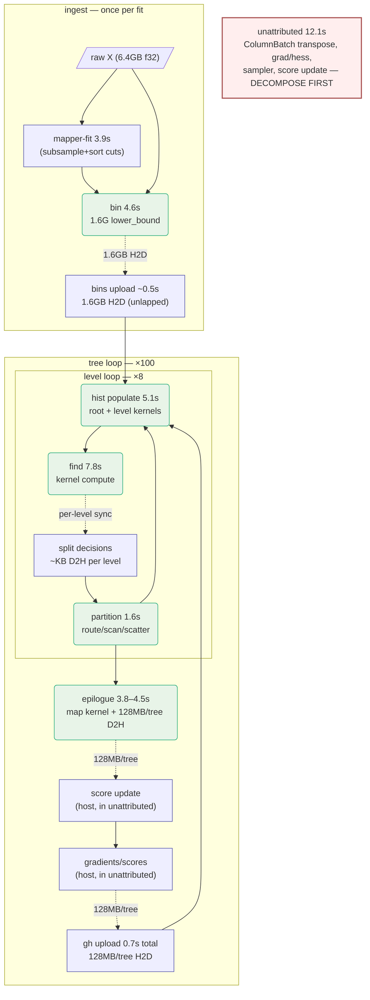
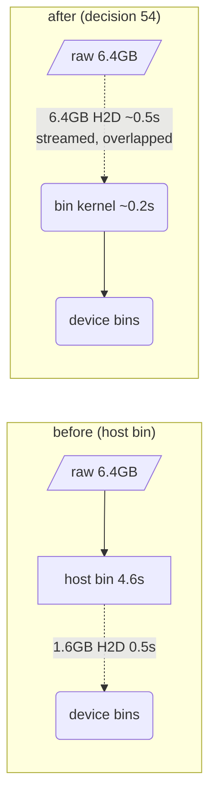

# 16 — The compute DAG: placement as a first-class design object

> **Status:** framing document (adopted with decision 54). The transaction API (doc 14) made the backend an implementation detail; this doc makes the *cost* of that boundary explicit. Every optimization round since decision 49 has been a move on the graph below — this formalizes the game so moves can be priced before they are played.

## The claim

The training narrative is a small compute DAG. Nodes are the algorithmic steps; each node has a measured cost per feasible placement (host or device); edges carry data, and an edge crossing the placement boundary costs `bytes / bandwidth(direction)`. Choosing an implementation *is* choosing a placement of nodes and a schedule of edges. General DAG placement with communication costs is NP-hard; ours has ~10 node types and ≤6 with free placement, so **exhaustive enumeration is trivial** — the hard part is honest constants, which the profilers already emit (`BONSAI_GROW_PROFILE`, `BONSAI_CUDA_PROFILE`, `BONSAI_INGEST_PROFILE`).

`scripts/dag_model.py` is the living companion: node/edge tables with measured constants, placement enumeration, and makespan estimates. Constants must come from **same-pod** profile lines (fleet spread between two L40S pods measured at ~25%; cross-pod absolutes are noise).

## The graph

Solid boxes are host-pinned (constraints below), rounded are device-feasible; dashed edges cross the placement boundary and are priced in bytes. Costs: 16M×100×255, L40S US-MO-1, post-decision-53 (PR #35 baseline run, fit 39.4s).



**Conservation rule.** The node costs must sum to the measured fit. Today they don't: `fit 39.4 − grow 18.9 − ingest 8.4 = 12.1s unattributed` (module-path ColumnBatch build, gradient/hessian computation, sampler fill, score update — none lapped at fit level). The graph's first output is therefore not an optimization but an instrumentation demand: **the largest line in the fit is currently invisible.** This is the third time conservation has flushed dark matter (make_root misattribution, the unlapped `ensure_dataset` upload). `FitProfiler` exists; the module path needs its laps wired.

## Placement constraints (pinned nodes)

- **mapper-fit → host.** Cut points come from `std::ranges::sample` with a seeded mt19937; reproducing the RNG stream on device buys nothing and risks identity. Model-changing to alter (phase 2 of decision 54, own decision).
- **split decisions → host.** The control plane must observe each level's outputs before opening the next (doc 12's contract). This pins one small D2H edge *per level* — the irreducible sync floor, ~800 syncs/fit. On healthy hosts that is ~10–20µs each (negligible); the decision-48 defective hosts turned it into 0.24s+ and a fleet-acceptance probe.
- **f64 policy.** Cross-chunk histogram merges stay double (docs 10/2); placement moves must not silently change accumulation order/precision — byte-identity gates catch this.

## Pricing moves: the rounds replayed

| move | edge/node change | model price | measured |
|---|---|---|---|
| 53 step 2 (rows cache) | delete 64MB/tree H2D | ~0.3–0.4s | root_stage 0.42→0.04 |
| 53 step 3 (epilogue) | 16M-row host loop → kernel + 128MB/tree D2H | several s | finalize 9.35→3.90 |
| 52 (device gradients) | delete 128MB/tree H2D, move grad compute | **~0.7–0.9s — NO-GO by arithmetic** | experiment measured 1.6s of 42.5; killed |
| 35 (pinned epilogue D2H) | reroute D2H through pinned + memcpy | *unpriceable — finalize line undecomposed* | refuted (3.78→4.45) |
| 54 (device binning) | delete 4.6s host node + 1.6GB H2D; add 6.4GB H2D streamed | ~4.5s | pending |

The model corrected its own author while being written: the design draft priced the 6.4GB raw upload at ~2.4s from stale intuition; the measured gh edge (12.8GB in 0.68s ⇒ ~19GB/s) prices it at **~0.35–0.5s**, nearly doubling decision 54's projected win. Arithmetic beats intuition even when the intuition is a week old.

Two lessons the table encodes: decision 52 cost a pod-day that the model prices in one line — H2D at ~14GB/s makes gradient-upload edges *cheap*, so deleting them can't pay. And #35 was unpriceable because the finalize node was an aggregate; **a node you can't decompose is a node you can't optimize** — hence the `fin_wait`/`fin_d2h` counters shipping with decision 54.

Decision 54 is also the canonical example that **min-bytes ≠ min-time**: it *increases* boundary traffic 4× (6.4GB raw vs 1.6GB binned) and still wins, because the edge is cheaper than the host node it displaces, and the transfer overlaps the kernel.



## The floor

For any placement, makespan ≥ (host-pinned work) + (device compute) + (irreducible boundary traffic), minus overlap. With today's kernels and everything feasible moved to device:

```
raw ingest transfer   ~0.5s   (once, streamed)
mapper-fit (pinned)   ~3.9s
device compute        ~14s    (find 7.6 + hist ~5 + partition ~1 + epilogue kernel ~0.2)
per-level sync floor  ~0.02s  (healthy host)
```

≈ **19s + the unattributed remainder** — which is why the unattributed 12.1s must be decomposed *before* the next placement bet: if most of it is gradient/score host loops, device residency of the objective (the refuted-as-upload-saving decision 52, revisited as *compute* placement) re-enters the game with a real price tag; if it is ColumnBatch transpose, the lever is module-side and no placement move touches it.

The floor also bounds ambition honestly: placement alone cannot beat `device compute ≈ 14s`; below that line the levers are kernel engineering (find's 7.6s is the largest) and algorithm changes, not residency.

## What this is for

1. **Price before betting.** A round that moves an edge must state its model price from same-pod constants; a price under ~1s doesn't buy a pod session.
2. **Dominance over precision.** Constants drift ~25% across hosts; play only moves that win across the plausible range.
3. **Exhaustion is a result.** When enumeration says remaining placements are within noise of the floor, the residency debate is *over* — by arithmetic, not fatigue.
4. **Pedagogy.** The transaction API (doc 14) is the DAG's cut boundary made explicit: `LevelInputs`/`LevelOutputs`/`TreeEpilogue` — and with decision 54, `ingest` — are the edge payloads. Each architecture doc describes a node; each decision is a move. A future guide chapter should walk this reframing and how the abstraction maps to the C++/CUDA patterns (transaction concepts, plane structs, opaque handles at the boundary, profile-gated laps).
