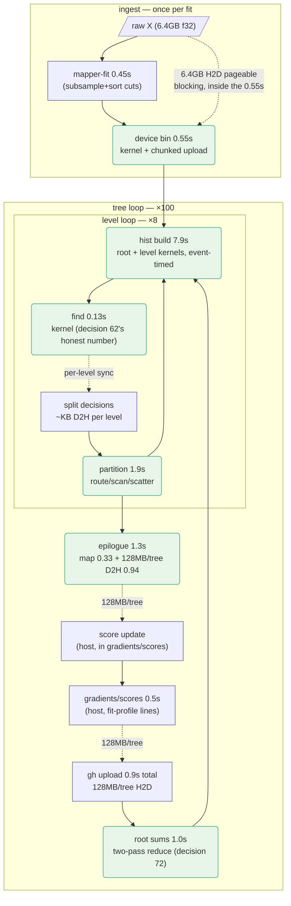
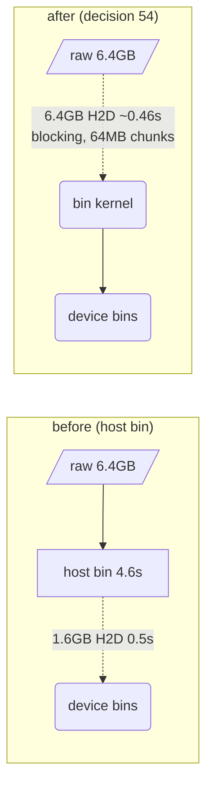

# 16: The compute DAG: placement as a first-class design object

> **Status:** framing document (adopted with decision 54). The transaction API (doc 14) made the backend an implementation detail; this doc makes the *cost* of that boundary explicit. Every optimization round since decision 49 has been a move on the graph below. This formalizes the game so moves can be priced before they are played.

## The claim

The training narrative is a small compute DAG. Nodes are the algorithmic steps; each node has a measured cost per feasible placement (host or device); edges carry data, and an edge crossing the placement boundary costs `bytes / bandwidth(direction)`. Choosing an implementation *is* choosing a placement of nodes and a schedule of edges. General DAG placement with communication costs is NP-hard; ours has ~10 node types and ≤6 with free placement, so **exhaustive enumeration is trivial**: the hard part is honest constants, which the profilers already emit (`BONSAI_GROW_PROFILE`, `BONSAI_CUDA_PROFILE`, `BONSAI_INGEST_PROFILE`).

`scripts/dag_model.py` is the living companion: node/edge tables with measured constants and makespan estimates. It does not enumerate placements. It prices two hand-written ones, the pre-54 host bin and decision 54's device bin, so the enumeration above is a paper argument about the size of the search space, not something the script performs. Constants must come from **same-pod** profile lines (fleet spread between two L40S pods measured at ~25%; cross-pod absolutes are noise).

## The graph

Solid boxes are host-pinned (constraints below), rounded are device-feasible; dashed edges cross the placement boundary and are priced in bytes. Costs: 16M×100×255 `cuda_depthwise`, L40S US-NC-1, 2026-07-15, post decisions 54/49/38/72 (fit 15.70s; this graph's first published constants were the PR #35-era 39.4s fit, and every delta between the two is a row in the moves table below or in guide 11's).


```mermaid
flowchart TD
    subgraph ingest [ingest — once per fit]
        X[/"raw X (6.4GB f32)"/]
        MF["mapper-fit 0.45s\n(subsample+sort cuts)"]
        BIN("device bin 0.55s\nkernel + chunked upload")
        X --> MF --> BIN
        X -. "6.4GB H2D pageable\nblocking, inside the 0.55s" .-> BIN
    end

    subgraph tree ["tree loop — ×100"]
        GH["gradients/scores 0.5s\n(host, fit-profile lines)"]
        GHUP["gh upload 0.9s total\n128MB/tree H2D"]
        subgraph level ["level loop — ×8"]
            POP("hist build 7.9s\nroot + level kernels, event-timed")
            FIND("find 0.13s\nkernel (decision 62's honest number)")
            DEC["split decisions\n~KB D2H per level"]
            PART("partition 1.9s\nroute/scan/scatter")
        end
        RS("root sums 1.0s\ntwo-pass reduce (decision 72)")
        EPI("epilogue 1.3s\nmap 0.33 + 128MB/tree D2H 0.94")
        SU["score update\n(host, in gradients/scores)"]
        GH -. "128MB/tree" .-> GHUP --> RS --> POP
        BIN --> POP
        POP --> FIND -. "per-level sync" .-> DEC --> PART --> POP
        PART --> EPI -. "128MB/tree" .-> SU --> GH
    end

    classDef dev fill:#e8f4e8,stroke:#2a7,stroke-width:1px
    classDef host fill:#eef,stroke:#55a,stroke-width:1px
    class POP,FIND,PART,EPI,BIN,RS dev
    class MF,GH,SU,DEC,GHUP host
```

**Conservation rule.** The node costs must sum to the measured fit, and as of decision 72 they do: `grow 14.05 + ingest 1.47 + objective/sample/score 0.51 ≈ fit 15.70`, with the grow buckets themselves closing against the event-timed kernel spans (`cuda-round-decomp`). It took three flushes of dark matter to get here (make_root misattribution, the unlapped `ensure_dataset` upload, and the 12.1s module-path block that PR #38 named as a serial 12.8GB memset), plus the decision-62 peel that split *wait* from *work* in the find line. When a future change reopens a gap between the sum and the wall clock, that gap is the next target, not noise.

## Placement constraints (pinned nodes)

- **mapper-fit → host.** Cut points come from `std::ranges::sample` with a seeded mt19937; reproducing the RNG stream on device buys nothing and risks identity. Model-changing to alter (phase 2 of decision 54, own decision).
- **split decisions → host.** The control plane must observe each level's outputs before opening the next (doc 12's contract). This pins one small D2H edge *per level*, the irreducible sync floor, ~800 syncs/fit. On healthy hosts that is ~10–20µs each (negligible); the decision-48 defective hosts turned it into 0.24s+ and a fleet-acceptance probe.
- **f64 policy.** Cross-chunk histogram merges stay double (docs 10/2); placement moves must not silently change accumulation order/precision; byte-identity gates catch this.

## Pricing moves: the rounds replayed

| move | edge/node change | model price | measured |
|---|---|---|---|
| 53 step 2 (rows cache) | delete 64MB/tree H2D | ~0.3–0.4s | root_stage 0.42→0.04 |
| 53 step 3 (epilogue) | 16M-row host loop → kernel + 128MB/tree D2H | several s | finalize 9.35→3.90 |
| 52 (device gradients) | delete 128MB/tree H2D, move grad compute | **~0.7–0.9s: NO-GO by arithmetic** | experiment measured 1.6s of 42.5; killed |
| 35 (pinned epilogue D2H) | reroute D2H through pinned + memcpy | *unpriceable: finalize line undecomposed* | refuted (3.78→4.45) |
| 54 (device binning) | delete 4.6s host node + 1.6GB H2D; add 6.4GB H2D chunked | ~4.5s | fit 37.9→31.3 |
| 72 (marginal round) | delete identity copy + host root reduce + final-level build; three more levers priced 0.1/0.5/0ms and killed | ~63ms/round | round 181→125ms |

The model corrected its own author while being written: the design draft priced the 6.4GB raw upload at ~2.4s from stale intuition; the measured gh edge (12.8GB in 0.68s ⇒ ~19GB/s) prices it at **~0.35–0.5s**, nearly doubling decision 54's projected win. Arithmetic beats intuition even when the intuition is a week old.

Two lessons the table encodes: decision 52 cost a pod-day that the model prices in one line: H2D at ~14GB/s makes gradient-upload edges *cheap*, so deleting them can't pay. And #35 was unpriceable because the finalize node was an aggregate; **a node you can't decompose is a node you can't optimize**, hence the `fin_wait`/`fin_d2h` counters shipping with decision 54.

Decision 54 is also the canonical example that **min-bytes ≠ min-time**: it *increases* boundary traffic 4× (6.4GB raw vs 1.6GB binned) and still wins, because the edge at bus rate is far cheaper than the 4.6s host node it displaces. The win does not depend on overlap: the shipped transfer is a blocking pageable copy per 64MB chunk (doc 15), and 6.4GB at the measured pageable rate is ~0.46s.


```mermaid
flowchart LR
    subgraph before ["before (host bin)"]
        A[/"raw 6.4GB"/] --> B["host bin 4.6s"]
        B -. "1.6GB H2D 0.5s" .-> C("device bins")
    end
    subgraph after ["after (decision 54)"]
        D[/"raw 6.4GB"/] -. "6.4GB H2D ~0.46s\nblocking, 64MB chunks" .-> E("bin kernel") --> F("device bins")
    end
```

## The floor

For any placement, makespan ≥ (host-pinned work) + (device compute) + (irreducible boundary traffic). With today's kernels and everything feasible moved to device, using only measured node lines:

```
host-pinned work      0.99s   (mapper-fit 0.45 + gradients/scores 0.51 + split decisions 0.03)
device compute       11.83s   (hist build 7.90 + partition 1.90 + root sums 1.02
                               + ingest bin 0.55 + epilogue map 0.33 + find 0.13)
boundary edges        1.82s   (gh 12.8GB H2D 0.88 + epilogue 12.8GB D2H 0.94, both measured)
```

≈ **14.6s against a measured 15.70s fit**: the placement game is nearly played out, and the model says so by arithmetic. Two accounting rules make that sum honest, and both were violated by the version of this section that claimed 13.9s. First, the ingest bin line is the `dbin` lap, which already contains the raw 6.4GB upload, so the transfer is not a separate row: the code copies each 64MB chunk with a blocking pageable `cudaMemcpy` and bins it (doc 15), and pricing a pinned overlapped transport that was never built understates the floor. Second, the gh and epilogue edges cross the boundary in *every* placement, because the objective is host-pinned, so a floor that drops them is not a floor.

The remaining ~1.1s between 14.6s and the wall clock is undecomposed: about 0.5s sits inside the ingest line past mapper-fit and `dbin`, the rest inside grow past the evented kernel spans. Under the conservation rule that gap is the next target, not noise.

**`scripts/dag_model.py --floor` prints 13.1s and is wrong in both directions named above**: it prices the raw upload at `h2d_pinned` with 30% declared overlap, and it omits the per-tree gh and epilogue edges. Read it as a lower bound on the device-compute-plus-mapper-fit part, not as the floor, until its `raw_X` edge is repriced against the pageable blocking copy and the floor branch counts the host-pinned objective's two edges. The node constants themselves are sound: they are same-pod profile lines from the 2026-07-15 US-NC-1 run, and nothing here needs re-measuring, only re-adding.

**Vintage (2026-08-08).** Every constant above is the 2026-07-15 tree. Decision 103 has since tile-blocked the binned plane and cut the depth-8 `adv_hist` line by 61% on its own pod, so the histogram node is the one that moved most and the floor is owed a same-pod refresh before it is quoted as today's. The structure of the accounting survives a refresh; the digits do not.

The floor also bounds ambition honestly: placement alone cannot beat `device compute ≈ 11.8s`, and **the histogram build is two thirds of that line**. Below the floor the levers are kernel engineering (the build's occupancy/layout, decision 72's named residue at ~72ms of the oblivious round's ~125ms) and algorithm changes, not residency. The find kernel, once believed to be the 7.6s giant, is 0.13s: decision 62's peel relocated the weight to where it always was.

## What this is for

1. **Price before betting.** A round that moves an edge must state its model price from same-pod constants; a price under ~1s doesn't buy a pod session.
2. **Dominance over precision.** Constants drift ~25% across hosts; play only moves that win across the plausible range.
3. **Exhaustion is a result.** When enumeration says remaining placements are within noise of the floor, the residency debate is *over*, by arithmetic, not fatigue.
4. **Pedagogy.** The transaction API (doc 14) is the DAG's cut boundary made explicit: `LevelInputs`/`LevelOutputs`/`TreeEpilogue` (and with decision 54, `ingest`) are the edge payloads. Each architecture doc describes a node; each decision is a move. A future guide chapter should walk this reframing and how the abstraction maps to the C++/CUDA patterns (transaction concepts, plane structs, opaque handles at the boundary, profile-gated laps).
