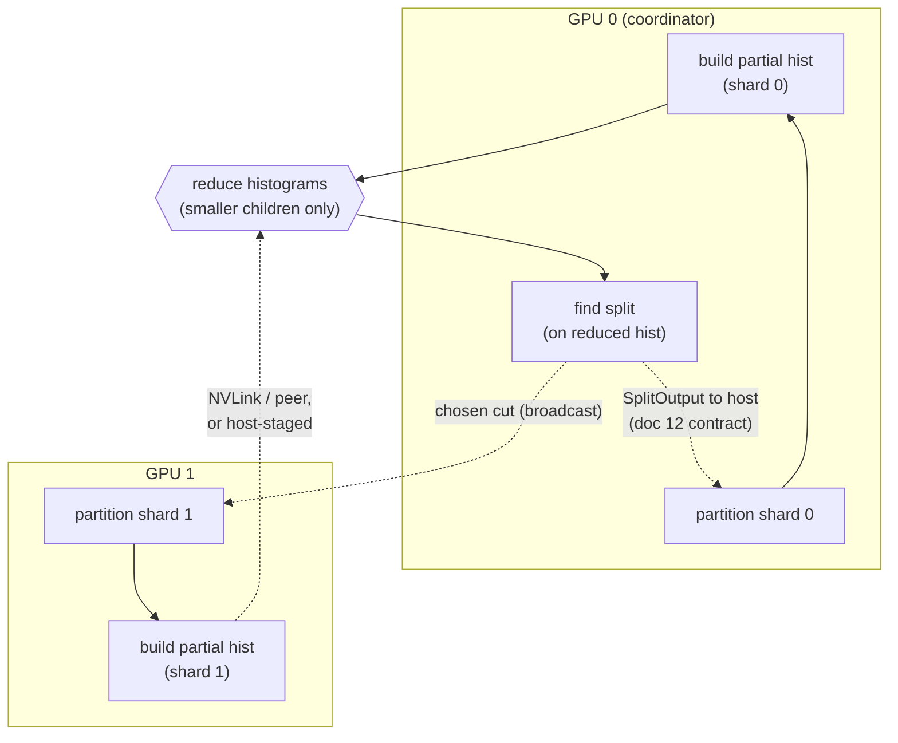

# 19: Single-node multi-GPU: a data-parallel backend beside the single-GPU one

> **Status:** experiment, parked (decision 76). Built and validated through the full doc plan (P1-P4a plus a five-lever optimization round), then measured to END-TO-END PARITY with single-GPU at both 16M and 64M rows on 4x A100 NVLink: the floor is the host-computed gradient stream (host-memory-bandwidth-bound) plus the reduction's correctness syncs, an architectural property, not a tuning residue. The engine, registry surface, and all five levers live on the `experiment/multi-gpu` branch; main keeps the single-device `parallel.device_id` (fit-parallel sweeps are the multi-GPU story that scales linearly today). Reopener: a device-resident objective (each GPU computing its shard's grad/hess from resident scores), which is also the single-GPU engine's own next frontier.

## The claim

Single-node multi-GPU training is a new engine, not a change to the existing one. Because the CUDA backend plugs in through the `HistogramEngine` / `GPULevelEngine` concepts ([`grower.hpp`](../../include/bonsai/grower.hpp)) rather than an inheritance hierarchy, a data-parallel backend is a new type satisfying the same concepts, added beside `CudaHistogramEngine` and selected by a new grower name. The single-GPU path stays exactly as short and as fast as decisions 53/71/72 left it.

This doc prices that design against the current code so the work can be phased before it is played (doc 16's rule).

## Why the seam holds

Growers are templated on the engine and own it by value ([`grower.hpp:135/165`](../../include/bonsai/grower.hpp)); the booster registry is a compile-time cartesian product `cartesian_product_t<Objectives, Growers, Samplers>` ([`configurations.hpp:17`](../../include/bonsai/registry/configurations.hpp)) that emits a booster for every combo. Adding a backend is: write a concept-satisfying type, add its grower instantiations to the `Growers` typelist, and the registry builds the boosters. No existing engine, grower, or dispatch code changes shape.

The host-side split-decision contract (doc 12) is what makes data-parallel a small delta: the grower calls `find_*`, receives a `SplitOutput` on the host, decides, then calls `partition/advance`. Multi-GPU changes what the engine does *inside* those calls, never the orchestration around them.

## The algorithm maps onto bonsai's control flow

Data-parallel GBM partitions rows across devices; each device owns a shard. Per level:

1. Each device builds partial histograms over its shard. This is exactly what `begin_root` / `advance_level` already do per device.
2. **Reduce the histograms to a coordinator device.** This is the one genuinely new operation, and it is a reduce, not an all-reduce: only the SMALLER children's partials need to cross devices, because the coordinator holds the global parent from the previous level and derives each larger child as parent_global minus small_global. That roughly halves cross-device traffic versus reducing both children.
3. Find the split on the reduced histogram. Reuses the existing find kernel on the coordinator (see below).
4. Each device partitions its own shard through the chosen split. `partition_level` is already per-shard; no rows cross devices.

The tree comes out identical on every device because every decision is made on the one global histogram. So the only new cross-device traffic is the reduction between build and find; row partitioning stays embarrassingly parallel. The architecture was, incidentally, already shaped for this.

Traffic pricing (16M x 100 x 255): a level's reduction is roughly frontier_slots x total_bins x 16B per cell, ~50-100MB at the deepest levels with the smaller-children-only scheme. Over PCIe (~25GB/s effective) that is ~2-4ms per level per device; over NVLink (600GB/s) ~0.1ms. Across 8 levels x 100 trees the PCIe tax is seconds per fit and the NVLink tax is noise: the interconnect is the experiment's independent variable, which drives the validation hardware below.

## Blast radius

**Untouched.** `CudaHistogramEngine` ([`histogram_engine.cu`](../../src/cuda/histogram_engine.cu), 1423 lines), all three growers, the CPU plane, the host control plane, the split math, SHAP, and the model format. The single-GPU crown regime is not disturbed.

**New (additive).**
- `MultiCudaHistogramEngine`, satisfying `HistogramEngine` + `GPULevelEngine`. Fans each op across N devices.
- The histogram reduction (hand-rolled peer memcpy + add kernel first, zero new deps; NCCL only if measured to matter), inserted inside `begin_root` / `advance_level` after the per-device build, before find. **It must ship with a host-staged fallback** (pinned bounce buffer + add): cloud multi-GPU pods frequently disable peer access (IOMMU/ACS in virtualized secure cloud, even on same-board SXM parts), so the engine probes `cudaDeviceCanAccessPeer` at construction and takes the peer path only when it is real. Every measurement is labeled with the regime it ran in.
- A sharded ingest (`cuda_ingest_sharded`) producing a multi-shard `IngestPlane`, additive next to `cuda_ingest` ([`histogram_engine.cu:143`](../../src/cuda/histogram_engine.cu)) at the same call site that already selects the CUDA plane ([`module.cpp:66`](../../src/python/module.cpp)).
- Config `parallel.device_ids` (the list sibling of #158's `parallel.device_id`) and grower names `cuda_multi_depthwise` / `cuda_multi_oblivious`.

**One refactor to keep single-GPU DRY.** Per-device state lives in `CudaHistogramEngine::Impl` (pimpl). Extract that state and its kernels into a reusable `CudaDeviceContext`, then make both `CudaHistogramEngine` (owns one) and `MultiCudaHistogramEngine` (owns N + a reducer) thin wrappers over it. This is a behavior-neutral, hash-gated extraction, not a rewrite: the single-GPU engine stays a thin wrapper and the histogram/partition/find kernels are shared rather than duplicated. It is the only place existing single-GPU code moves, and it moves sideways into a shared struct.

## Find-split placement

`find_splits_many` / `find_level_split` currently run on the device against device histograms. The simplest multi-GPU scheme is **reduce-to-coordinator**: sum the partials onto device 0, run the existing find kernel there, and let the host decision fan back out (the cut is tiny; broadcasting it is free). This reuses the single-GPU find almost verbatim. An alternative all-reduces to every device so each runs find redundantly (deterministic, trivial extra compute, double the traffic); reduce-to-coordinator is the phase-1 choice.

## Reproducibility

The CPU plane is hash-canonical (`scripts/model_hash.py` is CPU-only); the GPU path is a tolerance-match by construction, not bit-exact, because atomics accumulate in arbitrary order ([`histogram_engine.hpp:33`](../../include/bonsai/cuda/histogram_engine.hpp)). Multi-GPU inherits that contract unchanged: it must hold the same tolerance the single-GPU engine holds, and it fixes the reduction order (device id ascending) for run-to-run determinism at a given device count. There is no bit-identical-GPU guarantee for multi-GPU to break; the reproducibility posture is CPU-side and survives.

## Costs and risks (honest)

- **Sublinear speedup.** The level budget is already staging-bound (~104ms/round post decision 72, much of it transfer). A cross-device reduction every level means expect roughly 2-3x on 4 GPUs, not 4x, and interconnect dominates (NVLink far ahead of PCIe). Admitted for a use case that values the capability over the ROI.
- **No-P2P clouds.** Peer access is a host property, not a card property: virtualized pods often disable it. The host-staged fallback keeps the engine functional there, at a real bandwidth cost; the `cudaDeviceCanAccessPeer` probe plus a `p2pBandwidthLatencyTest` run open every validation session so numbers are never attributed to the wrong regime.
- **NCCL, if ever adopted,** is a new dependency gated behind the multi-GPU build so CPU and single-GPU builds never link it; phase 1 hand-rolls the reduction (the bonsai-ci image ships no NCCL).
- **Testing needs a physical multi-GPU box.** CI cannot validate it; use the same skip-on-single-GPU pattern as #158 plus a manual/pod validation.
- **Stragglers.** The reduction waits on the slowest shard; even row-sharding handles the common case, an uneven or mismatched card costs the difference.

## Phasing

1. Land #158 (`parallel.device_id`): the foundation, `device_id` becoming `device_ids`.
2. Extract `CudaDeviceContext` from `CudaHistogramEngine::Impl`: behavior-neutral, hash-gated, single-GPU identical.
3. Build `MultiCudaHistogramEngine` over N contexts with the reduce-to-coordinator scheme (peer path + host-staged fallback).
4. Add sharded ingest, the grower instantiations, and the registry/dispatch entries.
5. Validate on multi-GPU pods: tolerance match vs single-GPU at a fixed device count, then the scaling ladder (1/2/4 GPUs) at 16M+ rows. The ladder is **same-pod** (the 1-GPU baseline runs on GPU 0 of the multi-GPU host; fleet spread makes cross-pod comparisons noise), opens with the P2P gate, and measures BOTH interconnect regimes: 4x L40S (PCIe floor, same sm_89 silicon as every published bonsai GPU number, ~$4/hr secure) and 4x A100 SXM (NVLink 600GB/s headroom, sm_80 already validated, ~$6/hr secure); 2x A40 (~$0.9/hr) serves for P3 correctness bring-up and the fallback path. A100 PCIe is dominated (same interconnect class as L40S, older arch, more cost); H100 is overkill for a scaling-shape question.

Each step is new code beside old code, not surgery through it. That containment is the whole reason the feature is admitted.
