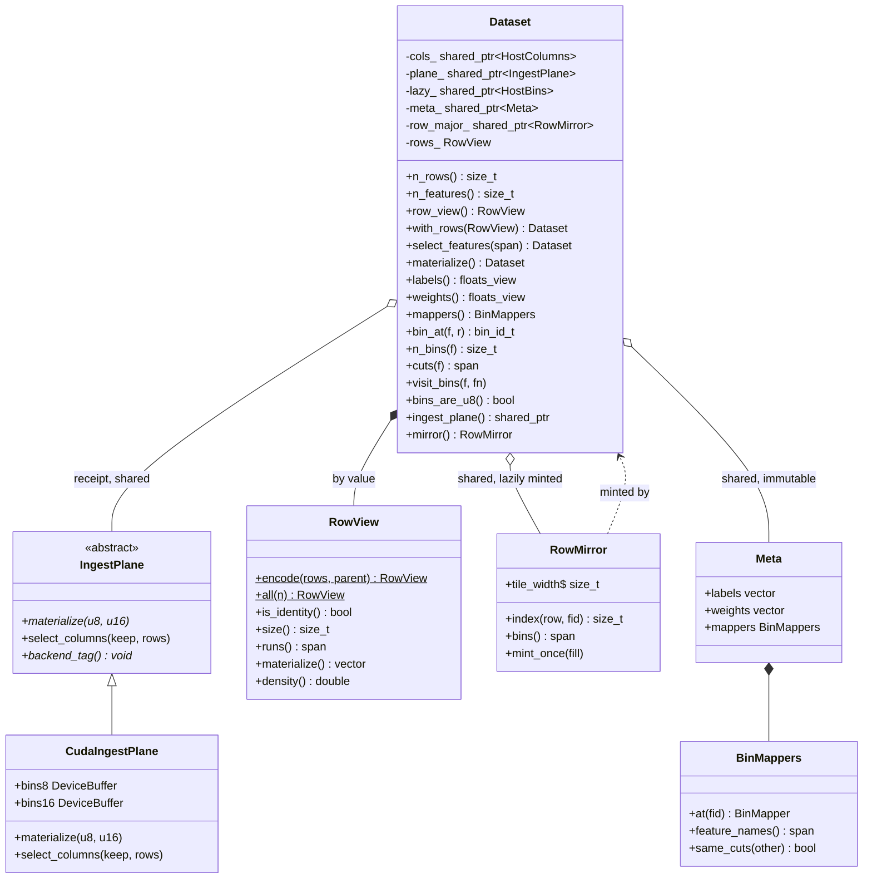

# 23: Core type decomposition: the census before the refactor

> **Status:** analysis only, no decision. This is the input to a decomposition pass, written so the pass argues from measured coupling rather than from a class's line count. Nothing here has been applied. The open questions in the last section are the deliverable.

## Why this exists

An adversarial design review of the row-views PR graded `Dataset` a C on single responsibility and named nine independent reasons it changes. That grade is fair, and acting on it directly would still be a mistake: a responsibility count tells you a class is doing too much, not where to cut it. This document supplies what the count does not.

It also corrects the first estimate made in that discussion. A crude `grep '\bmember('` put the extraction's blast radius at 147 call sites; that pattern matched declarations, definitions, comments, and identically-named members of other types. The census below counts only real call sites and separates production from tests, because the two carry different risk: a production site is behaviour, a test site is churn.

## The types today

`Meta`, `RowMirror` and the shared-plane arrangement are recent: labels, weights and cuts used to be copied by value into every view, and the mirror's block-addressing rule used to be a `Dataset` member.

## The coupling census

Call sites outside `dataset.hpp` / `dataset.cpp`, counted by member. Production and tests separated. Members whose names collide with common vocabulary (`size`, `index`, `bins`) are excluded as unmeasurable by grep.

| member | prod | tests | cluster |
|---|---|---|---|
| `n_rows` / `n_features` | high | high | shape, wanted by everything |
| `n_bins` | 22 | 19 | bin store |
| `bins_are_u8` | 10 | 24 | bin store |
| `visit_bins` | 7 | 10 | bin store |
| `bin_at` | 7 | 37 | bin store |
| `ingest_plane` | 5 | 3 | bin store |
| `cuts` | 5 | 53 | mappers |
| `bin_of_threshold` | 6 | 0 | mappers |
| `mappers` | 2 | 11 | mappers |
| `labels` | 11 | 12 | fit inputs |
| `weights` | 8 | 7 | fit inputs |
| `row_view` | 27 | 11 | row selection |
| `view_n_rows` | 12 | 5 | row selection |
| `mirror` | 6 | 22 | derived cache |
| `with_rows` | **1** | 17 | row selection |
| `select_features` | **1** | 18 | rewrite |
| `materialize` | 5 | 6 | rewrite |

Two readings matter.

**The bin store is ~51 production sites, concentrated.** `bin_at` is 7 sites across four files (`booster.hpp`, `grower_impl.hpp`, `shap.cpp`, `device_context.cu`); `n_bins` is ~22 across eight. That is a third of the first estimate, and it is clustered rather than smeared, which is what makes an extraction tractable.

**The view surface is one production site each.** `with_rows` and `select_features` are called once each, from the binding. Their coupling is almost entirely test coupling. A decomposition is nearly free to move them.

## What `Dataset` currently is

Nine change reasons, grouped by what would move together:

| cluster | members | changes when |
|---|---|---|
| bin store | `cols_`, `plane_`, `lazy_`, `bins_are_u8_`, `visit_bins`, `bin_at`, `n_bins`, `ingest_plane` | a backend or bin width changes |
| cut metadata | `mappers`, `cuts`, `bin_of_threshold` | binning policy changes |
| fit inputs | `labels`, `weights` | never, after bin time |
| row selection | `rows_`, `row_view`, `view_n_rows`, `with_rows` | the view design changes |
| rewrites | `select_features`, `materialize` | the rewrite design changes |
| derived cache | `row_major_`, `mirror` | cache sizing changes (already extracted) |

## The question this analysis cannot answer

Extract the bin store and the residue is: labels, weights, mappers, a row view, and a pointer to the store. That residue is not a dataset. It is a *fit specification over* a dataset.

So the decomposition question is not "should `BinStore` come out". It is:

1. **Is the store the real `Dataset`,** with the residue becoming something like `Fit` or `TrainingView`? That inverts the naming, and the C++ type is internal (the Python `bonsai.Dataset` is a separate binding class), so a rename breaks no user and costs only docs.
2. **Do cuts belong to the store or the fit?** They are needed to interpret the bins (store) and to validate a second matrix against the first (fit). Today `Meta` holds them with labels, which pairs them with the fit; `same_cuts` argues they belong with the store.
3. **Does the row view belong on the type at all,** or is it an argument to `grow`? It rides on `Dataset` so the fills can read it without a parallel parameter, but a view is a property of *this fit*, not of the data.
4. **What is the boundary's arity?** `IngestPlane` is the one type-erased seam by deliberate choice (doc 6). A `BinStore` that wraps it adds a second layer over the same data; whether that is one abstraction too many is a judgment the census cannot make.

## Constraints any answer must respect

- `bonsai::Dataset` is internal. The Python `Dataset` in `module.cpp` wraps it, so core renames are free at the API boundary and cost only guide prose.
- The plane is shared by `shared_ptr` across copies and keyed by address in the device context (`DatasetKey.dataset`), so any type that copies must preserve identity semantics or the device upload-skip cache misbehaves.
- `bin_at` and `RowMirror::index` are per-element reads in the fills. They must stay header-inline; the mirror extraction verified this by same-machine A/B (`populate` 3.56s before, 3.55s after, 2M x 32 x 150 iters).
- Wire identity `55c6fe308852d9bb` is the gate. A decomposition that changes model bytes has changed behaviour.

## Method, so the numbers can be rechecked

Census: `grep -rn '\.<member>(\|-><member>(' --include=*.cpp --include=*.hpp --include=*.cu src/ include/ tests/`, excluding `dataset.hpp` and `dataset.cpp`, split on a `tests/` prefix. Compile cost and churn attribution use the technique in the review-round notes: time a trivial TU to find the framework floor before assuming a split multiplies cost, and bucket `git log -p` hunks by the text after the second `@@` (the enclosing declaration, which survives line drift) rather than by line number.
