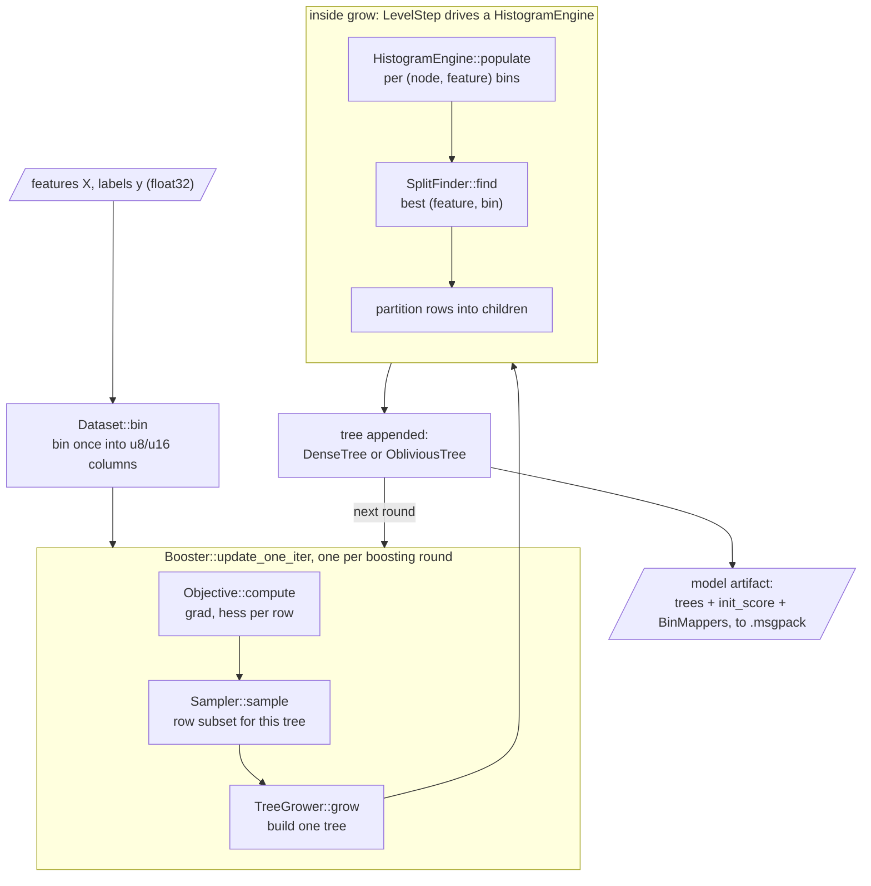
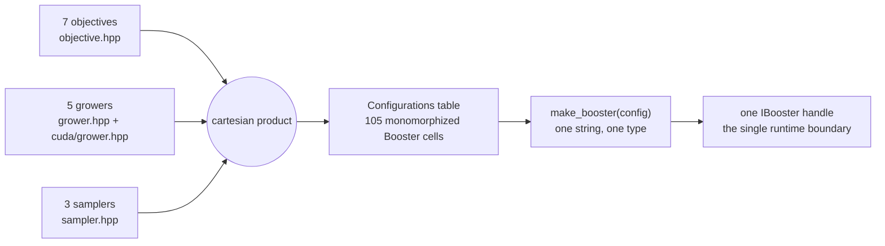

# The system map

bonsai is a histogram gradient-boosting library with a C++23 core written to be read.
This page is the map: the three layers, one fit's data flow, and the dispatch table that ties them together.
Every box names the file it lives in, so the code is one link away.

## Three layers

**A readable C++23 core.**
The training and prediction logic lives in header form under [`include/bonsai/`](../../include/bonsai), 5,379 lines across the public headers (measured 2026-07-19).
A reader can start from five: [`dataset.hpp`](../../include/bonsai/dataset.hpp) (201 lines), [`objective.hpp`](../../include/bonsai/objective.hpp) (141), [`histogram.hpp`](../../include/bonsai/histogram.hpp) (174), [`grower.hpp`](../../include/bonsai/grower.hpp) (289), and [`booster.hpp`](../../include/bonsai/booster.hpp) (790).

**Engine backends behind concepts.**
The core names its variable parts through C++20 concepts, not base classes: `Objective`, `TreeGrower`, `HistogramEngine`, `Sampler`.
A backend is any type that satisfies a concept, so the CPU and CUDA paths share one grow loop ([`src/grower_impl.hpp`](../../src/grower_impl.hpp), 782 lines) and the GPU lives in one translation unit ([`src/cuda/histogram_engine.cu`](../../src/cuda/histogram_engine.cu), 392 lines).
[Concepts to types](api-tour-concepts.md) walks these one by one.

**Bindings and CLI as thin shells.**
The Python module ([`src/python/module.cpp`](../../src/python/module.cpp)) and the CLI ([`src/cli/`](../../src/cli)) hold no training logic.
Both parse configuration into the same `Config`, call the same factory, and drive the same `IBooster`.

## Data flow of one fit

Features come in, the `Dataset` bins them once, and the booster loop appends one tree per round until the ensemble is a model artifact.

Each box, one sentence, and where it lives:

| Box | What it does | File |
|---|---|---|
| `Dataset::bin` | Bins raw float columns once into `u8`/`u16` bin ids; every later train reuses them. | [`include/bonsai/dataset.hpp`](../../include/bonsai/dataset.hpp) |
| `Objective::compute` | Turns current scores and labels into a per-row gradient and hessian. | [`include/bonsai/objective.hpp`](../../include/bonsai/objective.hpp) |
| `Sampler::sample` | Picks the row subset the tree sees this round: all rows, Bernoulli, or GOSS. | [`include/bonsai/sampler.hpp`](../../include/bonsai/sampler.hpp) |
| `TreeGrower::grow` | Builds one tree; the three growth strategies are three types. | [`include/bonsai/grower.hpp`](../../include/bonsai/grower.hpp) |
| `HistogramEngine::populate` | Fills per (node, feature) gradient histograms, on CPU or GPU. | [`include/bonsai/grower.hpp`](../../include/bonsai/grower.hpp) |
| `SplitFinder::find` | Scores every candidate cut and returns the best split per node. | [`include/bonsai/split.hpp`](../../include/bonsai/split.hpp) |
| row partition | Routes each node's rows to its children; the subtraction trick halves histogram work. | [`src/level_step.hpp`](../../src/level_step.hpp) |
| `DenseTree` / `ObliviousTree` | The two tree shapes a grower emits, appended to the ensemble. | [`include/bonsai/tree.hpp`](../../include/bonsai/tree.hpp) |
| model artifact | Serializes trees, init score, and `BinMappers` to a `.msgpack` file. | [`src/io/model.cpp`](../../src/io/model.cpp) |

## The dispatch product

The core is one class template, `Booster<Objective, TreeGrower, Sampler>`, and the config boundary must turn runtime strings into one instantiation.
bonsai enumerates the whole space at compile time: 7 objectives times 5 growers times 3 samplers is 105 cells in one factory table.
That table is `Configurations`, a `cartesian_product_t` ([`include/bonsai/registry/configurations.hpp`](../../include/bonsai/registry/configurations.hpp)), and `make_booster` does the one string-to-type lookup ([`src/registry/make_booster.cpp`](../../src/registry/make_booster.cpp)).
Softmax is the one objective whose K-output shape does not fit `Booster`, so it routes to `MulticlassBooster` (decision 26, [dispatch](../architecture/6-dispatch.md)).

The budget on that table is about 200 combinations.
The [dispatch doc](../architecture/6-dispatch.md) records how it is held: prune void combinations first, gate expensive families second, erase a seam only last.

## Where to go next

- [Concepts to types](api-tour-concepts.md): the concepts above as an implementer's surface, with the requires-clauses.
- [The HPC tension](the-hpc-tension.md): where these seams meet the GPU, and what they cost.
- [Determinism as a contract](determinism.md): why the same inputs produce the same model bytes.
- [The API in one read](../use/api-tour.md): the user-facing surface, estimators and `train` and config keys.
- The full historical record is the [architecture notes](../architecture/README.md) and the [decisions log](../decisions.md).
