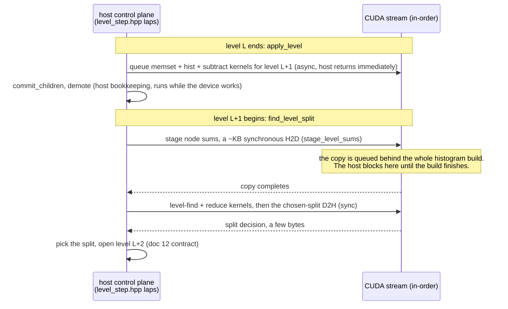

# 11. Performance engineering as a compute DAG

## The idea

Chapter 10 showed *where* the GPU boundary sits. This chapter is about **how you find out where it should sit**: the method behind the July 2026 campaign that took the 16M-row fit from ~43s to 26.9s and past XGBoost-GPU, told through its real moves and, more instructively, its real refutations.

The reframing that made the campaign systematic: training is a small **compute DAG**. Nodes are the algorithmic steps (bin, gradients, per level: build/find/partition, epilogue, score update); each node has a measured cost per feasible placement (host or device); edges carry data, and an edge crossing the placement boundary costs `bytes / bandwidth(direction)`. Choosing an implementation *is* choosing a placement plus a schedule. General DAG placement is NP-hard; this DAG has ~10 node types and at most six with free placement, so **exhaustive enumeration is trivial**: the entire difficulty is honest constants. ([architecture/16](../architecture/16-compute-dag.md) is the reference; `scripts/dag_model.py` is the living evaluator.)

Three rules fall out, each purchased with a real mistake:

1. **Price before betting.** An edge move must state its model price from measured constants before anyone writes a kernel.
2. **A node you can't decompose is a node you can't optimize.** Aggregate profiler lines mislead; every line must split into wait vs work, transfer vs compute.
3. **Conservation flushes dark matter.** The node costs must sum to the measured total; when they don't, the gap *is* the next target.

## The math

The model is deliberately primitive. It exists to kill bad bets, not to simulate:

```math
T(\text{placement}) \;=\; \sum_{v \in \text{nodes}} c_v(\text{side}(v)) \;+\; \sum_{(u,w)\,:\,\text{side}(u)\neq\text{side}(w)} \frac{\text{bytes}(u,w)}{\beta_{\text{dir}}}\,(1 - \text{overlap})
```

with per-direction bandwidths $\beta$ measured on the same machine (H2D pageable measured ~14–19GB/s; D2H is the slow direction and host-dependent). Two honesty constraints govern its use: constants come from **same-pod** profile runs only (two identical-model GPUs measured 25% apart across the fleet), and a move is played only if it wins across the plausible constant range: *dominance over precision*.

The model also yields a **floor**: with every feasible node on device, $T \geq$ one-time ingest transfer + total kernel compute + the irreducible per-level sync (the host must observe each level's split decisions before opening the next; that is the control-plane contract, and it pins one tiny D2H per level forever). When enumeration says remaining placements sit within noise of the floor, the placement game is over *by arithmetic* and only kernel engineering remains.

## The campaign, replayed as moves

Every row is a real decision from [decisions.md](../decisions.md); the deltas are same-pod measurements.

| move | change on the graph | priced | measured |
|---|---|---|---|
| 49 row-wise fill | host node cost (cache behavior, not placement) | n/a | fit 1.6–1.7× (populate 2.1×) |
| 53 §2 rows cache | delete a 64MB/tree H2D edge | ~0.4s | root staging 0.42→0.04s |
| 53 §3 epilogue | 16M-row host loop → device map + bulk D2H | several s | finalize 9.4→3.9s |
| **52 device gradients** | delete the 12.8GB/fit gh H2D edge | **~0.9s → NO-GO** | experiment confirmed ~1.6s; killed |
| **35 pinned epilogue D2H** | reroute D2H via pinned + memcpy | **unpriceable** (finalize was an aggregate) | refuted: 3.78→4.45s (*worse*) |
| 54 device binning | delete 4.6s host bin node + 1.6GB edge; add a 6.4GB streamed edge | ~4.5s | fit 37.9→31.3s |
| 38 buffer recycling | delete a 12.8GB/fit host *memset* node | ~6s | fit 34.7→26.9s |
| 72 identity contract | delete a 64MB/tree host identity copy + its staging | 33ms/round | grow/round 181→148ms |
| 72 device root sums | 16M-row host reduce → deterministic two-pass kernel | ~12ms/round | landed within price |
| 72 final-level skip | delete the last level's write-only histogram build | ~18ms/round | grow/round → 125ms |
| **72 epilogue sync, memset, pinned gh** | three more levers from the same table | **0.1ms / 0.5ms / break-even → killed** | never implemented |

Four of these deserve the space:

- **Decision 52 is the cautionary tale for rule 1.** "Keep gradients device-resident" sounds obviously right, until you price the edge it deletes: 128MB/tree over a ~19GB/s bus is under a second of a 42s fit. A pod-day experiment confirmed what one line of arithmetic would have said. (The experiment still paid: it flushed out a live device-plane bug, PR #29.)
- **PR #35 is rule 2.** The finalize line read 3.9s and intuition said "pageable D2H is slow, pin it". But finalize was an *aggregate* (stamp kernels + map kernel + sync + copies) and the actual copy share was small; the pinned route added a 128MB/tree memcpy and measured **worse**. The counters that would have priced it correctly (`fin_wait`/`fin_d2h`) were added the next day, and no line has been designed against un-decomposed since.
- **Decision 54 is the canonical "min-bytes ≠ min-time".** Device binning *increases* boundary traffic 4× (6.4GB of raw floats instead of 1.6GB of binned bytes) and still wins big, because the edge is cheaper than the 4.6s host node it deletes, and the model, fed the measured gh-edge bandwidth, re-priced the design's own draft (which had guessed 2.4s for the transfer; it's ~0.5s) *while the design was being written*.
- **PR #38 is rule 3 twice over.** Conservation said fit − grow − ingest left **12s attributed to nothing**. New buckets named it in one pod run: the per-tree zero-initialization of the output vectors, 12.8GB of `memset` per fit that every profiler had filed under "grow". Deleting it (the booster recycles the buffers; every element is provably written before read) was worth more than any kernel this campaign, and its correctness proof is the byte-identical model hash with tree *n+1* starting from tree *n*'s garbage.
- **The decision-72 rows are the method compressed into one round.** The target was the oblivious grower's 155ms marginal round (decision 71's residue). Rung 0 built the price list before any lever: a profile-only sync peel replayed the decision-62 lesson (6.1s filed under find staging was really the previous level's histogram kernels draining at the next sync), and conservation flushed two residues nothing else explained, the identity copy and the final level's write-only build. Six levers were priced from that one table; three landed for ~63ms, and three were killed for a combined price under a millisecond, the cheapest refutations of any campaign. Result: 181→125ms per round (fit 19.4→13.9s), r² four-decimal identical, CPU hash byte-identical. What remains is ~72ms of histogram kernel plus ~32ms of partition and bus, which is a *kernel engineering* boundary, not a placement one: the floor section's distinction, measured. The whole round is walked step by step in [the worked round](#the-worked-round-181-milliseconds-named-and-cut) below.

## In bonsai: what the abstraction looks like as C++

The DAG is not a diagram on the side; it is load-bearing in the code's shapes:

- **Transactions as the API**: [`src/level_step.hpp`](../../src/level_step.hpp): `make_root` / `open_level` / `apply_level` / `end_tree`, identical vocabulary on both planes, with `ingest` as the zeroth verb (decision 54). The transaction boundary *is* the DAG cut; `LevelOutputs` and the epilogue are its edge payloads. Backends are implementation details behind a concept, not a base class: static dispatch in the narrative.
- **Planes as structs with lifetimes**: `CudaHistogramEngine::Impl` is three nested structs (`DeviceData` per dataset, `GradientPlane` per tree, `LevelPipeline` per level) so a buffer's lifetime is its type's, not a comment's.
- **Opaque receipts + backend tags at TU firewalls**: [`IngestPlane`](../../include/bonsai/dataset.hpp) is the one sanctioned virtual interface besides `IBooster`: the host TU cannot name CUDA types, so compile-time dispatch is impossible *by construction* there, and even then, recognition is a TU-local tag address, not RTTI. Everywhere else: concepts, `if constexpr (requires ...)`, and typelists.
- **Profile-gated laps**: every phase brackets itself with a `Lap` that is a no-op unless the env var is set ([`include/bonsai/detail/perf.hpp`](../../include/bonsai/detail/perf.hpp)), including profile-only `cudaDeviceSynchronize` calls that split *wait* from *work* in async lines. The constants in the model are these lines; instrumentation ships **before** the optimization it prices, in the same PR.
- **Immovable buffers**: `DeviceBuffer` deliberately has no copy *or move*; aggregates holding one are filled by out-param. The compiler enforcing "device memory does not silently relocate" caught a bug in this very campaign at CI time.

## The worked round: 181 milliseconds, named and cut

The rules above are abstract until you watch them applied once, end to end, at the altitude where the measuring actually happens. This section replays the decision-72 campaign as that walkthrough: what physically runs where in one GPU tree level, what each profiler number does and does not include, how the misattribution was detected, how conservation flushed the dark matter, and how the levers were priced, landed, or killed. Every number is from the committed record (PR #148, decision 72, and the doc-16 constants).

### The stage: one oblivious level, host and device

The host is the control plane (doc 12): it must observe each level's split decision before opening the next. The device does the heavy compute. The connection is a single in-order CUDA stream, which means every operation queued on it runs in submission order, and a *synchronous* copy cannot start until everything queued before it has finished.



The trap is in the middle: the histogram build for level L+1 was queued *asynchronously* at the end of level L, so its cost does not appear in the lap that queued it. It appears wherever the next synchronous operation happens to sit, which is the kilobyte-sized staging copy at the top of `find_level_split`. The host lap around that copy reads tens of milliseconds for a transfer that physically costs microseconds.

### What a number means before you trust it

Three instruments measure this loop, and they measure different things:

| instrument | what it reads | what it includes | what it cannot see |
|---|---|---|---|
| host `Lap` (`GrowProfiler`, level_step.hpp) | wall time between two host-code points | compute, transfers, *and any waiting on the device* | which device work it waited on |
| `cudaEvent` pair (`cuda-round-decomp`) | device time between two stream points | only the kernels between the events | host time, and anything on other streams |
| profile-only peel sync (`gpu_wait`) | an explicit `cudaDeviceSynchronize` lapped by the host, compiled out in production | the wait that was about to be absorbed by whatever synced next | nothing; that is its job: it converts "absorbed somewhere" into a named bucket |

A host lap that contains a hidden sync inherits someone else's compute. An event pair never lies about *what* ran but says nothing about whether anyone *waited* on it. The peel tells you the wait; the events tell you the work; the two need not be equal, because work that overlaps host bookkeeping is real compute but free wall clock.

### Step 1: conservation, and the smell

The campaign opened with the round at 181ms/round on the rung-0 pod (fit 19.43s at the 16M x 100 cell). The host buckets summed to the wall clock, so conservation held at the top, but one line failed the physical sniff test: the find lap carried ~61ms/round labeled as *staging*, and staging moves kilobytes. A kilobyte copy that reads 61ms is not slow, it is mislabeled: rule 3 of doc 16, a bucket you cannot decompose is a bucket you cannot trust, and a bucket whose bytes cannot cost its milliseconds is already decomposed for you: it is somebody else's time.

This was not even a new lesson: decision 62 had caught the identical misattribution in the depthwise plane a week earlier and added the peel there. The oblivious plane simply had no peel yet.

### Step 2: relocate the wait, name the work

Rung 0 added two things to the oblivious path, both compiled out without `BONSAI_CUDA_PROFILE`: the peel sync at the top of `find_level_split` (histogram_engine.cu, lapped as `gpu_wait`), and `cudaEvent` pairs around the async memset/hist/subtract chain (read only after an existing sync, so measuring adds no serialization). The staging label collapsed to its physical microseconds; `gpu_wait` inherited the ~61ms honestly; and the events named the underlying work: `adv_hist` 84ms/round of histogram-kernel compute. The gap between the 84ms of work and the ~61ms of wait is the overlap with host bookkeeping, wall clock the async schedule was already hiding, which is exactly what you want more of, not less.

### Step 3: conservation again, finer, and the dark matter

With the wait relocated, the round's buckets were re-summed against the wall clock, and two residues fell out that no existing label explained:

- **`assign` 33ms/round**: a new lap on the only un-lapped block in `make_root` revealed a 64MB-per-tree *host* copy of the sampler's row list, made even on full-data fits where the list is the identity permutation the device could build itself with one trivial kernel.
- **`fin_stamp` 22ms/round**: the event spans showed a full histogram build for the final level, whose children are all leaves. Nothing ever reads those histograms. The build was write-only work that the layout bookkeeping (`advance_layout_only`) could replace.

Neither residue was visible before the relocation, because both were drowned inside buckets that also contained the misattributed build. Dark matter hides behind misattribution; you flush it in dependency order.

### Step 4: the price list, with the kills pre-registered

Six levers were priced from the rung-0 table before any implementation, each with a kill criterion written down first:

| lever | priced at | kill criterion | verdict |
|---|--:|---|---|
| identity contract (delete the host row copy) | 33ms | priced under 10ms | landed: round 181→148ms |
| device root sums (delete a 16M-row host reduce) | ~12ms | priced under 10ms | landed |
| final-level skip (delete the write-only build) | ~18ms | priced under 5ms | landed: round → 125ms |
| epilogue sync scope | priced from its lap | under 5ms | **killed at 0.1ms** |
| per-level memset | priced from its event | under 5ms | **killed at 0.5ms** |
| pinned gh staging | desk arithmetic | no measured overlap win | **killed at break-even** |

The three kills cost a combined price under one millisecond to refute, because the table priced them before anyone wrote a kernel. That is the entire economic argument for instrument-first: refutation is cheapest at the price-list stage and most expensive after implementation.

### Step 5: gates, and the outside view

Each landed lever passed the same gates: `[cuda]` suite on device, r² identical to four decimals at the 16M cell, and the CPU `model_hash` byte-identical (a GPU-only change must not move the host plane; the suite caught two real bugs on the way, both recorded in PR #148). Same-pod: round 181→125ms, fit 19.43→13.88s.

Then the frontier re-run measured the campaign from the outside (decision 72): marginal round 155→104ms in the ladder decomposition, the bonsai-CatBoost crossover pushed from ~100 rounds to ~320, past both libraries' accuracy plateaus, and every shared r² point reproduced to four decimals across pods. The remaining round is ~72ms of histogram kernel plus ~32ms of partition and bus, and the campaign's last recorded act was *not spending* the kernel rung: the 80ms gate was not met and the frontier no longer needed it.

### The checklist that generalizes

1. Sum the buckets against the wall clock at every altitude (fit, grow, round). An unexplained gap is the next target; a perfectly-explained clock with a physically impossible line item is a misattribution.
2. In async systems, cost appears at the next sync, not at the call site. Find every synchronous operation and ask what it might be draining.
3. Peel waits from work with profile-only syncs; name work with event pairs read at existing syncs. Neither changes the production schedule.
4. Expect wait ≤ work when overlap exists; the difference is wall clock the schedule already saved you.
5. Price every lever from the measured table before implementing, and write the kill criterion first.
6. Gate behavior, not just speed: metric identity and byte-identical hashes for planes the change must not touch.
7. Re-measure from the outside when done; the profiled delta and the end-to-end delta must tell the same story.

## Try it

```bash
# The model, with the campaign's constants — evaluate placements and the floor:
uv run scripts/dag_model.py --floor

# Reproduce a ledger line yourself (any machine with a CUDA device):
BONSAI_GROW_PROFILE=1 BONSAI_CUDA_PROFILE=1 BONSAI_FIT_PROFILE=1 BONSAI_INGEST_PROFILE=1 \
  bonsai bench --config configs/california_housing.toml --set dispatch.grower_name=cuda_depthwise
```

Then check conservation: does `fit-profile`'s total explain the wall clock? Does `grow` equal the sum of `grow-profile`'s buckets? If not, you have found the next chapter of this story.

## Gotchas & war stories

- **Fleet variance is not noise you can average away.** 39.5s vs 49.0s for identical code on two same-model pods. Every claim in this chapter is a same-pod delta; any cross-machine absolute in a benchmark table should make you reach for the raw jsonl.
- **Intuition has a shelf life of about a week.** The 2.4s-vs-0.5s transfer mis-estimate in decision 54's draft came from constants remembered from a *different bus generation*. The model beat its own author because it refuses to remember: it only reads measurements.
- **Refutations are deliverables.** Decisions 52 and 35 are written up with the same care as the wins, because the cheapest optimization is the one arithmetic kills before implementation. If your decision log contains only successes, your method isn't producing knowledge, just survivors.
