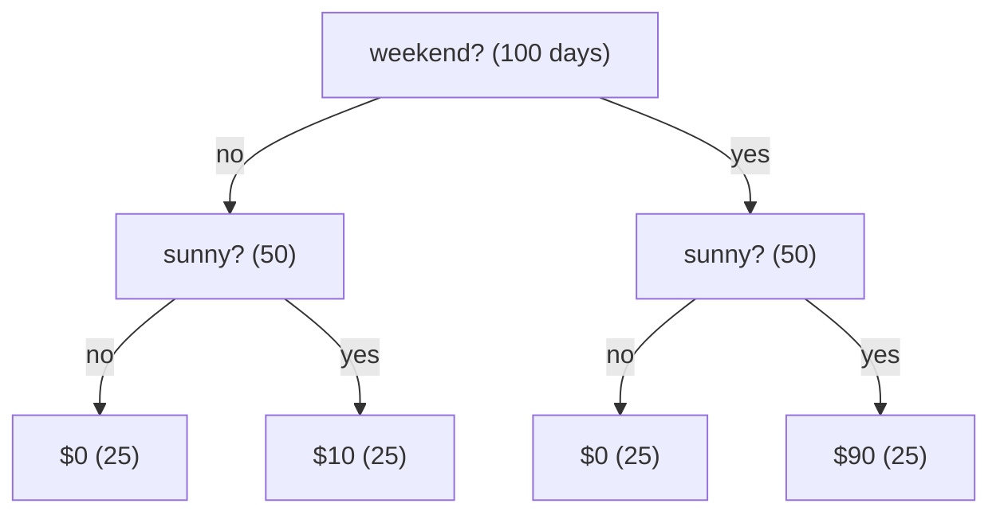
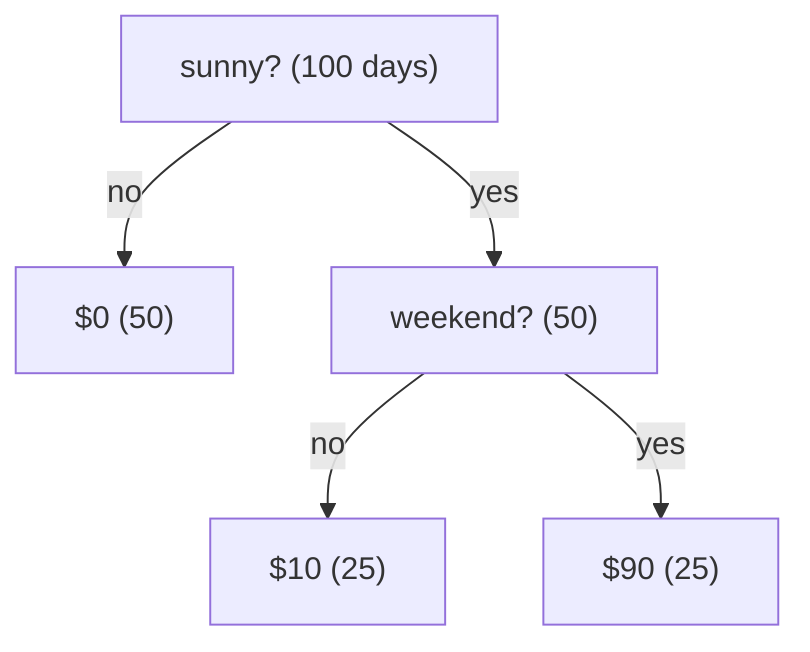

# 15. Explaining predictions: TreeSHAP

## The idea

Chapter 8 answers a global question: which features mattered to the model overall. This chapter answers the local one: which features moved *this* prediction, and by how much. The question arrives the moment a model faces a person. Why was this loan declined; why is this reading flagged; why did the forecast jump.

The obvious answers turn out to be broken in a specific, demonstrable way, and the fix has a name: SHAP. The paper behind it ([Lundberg et al., 2018](https://arxiv.org/abs/1802.03888)) is a famously hard read, so this chapter takes the long way: one tiny example, carried from the broken attributions to the exact algorithm, with every number small enough to check by hand. The example is also a unit test (`[guide15]` in [`tests/unit/test_shap.cpp`](../../tests/unit/test_shap.cpp)), so the tables below cannot silently drift from what the code computes.

## The stand: one example for the whole chapter

An ice-cream stand records its daily revenue. Two binary features: is it **sunny**, is it a **weekend**. The training data is 100 days, 25 in each of the four combinations. The stand's true behavior, which our model B captures exactly:

- Sunny weekend: revenue 90.
- Sunny weekday: revenue 10 (walk-in sales; sun always sells something).
- Not sunny: revenue 0, weekend or not.

We also keep a simpler model A (revenue 80 on sunny weekends, 0 otherwise) for one comparison later: B clearly *depends more on sunshine* than A, because in B sunshine pays even without the weekend.

Here is the trap this chapter is built around. The same model B can be grown as two different trees. One splits on weekend first, one splits on sunny first, and both compute identical predictions on every input:





Same function, same training days, two shapes. A trustworthy attribution must give the same answer for both, because the *model* is the same. Now watch two popular attributions fail exactly that test, on the day we care about: sunny and weekend, prediction 90.

### Reading an expectation off a tree

One piece of bookkeeping powers everything in this chapter. Every node remembers how many training days reached it during training; that count is its **cover**, and the diagrams above print it in parentheses (100 at the root, 50 at each side, 25 at each leaf). Like gain in chapter 8, cover is stamped at training time or it is gone.

Covers turn any node into an expected revenue. The rule: average the leaves below the node, each weighted by its share of the node's days. At the root of either tree, all four leaves are below:

```math
\frac{25 \times 0 + 25 \times 10 + 25 \times 0 + 25 \times 90}{100} = 25
```

Standing at the weekend-side node instead, only two leaves remain below, out of that node's 50 days:

```math
\frac{25 \times 0 + 25 \times 90}{50} = 45
```

So "the model's expectation, knowing it is a weekend" is 45 dollars, read straight off the tree. These two numbers are the first steps of the table below.

One honesty note about this example: the quadrants are deliberately equal (25 days each), so every weighted average above collapses to a plain mean and the arithmetic stays friendly. In a real tree the covers are uneven and the weights carry the information. If 40 of the 50 sunny days had been weekdays, the sunny-side expectation would be $(40 \times 10 + 10 \times 90) / 50 = 26$, not 50: same leaves, different weights, different expectation.

## Two attributions that fail

**Saabas attribution** (the pre-SHAP heuristic, named for its author) is the natural first idea: walk the day's path and credit each split with how much it moved the expected revenue. The root starts at the whole-data expectation, 25, computed above.

| tree shape | step 1 | step 2 | verdict |
|--|--|--|--|
| weekend first | 25 to 45: **weekend +20** | 45 to 90: **sunny +45** | sunny matters more |
| sunny first | 25 to 50: **sunny +25** | 50 to 90: **weekend +40** | weekend matters more |

Same model, same day, and the ranking flips with the tree shape. The flaw is structural: whichever feature splits *last* collects the interaction, because its step lands on the leaf.

**Gain** (chapter 8) fails the same test. Summing each split's variance reduction and taking shares of the total:

| tree shape | gain share, sunny | gain share, weekend | verdict |
|--|--:|--:|--|
| weekend first | 72% | 28% | sunny matters more |
| sunny first | 44% | 56% | weekend matters more |

Both attributions depend on an accident of tree growth. The property they lack has a name, **consistency**: for the same model (or one that relies *more* on a feature), the feature's attribution must not come out lower. Without consistency, comparing attributions between two models, or even two retrainings of one model, means nothing.

## The fix: ask every subset

The failure came from privileging one order of learning the features. The fix is to privilege none: ask what the model expects at *every state of knowledge about the day*, and average each feature's contribution over all of them.

A state of knowledge is a subset $S$ of features whose values we know. The model's expectation given $S$, written $v(S)$, is the expectation-reading rule from above, applied mid-walk. Descend from the root; at a split on a feature in $S$, follow the day's own value; at a split on a feature not in $S$, take both children, weighted by their covers:

```math
v_{\text{node}} = \frac{\text{cover}_{\text{left}}}{\text{cover}} \, v_{\text{left}} \;+\; \frac{\text{cover}_{\text{right}}}{\text{cover}} \, v_{\text{right}}
```

Knowing nothing gives the root computation from before (25); knowing only "weekend" walks one step then averages (45). For our sunny weekend day, all four subsets:

| known | how the walk goes | $v(S)$ |
|--|--|--:|
| nothing | average everything | 25 |
| weekend | weekend side, average over sunny | 45 |
| sunny | sunny side, average over weekend | 50 |
| sunny, weekend | the actual leaf | 90 |

Both tree shapes give these same four numbers, because $v(S)$ asks about the *function*, not the shape. Now attribute by marginal contribution, averaged over the orders in which the two features could become known:

| feature | learned first | learned second | average $\phi$ |
|--|--:|--:|--:|
| sunny | 50 − 25 = 25 | 90 − 45 = 45 | **35** |
| weekend | 45 − 25 = 20 | 90 − 50 = 40 | **30** |

Check three things in the numbers. **Shape-invariance**: both trees produce $\phi_{\text{sunny}} = 35$, $\phi_{\text{weekend}} = 30$; the flip is gone. **Efficiency**: 25 + 35 + 30 = 90; base rate plus contributions equals the prediction, exactly, in dollars. **Consistency**: on model A the same table gives 30 and 30; moving to B, which depends more on sunshine, raises sunny's share to 35. The attribution now tracks the function.

This averaging is the **Shapley value**. With $p$ features, a subset of size $|S|$ carries weight $\frac{|S|!\,(p-|S|-1)!}{p!}$, which is "average over all orderings" written as one sum. It deserves exactly one aside: the construction comes from game theory, where it is provably the *only* attribution with efficiency, consistency, and symmetry. For this chapter it is simply the average that treats every learning order equally.

## The naive algorithm and its wall

Everything above is already an algorithm, and bonsai ships it: [`tree_expected_value`](../../include/bonsai/shap.hpp) computes $v(S)$ for any subset by exactly the walk described. Enumerate the subsets, apply the weights, done. At $p = 2$ that was a four-row table.

The wall is the subset count: $2^p$. Chapter 14's superconductivity dataset has 81 features, so $2^{81} \approx 2.4 \times 10^{24}$ tree walks *per day, per tree*. At a nanosecond per walk that is roughly 77 million years for one explanation. bonsai does not simplify the naive algorithm away; it keeps it, in the open, as the reference the fast algorithm must match: `brute_force_shapley` in the test file enumerates it for small trees and demands agreement to 1e-9.

## TreeSHAP: the subsets collapse onto paths

The rescue observation: $v(S)$ never cared about most of $S$. Walking the tree, a feature only matters where it appears on the current path, and a path holds at most $D$ features. So walk each root-to-leaf path once, and carry just enough bookkeeping about the path features to know what *every* subset would have contributed. Three numbers per path feature:

- `one_fraction`: does the day's own value flow down this branch (1) or not (0)?
- `zero_fraction`: when the feature is *unknown*, what share of the background flows down (the cover ratio)?
- `pweight`: the accumulated Shapley weight mass for path prefixes of each size.

Here is the whole computation for the weekend-first tree and our sunny weekend day. Each row is the path state on arrival at a node; the bias entry is the seed:

| node reached | path state, one entry per (feature: zero, one, pweight) |
|--|--|
| root | (bias: 1, 1, 1.00) |
| weekend side | (bias: 1, 1, 0.25), (weekend: 0.5, 1, 0.50) |
| leaf $90 | (bias: 1, 1, 0.083), (weekend: 0.5, 1, 0.167), (sunny: 0.5, 1, 0.333) |
| leaf $10 | (bias: 1, 1, 0.083), (weekend: 0.5, **0**, 0.083), (sunny: 0.5, 1, 0) |

Each leaf pays every feature on its path: (weight from unwinding that feature) × (`one_fraction` − `zero_fraction`) × leaf value.

| leaf | pays sunny | pays weekend |
|--|--:|--:|
| $90 (sunny weekend) | +33.75 | +33.75 |
| $10 (sunny weekday) | +1.25 | **−3.75** |
| $0 leaves | 0 | 0 |
| **total** | **35** | **30** |

The same 35 and 30 as the subset table, from two paying leaves instead of four subset walks. The negative cell is the algorithm being smarter than it looks: learning it is a *weekend* rules out the walk-in-only outcome, so the weekday leaf counts *against* weekend. Zero-value leaves pay nothing, which is why the cost scales with leaves rather than subsets: $O(L \cdot D^2)$ per tree per day. The 81-feature dataset that needed $2.4 \times 10^{24}$ subset walks needs roughly 2,300 operations per tree.

Ensembles simply add: the Shapley value of a sum of trees is the sum of the per-tree values, so the booster loops and accumulates.

## In bonsai

The implementation is one small pair, and the trace above used its variable names on purpose: [`include/bonsai/shap.hpp`](../../include/bonsai/shap.hpp) (29 lines, the contract) and [`src/shap.cpp`](../../src/shap.cpp) (251 lines, Algorithm 2 of the paper).

- `PathElement` is one entry of the trace rows: `zero_fraction`, `one_fraction`, `pweight`. `extend` appends a split condition on the way down; `unwind` removes one so a leaf can ask what its payout would be without that feature; the payout line in `recurse` is the leaf formula above, verbatim.
- `hot_child` picks the branch the day actually follows, including the learned default branch for `NaN` (chapter 3), so missing values are attributed like any other routing.
- A feature appearing twice on a path is folded into one entry, and each branch works on a copy of the path, exactly as the paper's pseudocode duplicates it.
- One bonsai-specific guard: zero-cover branches are skipped rather than assumed away. Empty children exist here by construction (device partitioning keeps them as leaves, and oblivious trees expand with dead slots), and unwinding a zero-cover entry would divide zero by zero. The day's own branch still recurses whenever the row routes down it, which keeps efficiency exact even through a dead slot.
- Covers are the load-bearing data: every `zero_fraction` in the trace was a cover ratio. A model without per-node covers cannot answer $v(S)$, and `tree_shap` throws rather than guess. Same lesson as gain in chapter 8: stamp it at training time or it is gone.
- The surfaces: `pred_contribs(X)` returns `(n, p + 1)`, features plus bias, rows summing to raw predictions; multiclass returns per-class slices `(n, K, p + 1)` (chapter 12); oblivious models answer through their dense expansion.

The test story is the part worth copying into your own projects. [`tests/unit/test_shap.cpp`](../../tests/unit/test_shap.cpp) keeps the naive algorithm alive as `brute_force_shapley` and reconciles the fast path against it at 1e-9. The `[guide15]` case pins this chapter's example: both tree shapes, asserted equal, asserted to give 35, 30, and bias 25. Booster-level tests assert the efficiency identity, and multiclass slices must vote like `predict`. The algorithm is not trusted; it is reconciled against the definition it claims to compute.

## Try it

The chapter's example was hand-sized; here is the same machinery on data too big to hand-check, with the efficiency identity as the runtime proof.

```{.python .run}
import numpy as np
import bonsai

rng = np.random.default_rng(0)
n = 4000
X = rng.normal(size=(n, 5)).astype(np.float32)
y = (3.0 * np.sign(X[:, 0]) + X[:, 1] * X[:, 2]
     + 0.1 * rng.normal(size=n)).astype(np.float32)

m = bonsai.BonsaiRegressor(n_iters=150).fit(X, y)
phi = np.asarray(m.pred_contribs(X[:500]))
pred = np.asarray(m.predict(X[:500]))
print("phi shape:", phi.shape)
print("max |sum(phi) - prediction|:", f"{np.abs(phi.sum(axis=1) - pred).max():.2e}")
r = 0
print("row 0: x =", X[r].round(2))
print("row 0: phi =", phi[r, :-1].round(3), " bias =", round(float(phi[r, -1]), 3),
      " prediction =", round(float(pred[r]), 3))
global_shap = np.abs(phi[:, :-1]).mean(axis=0)
print("mean-abs-SHAP ranking:", np.argsort(global_shap)[::-1])
print("gain ranking         :", np.argsort(np.asarray(m.importance('gain')))[::-1])
print("corr(phi_1, x1*sign(x2)):",
      round(float(np.corrcoef(phi[:, 1], X[:500, 1] * np.sign(X[:500, 2]))[0, 1]), 3))
```

The identity holds to float precision (about 3e-06): every row's contributions plus bias reproduce its prediction. Row 0's explanation is legible, one dominant feature and noise. The global rankings from mean-absolute-SHAP and gain agree here; chapter 14 measured where they stop agreeing (on wide data, SHAP on validation rows was the better ranking). The last line is the ice-cream lesson on real data: feature 1's per-row credit tracks $x_1 \cdot \text{sign}(x_2)$ at correlation 0.8, because in a product term, whether $x_1$ helped or hurt depends on its partner, exactly like the weekday leaf counting against weekend.

## What to distrust

- **SHAP explains the model, not the world.** $\phi_f$ is the model's bookkeeping, not a causal effect. A feature standing in for a confounder gets the credit the confounder earned.
- **The background matters.** bonsai attributes the cover-weighted conditional expectation, the paper's path-dependent variant: unknown features average over where *training days actually went*. The `shap` package's default interventional variant answers against an explicit background dataset instead. Under correlated features the two disagree, and neither is wrong; they answer different counterfactuals.
- **Global SHAP is a sum of locals, priced accordingly.** Cost is $O(\text{rows} \times \text{trees} \times L D^2)$. For a global ranking a few hundred rows is usually plenty; chapter 14's `shap_val` used the validation slice, which is also the better-measured choice on wide data.
- **The efficiency identity is a free integrity check.** If `sum(phi)` drifts from the raw prediction by more than float noise, something upstream is wrong (a mismatched model file, a wrong objective transform). Assert it in pipelines; it costs one line.
