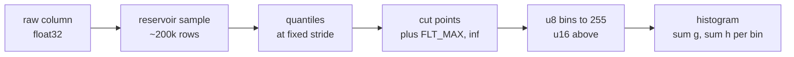

# 2. Binning & histograms

## The idea

To split a node you must ask, for every feature, "which threshold best
separates low residuals from high ones?" The exact answer requires sorting
every feature's values (expensive, repeatedly). The histogram trick answers
a slightly blurrier question much faster: discretize each feature into at
most ~255 quantile buckets **once**, up front; then a node's split search
is just "sum gradients into 255 cells, scan the cells". No sorting ever
again, and feature values shrink to one byte-ish integers that are kind to
caches.

The blur costs almost nothing: with 255 quantile bins, candidate
thresholds sit at every ~0.4th percentile of the feature. Splits between
them were statistically indistinguishable anyway, which is why XGBoost
(`tree_method=hist`), LightGBM, and CatBoost all default to this.

## The pipeline

A column travels the same five stages every fit, from raw floats to the
per-node histogram the split search scans:



Cuts are fit once, up front; the histogram is rebuilt per node.

## The math

Binning maps value to bucket via quantile cut points
$c_0 < c_1 < \cdots < c_{k-1}$: bin $b$ holds values in $(c_{b-1}, c_b]$
(right-inclusive). Per node and feature, the histogram accumulates
per-bin sums:

```math
\text{cell}[b] = \Big(\sum_i g_i,\; \sum_i h_i\Big)
\quad\text{over rows } i \text{ in the node with } \mathrm{bin}(x_i) = b
```

A candidate split "$\le b$" needs the left-side sums $G_L, H_L$ (a prefix
sum over cells), and the right side is $G - G_L$ by subtraction from the
node totals. One O(bins) scan scores every threshold of a feature
([chapter 3](3-finding-splits.md)).

**The subtraction trick**: when a node splits, its two children partition
its rows, so $\text{hist}(\text{parent}) = \text{hist}(\text{left}) +
\text{hist}(\text{right})$ cell-by-cell. Build the histogram only for the
*smaller* child and get the larger one free:
$\text{hist}(\text{large}) = \text{hist}(\text{parent}) -
\text{hist}(\text{small})$. Since the smaller child has at
most half the rows, this halves histogram work at every level: the single
most important optimization in histogram GBT.

## In bonsai

- **Fitting cuts**: [`BinMapper::fit`](../../src/bin_mapper.cpp):
  reservoir-sample the column, pull quantiles with `nth_element` at a
  fixed stride, deduplicate, append `+inf` as a sentinel. The **last bin
  is reserved for missing values** (NaN); a plain sentinel value can also
  be mapped to missing via `data.missing_sentinel`.
- **Binning**: [`Dataset::bin`](../../src/dataset.cpp): per feature,
  `transform` is a `lower_bound` over the cuts. Storage is column-major
  (`feature_bins(fid)` is contiguous) because histogram building walks one
  feature across many rows.
- **The histogram**: [`include/bonsai/histogram.hpp`](../../include/bonsai/histogram.hpp):
  a `vector<HistCell>{sum_grad, sum_hess}`. `add(bin, g, h)` is the entire
  hot loop body. Note what's *not* there: running totals. They used to be
  maintained per `add`, two redundant double-adds per row×feature,
  duplicated across every feature of the node, and were hoisted to a
  once-per-node cell sweep (`totals()`; decision 33).
- **Building per node**: `CpuHistogramEngine::populate_many` in
  [`src/grower.cpp`](../../src/grower.cpp), which picks one of two fills.
  u8 bins (the `max_bin ≤ 255` default) take the **row-wise fill**
  (`run_fill`, decision 49): row blocks stream a row-major mirror of the
  bins (`Dataset::row_major_bins`), reading each row's features as one
  contiguous strip (full cache lines at any node sparsity) into
  per-block partial histograms merged in fixed order. u16 bins keep the
  **feature-parallel fill** (`fill_feature_parallel`): one thread owns one
  feature's histogram and walks that column. Why two: the column walk
  reads `bins[rows[k]]` at random row offsets, which is fine when a node
  holds most rows and disastrous (one cache line per *byte* used) when a
  deep node's rows are sparse: the row-wise shape fixed a measured 5×
  dense-vs-sparse throughput gap ([chapter 9](9-parallelism-and-determinism.md)
  has the determinism price).
- **The subtraction trick**: `plan_level`/`build_children` route every
  split so only the *smaller* child is populated and the larger derives by
  cell-wise subtract with the parent's histograms *moved*, not copied
  ([`src/level_step.hpp`](../../src/level_step.hpp)); the CUDA engine runs
  the same plan with a subtract kernel on device histograms.

## Missing values

Every column reserves its last bin for NaN. That bin never enters the
threshold scan. Each split instead learns a `default_left` bit, the side
missing rows follow, chosen by whichever direction scores higher gain.
One tree can route NaN left at one node and right at another.

Finite values above the last real cut used to bin as missing. Training
routed them by `default_left`, but prediction sent them right of every
threshold, so the same row could route two ways. The
[missing-bin case](../learn/engine/2-the-missing-bin.md) closed that skew
(decisions 73 and 74).

## The Dataset API

Bin edges can also come from you, not from quantiles. Pass `bin_edges`
to `bonsai.Dataset` and the listed features bin at your cut points, which
then travel inside the saved model. A domain band like age brackets stays
identical from training to deployment, with no external transform to
drift:

```{.python .run}
import numpy as np
import bonsai

rng = np.random.default_rng(0)
n = 2000
age = rng.uniform(0.0, 100.0, n).astype(np.float32)
noise = rng.random((n, 2), dtype=np.float32)
X = np.column_stack([age, noise]).astype(np.float32)
band = np.digitize(age, [18.0, 65.0]).astype(np.float32)
y = (band * 2.0 + rng.normal(0, 0.05, n)).astype(np.float32)

# Column 0 bins at the two domain edges; the rest fit as usual.
ds = bonsai.Dataset(X, y, bin_edges={0: np.array([18.0, 65.0], dtype=np.float32)})
model = bonsai.train([("booster.n_iters", "30"), ("tree.max_depth", "4")], ds)

# The edges live in the model, so predict reads raw ages.
probe = np.array([[10.0, 0.5, 0.5], [40.0, 0.5, 0.5], [80.0, 0.5, 0.5]],
                 dtype=np.float32)
print(np.asarray(model.predict(probe)).round(2))
```

The bands are right-inclusive, so `18.0` bins with the group below it.
Edges must be finite and strictly increasing; bad columns and duplicates
raise a config error ([decision 73](../decisions.md)).

## Try it

Coarser bins trade split resolution for speed. Set `max_bin` low and
watch accuracy hold on smooth features:

```{.python .run}
import numpy as np
import bonsai

rng = np.random.default_rng(0)
X = rng.normal(size=(4000, 8)).astype(np.float32)
y = (X[:, 0] * 2.0 + X[:, 1] + rng.normal(0, 0.1, 4000)).astype(np.float32)

for max_bin in (32, 255):
    m = bonsai.BonsaiRegressor(n_iters=60, max_bin=max_bin).fit(X, y)
    rmse = float(np.sqrt(np.mean((np.asarray(m.predict(X)) - y) ** 2)))
    print(f"max_bin={max_bin:3d}  train RMSE={rmse:.4f}")
```

On California Housing, dropping 255 to 32 bins moves RMSE by well under 1%
for every library. Histogram scans get 8x shorter: the blur really is
cheap.

## Gotchas & war stories

- **The missing bin participates in every histogram** but is excluded from
  the threshold sweep; split scoring decides which side NaNs travel
  ([chapter 3](3-finding-splits.md)). Forgetting that the last bin is
  special is the classic off-by-one of this design.
- **Accumulate in double, store in float.** Cells are double pairs;
  gradients are float. Half a million float adds into a float accumulator
  loses real precision; into a double, it doesn't.
- **Row order = reproducibility.** FP addition isn't associative, so *the
  order rows enter `add` is part of the contract*. bonsai keeps each
  node's rows in ascending order (a stable split scatter), which is also
  why its histograms are bit-identical at any thread count.
