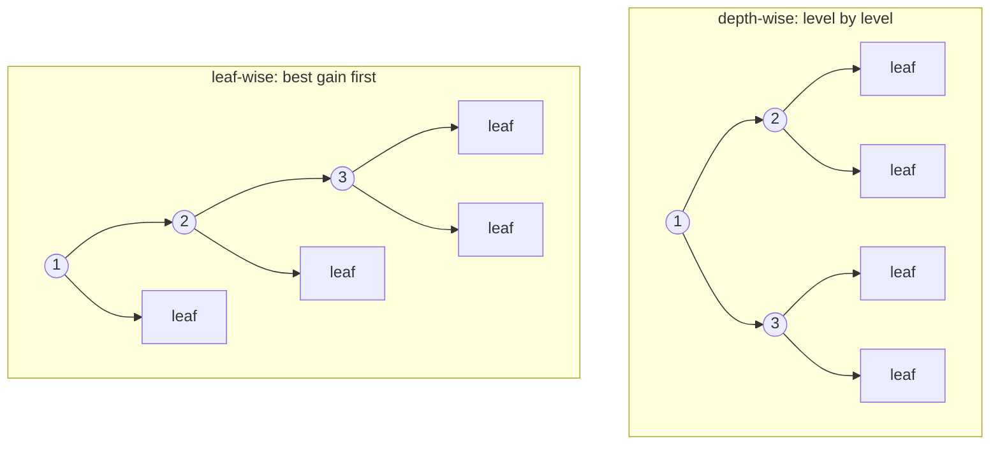
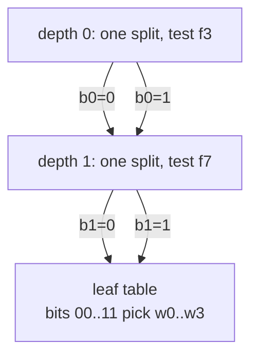

# 4. Growing trees

## The idea

Chapters 2–3 explain how to split *one* node. A grower decides **which
node to split next**, and that scheduling choice is most of what
distinguishes the three reference libraries:

- **Depth-wise** (XGBoost's default): split every node at depth `d`
  before touching depth `d+1`. Balanced trees, capped by `max_depth`.
- **Leaf-wise / best-first** (LightGBM's default): always split the single
  leaf (anywhere in the tree) whose best split has the highest gain.
  Deliberately *unbalanced*: for a fixed leaf budget (`max_leaves`), it
  drives training loss down fastest, at higher overfitting risk.
- **Oblivious / symmetric** (CatBoost): every node at a level shares *one*
  split. The tree is a perfect table (2^depth leaves indexed by a
  bitstring) which makes predict extremely fast and acts as a strong
  regularizer.

The growth order is the whole difference. Depth-wise fills a level before
the next; leaf-wise always expands the highest-gain leaf. The nodes below
carry their growth order, on the same split budget:



An oblivious tree spends one split per level, shared by every node on it.
The leaves become a flat table indexed by the path bits, which is why
predict is a branchless bit-gather:



## The math

There's no new math, only a queue discipline over the same gain scores:

```
depth-wise:  FIFO by level          — frontier is a vector, loop per depth
leaf-wise:   max-heap keyed on gain — pop best, split, push two children
oblivious:   argmax over the SUM of per-parent gains for one shared (feature, bin)
```

Leaf-wise's property worth internalizing: each expansion converts one leaf
into two (net +1), so `max_leaves` bounds the tree exactly, and the tree
is the greedy-optimal sequence of the first `max_leaves - 1` splits. A
depth-wise tree spends its budget evenly; a leaf-wise tree spends it where
gain lives.

## In bonsai

All three share every mechanism from chapters 2–3 (`make_root`,
`split_node`, `finalize_as_leaf`, the same split finders) and differ only
in their grow loop ([`src/grower.cpp`](../../src/grower.cpp)):

- `DepthwiseGrower::grow`: `current` / `next` frontier vectors,
  `update_nodes` splits or finalizes each node of a level, swap, repeat
  until `max_depth`.
- `LeafwiseGrower::grow`: a `std::vector<Candidate>` maintained with
  `std::push_heap`/`std::pop_heap` (chosen over `std::priority_queue`
  because `top()` returns const& and fights moving the histogram-heavy
  payload out). Gain is the key; ties break on lower node id so growth is
  deterministic. Stops at `max_leaves`, `max_depth`, or a drained heap.
  There's a full implementation walkthrough in
  [leafwise_grower.md](https://github.com/daniel-m-campos/bonsai/blob/main/docs/leafwise_grower.md), the guide this grower was
  actually built from.
- `ObliviousGrower::grow`: one shared split per level via the *level*
  finder (gain = sum of per-parent gains, see decision 30 for the
  fold-then-score mistake that summing per-parent fixes), children by
  index arithmetic, leaves in a $2^{\text{depth}}$ table.

Both node-splitting growers emit a `DenseTree` (flat node array); the
oblivious grower emits an `ObliviousTree` (level splits + leaf table),
[`include/bonsai/tree.hpp`](../../include/bonsai/tree.hpp). Selection is a
config string: `dispatch.grower_name = depthwise | leafwise | oblivious`.

## A second, orthogonal axis: the boosting scheme

Growth structure (*where splits go*) is only one of two axes. The other is
the **boosting scheme** (*how each row's gradient is computed*):

- **Plain** (every library's default at scale, and bonsai's only mode): row
  $i$'s gradient comes from the full current ensemble's prediction for row
  $i$, an ensemble that was trained on all rows, including $i$ itself.
- **Ordered** (CatBoost's small-data mode): row $i$'s gradient comes from a
  model trained only on the rows *before* $i$ in a random permutation, so
  the gradient never sees $i$'s own label. This removes a subtle bias
  CatBoost calls **prediction shift**, the same self-referential leak that
  [ordered target statistics](13-categorical-features.md) fix for
  categorical encodings, one level up.

The two axes are independent: any structure composes with any scheme.
CatBoost *bundles* oblivious trees with ordered boosting, but that is a
packaging choice, not a dependency: you can grow depth-wise trees with
ordered gradients, or oblivious trees with plain ones.

Seen this way, bonsai already spans the **structure** axis more widely than
either reference library, three growth disciplines to XGBoost's two
(depth/leaf) and CatBoost's one (oblivious). What it does not offer is the
ordered *scheme*. That was a measured decision, not an oversight: toggling
CatBoost's own `boosting_type` shows ordered boosting buys essentially zero
test r² on high-signal numeric data (0.8722 vs 0.8720 plain at 200k rows)
while costing ~7× the fit time, and CatBoost itself falls back to plain past
~50k rows. Prediction shift is real, but it bites on small, noisy, or
categorical problems: exactly where the target-statistics *encoder* already
applies the ordered fix without a core change. The full ladder that priced
this out is [decision 62–63](../decisions.md); the evidence is
[benchmarks/catboost-scale-edge-2026-07.md](../../benchmarks/catboost-scale-edge-2026-07.md).

## Try it

```{.python .run}
import numpy as np
import bonsai

rng = np.random.default_rng(0)
X = rng.normal(size=(4000, 10)).astype(np.float32)
y = (X[:, 0] + X[:, 1] * X[:, 2] + rng.normal(0, 0.1, 4000)).astype(np.float32)

for grower in ("depthwise", "leafwise", "oblivious"):
    m = bonsai.BonsaiRegressor(n_iters=60, grower=grower).fit(X, y)
    rmse = float(np.sqrt(np.mean((np.asarray(m.predict(X)) - y) ** 2)))
    print(f"{grower:10s}  train RMSE={rmse:.4f}")
```

Expect the ordering the benchmarks reproduce every time: leaf-wise is the
best accuracy-per-second (31 leaves ≈ depthwise-8's RMSE at half the
time), depth-wise squeezes out the last fraction of RMSE with 16× more
nodes, oblivious trades a little RMSE for the fastest predict.

## Gotchas & war stories

- **`max_leaves` vs `max_depth` govern different growers.** A leafwise
  config that only sets `max_depth=8` still stops at the default 31
  leaves: the budget, not the cap, is usually what binds.
- **Heap ties are a determinism hazard.** Equal gains happen (symmetric
  data produces them exactly); without the node-id tie-break, two runs
  could grow different trees and both look "correct".
- **The oblivious gain is a sum of per-parent gains, not the gain of
  summed histograms.** The score is quadratic in $G$, so folding histograms
  first computes the wrong thing. The original implementation did, and
  produced degenerate trees whose failure mode looked plausible enough to
  get rationalized (decision 30). The re-implementation matches CatBoost's
  per-leaf aggregation.
