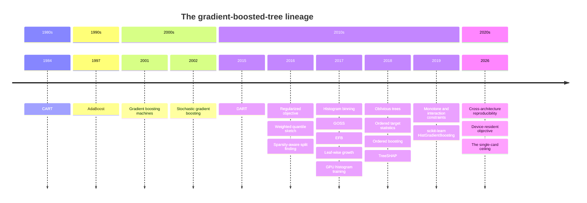

<!-- GENERATED by scripts/render_timeline.py from docs/learn/timeline.json. Edit the data file or the generator, not this page. -->

# How we got here

Gradient-boosted trees are the sum of forty years of small, sharp ideas. This page traces that lineage and marks where bonsai stands on each idea: adopted, adapted, declined, still open, or first done here.

This page supersedes the archived library notes for [XGBoost](../lineage/xgboost.md), [LightGBM](../lineage/lightgbm.md), and [CatBoost](../lineage/catboost.md).

The diagram sketches the timeline. The table below carries the detail, one row per idea. Each row links into the guide, the decisions log, or a design note for how bonsai handles that idea.

## The milestones

| Year | Idea | Carried by | bonsai |
|---|---|---|---|
| 1984 | **[CART](https://www.routledge.com/Classification-and-Regression-Trees/Breiman-Friedman-Stone-Olshen/p/book/9780412048418)**: Recursive binary splits, one prediction per leaf: the regression tree every booster still grows. *(Breiman, Friedman, Olshen, and Stone, 1984)* | XGBoost, LightGBM, CatBoost, bonsai | [adopted](../guide/0-a-tree-by-hand.md) |
| 1997 | **[AdaBoost](https://doi.org/10.1006/jcss.1997.1504)**: Combine many weak learners by reweighting the examples each one gets wrong. *(Freund and Schapire, JCSS 1997)* | none | [adapted](../guide/1-gradient-boosting.md) |
| 2001 | **[Gradient boosting machines](https://doi.org/10.1214/aos/1013203451)**: Fit each new tree to the gradient of the loss, so boosting becomes gradient descent in function space. *(Friedman, Annals of Statistics 2001)* | XGBoost, LightGBM, CatBoost, bonsai | [adopted](../guide/1-gradient-boosting.md) |
| 2002 | **[Stochastic gradient boosting](https://doi.org/10.1016/S0167-9473(01)00065-2)**: Subsample the rows before each tree, trading a little bias for lower variance and faster fits. *(Friedman, CSDA 2002)* | XGBoost, LightGBM, CatBoost, bonsai | [adopted](../guide/5-sampling.md) |
| 2015 | **[DART](https://arxiv.org/abs/1505.01866)**: Drop a random subset of existing trees before each round, borrowing dropout from neural networks. *(Rashmi and Gilad-Bachrach, AISTATS 2015)* | XGBoost, LightGBM, bonsai | [adopted](../guide/7-early-stopping-and-dart.md) |
| 2016 | **[Regularized objective](https://arxiv.org/abs/1603.02754)**: Score splits with a regularized second-order (Newton) objective and read leaf values from the same gradient and hessian sums. *(Chen and Guestrin, KDD 2016)* | XGBoost, LightGBM, CatBoost, bonsai | [adopted](../guide/3-finding-splits.md) |
| 2016 | **[Weighted quantile sketch](https://arxiv.org/abs/1603.02754)**: Propose split points from hessian-weighted quantiles, keeping approximate split finding accurate at scale. *(Chen and Guestrin, KDD 2016)* | XGBoost, bonsai | [adapted](../decisions.md#64-one-shared-row-sample-for-binning-not-one-reservoir-pass-per-feature-adopted) |
| 2016 | **[Sparsity-aware split finding](https://arxiv.org/abs/1603.02754)**: Learn one default branch direction per split in a single pass over the present values, for missing and implicitly-zero entries. *(Chen and Guestrin, KDD 2016)* | XGBoost | [declined](../guide/3-finding-splits.md) |
| 2017 | **[Histogram binning](https://proceedings.neurips.cc/paper/2017/hash/6449f44a102fde848669bdd9eb6b76fa-Abstract.html)**: Bucket each feature into a few hundred bins, so splits search over bins, not raw values. *(Ke et al., NeurIPS 2017)* | XGBoost, LightGBM, CatBoost, bonsai | [adopted](../guide/2-binning-and-histograms.md) |
| 2017 | **[GOSS](https://proceedings.neurips.cc/paper/2017/hash/6449f44a102fde848669bdd9eb6b76fa-Abstract.html)**: Keep every large-gradient row and subsample the rest, focusing the fit on the hard examples. *(Ke et al., NeurIPS 2017)* | LightGBM, bonsai | [adopted](../guide/5-sampling.md) |
| 2017 | **[EFB](https://proceedings.neurips.cc/paper/2017/hash/6449f44a102fde848669bdd9eb6b76fa-Abstract.html)**: Bundle mutually exclusive sparse features into one, shrinking the feature count with little accuracy loss. *(Ke et al., NeurIPS 2017)* | LightGBM | [declined](../lineage/lightgbm.md#not-yet-measured-efb) |
| 2017 | **[Leaf-wise growth](https://proceedings.neurips.cc/paper/2017/hash/6449f44a102fde848669bdd9eb6b76fa-Abstract.html)**: Grow the single highest-gain leaf next instead of a whole level, cutting loss faster per node. *(Ke et al. (LightGBM), NeurIPS 2017)* | XGBoost, LightGBM, bonsai | [adopted](../guide/4-growing-trees.md) |
| 2017 | **[GPU histogram training](https://doi.org/10.7717/peerj-cs.127)**: Build the split histograms on the GPU, moving the training bottleneck onto the device. *(Mitchell and Frank, PeerJ CS 2017)* | XGBoost, LightGBM, CatBoost, bonsai | [adopted](../guide/10-gpu-training.md) |
| 2018 | **[Oblivious trees](https://arxiv.org/abs/1706.09516)**: Use the same split across a whole tree level, giving symmetric trees and branch-free prediction. *(Prokhorenkova et al., NeurIPS 2018)* | CatBoost, bonsai | [adopted](../guide/4-growing-trees.md) |
| 2018 | **[Ordered target statistics](https://arxiv.org/abs/1706.09516)**: Encode a category by the target mean over only the rows seen before it, so the statistic cannot leak the label. *(Prokhorenkova et al., NeurIPS 2018)* | CatBoost, bonsai | [adapted](../decisions.md#58-categoricals-resolved-by-measurement-an-encoder-not-an-engine-feature-adopted) |
| 2018 | **[Ordered boosting](https://arxiv.org/abs/1706.09516)**: Score each row with a model trained without it, removing the target leakage of ordinary boosting. *(Prokhorenkova et al., NeurIPS 2018)* | CatBoost | [tbd](../decisions.md#80-the-categorical-reopener-predicate-is-established-the-build-decision-waits-for-launch-strategy-adopted) |
| 2018 | **[TreeSHAP](https://arxiv.org/abs/1802.03888)**: Compute exact Shapley feature attributions for a tree ensemble in polynomial time. *(Lundberg, Erion, and Lee, 2018)* | XGBoost, LightGBM, CatBoost, bonsai | [adopted](../guide/8-feature-importance.md) |
| 2019 | **Monotone and interaction constraints**: Constrain a feature's effect to one direction, or restrict which features may interact on a path. *(XGBoost and LightGBM engineering, circa 2019)* | XGBoost, LightGBM, bonsai | [adopted](../guide/6-regularization-and-constraints.md) |
| 2019 | **[scikit-learn HistGradientBoosting](https://scikit-learn.org/stable/modules/ensemble.html#histogram-based-gradient-boosting)**: Ship a histogram gradient-boosting estimator in the standard scikit-learn API. *(scikit-learn 0.21, 2019)* | bonsai | [adopted](../use/api-tour.md) |
| 2026 | **Cross-architecture reproducibility**: Produce byte-identical models across host architectures at a fixed thread count. *(bonsai, 2026 (decision 59))* | bonsai | [origin](../design/determinism.md) |
| 2026 | **Device-resident objective**: Derive each tree's gradients on the GPU and fuse leaf values into resident scores, deleting the per-tree host round-trip. *(bonsai, 2026 (decisions 77 to 79))* | bonsai | [origin](../decisions.md#77-the-device-resident-objective-the-per-tree-host-round-trip-deleted-adopted) |
| 2026 | **The single-card ceiling**: Measure how large a dataset one GPU trains end to end: a 500M by 100 float32 matrix on one 80GB card. *(bonsai, 2026)* | bonsai | [origin](../method/results.md#the-single-card-ceiling) |

## Status legend

| Status | Meaning |
|---|---|
| `adopted` | bonsai implements the idea. |
| `adapted` | bonsai carries the idea in a changed form. |
| `declined` | Measured or judged not worth the complexity, for now. |
| `tbd` | A named future campaign, not yet built. |
| `origin` | First done in bonsai. |

## About this page

The diagram and the table are generated from `docs/learn/timeline.json` by `scripts/render_timeline.py`, and CI fails on drift. Edit the data, not this page.
