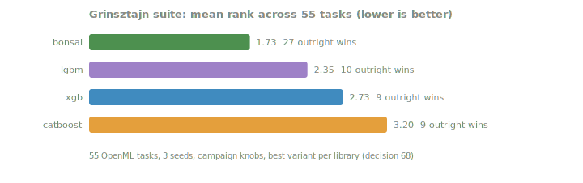
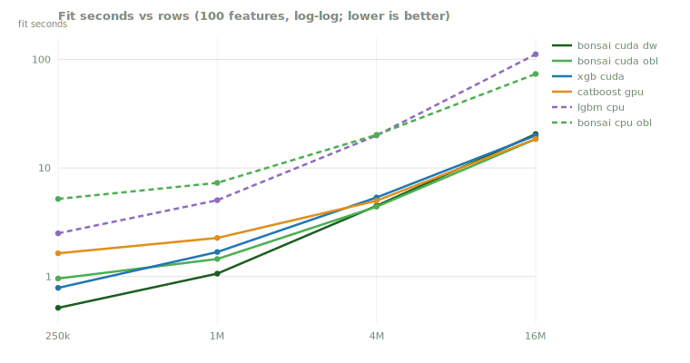
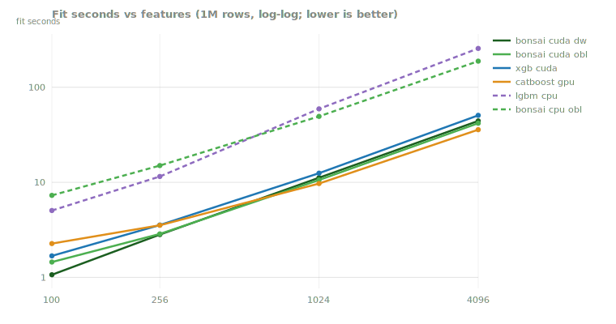
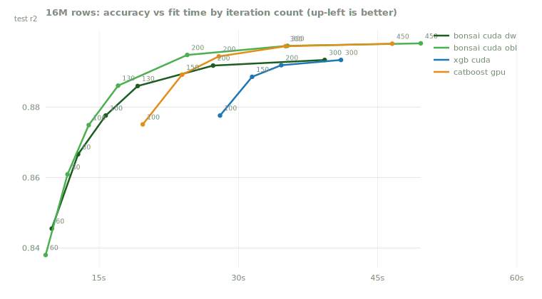
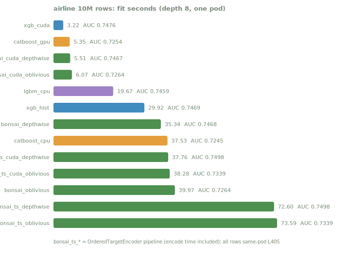

<!-- GENERATED by scripts/render_results.py. Edit the generator, not this page. -->

# The results ledger

Every committed data file under [`benchmarks/results/`](../../benchmarks/results) is rendered on this page, which is generated straight from the data: `python3 scripts/render_results.py` rewrites it and CI fails if the page drifts from the files. Rows are as-run records under the [benchmark protocol](benchmark-protocol.md): quality division numbers never cite timing, perf division numbers name their timing mode, and superseded files are deleted rather than kept beside their replacements, so what is here is the current evidence, whole.

## Quality division

### External standings: the Grinsztajn suite

The [Grinsztajn et al. tabular benchmark](https://arxiv.org/abs/2207.08815) at the paper-medium protocol: 55 OpenML tasks, three seeds, campaign knobs for every library (decision 68). Best variant per library, average rank across tasks, lower is better.

| library | mean rank | outright wins |
|---|---|---|
| bonsai | 1.44 | 36 |
| lgbm | 2.51 | 5 |
| xgb | 2.84 | 6 |
| catboost | 3.22 | 8 |

Per-suite mean rank:

| library | cat_clf | cat_reg | num_clf | num_reg |
|---|---|---|---|---|
| bonsai | 1.29 | 1.46 | 1.67 | 1.30 |
| lgbm | 2.29 | 2.77 | 2.47 | 2.45 |
| xgb | 3.57 | 2.54 | 2.87 | 2.75 |
| catboost | 2.86 | 3.23 | 3.00 | 3.50 |

Sensitivity: xgboost's campaign mapping sets `min_child_weight=20` (hessian-weighted, the knob-translation bracket recorded in decision 68); replacing its rows with the `min_child_weight=1` run gives the other end of the bracket:

| library | mean rank | outright wins |
|---|---|---|
| bonsai | 1.78 | 18 |
| xgb | 2.18 | 23 |
| lgbm | 2.69 | 6 |
| catboost | 3.35 | 8 |

Reproduce: `pip install bonsai-gbt[bench]`, then `python -m bonsai.bench.grinsztajn out.jsonl --report`.

*Source: [`grinsztajn-2026-07.jsonl`](../../benchmarks/results/grinsztajn-2026-07.jsonl), [`grinsztajn-2026-07-xgb-mcw1.jsonl`](../../benchmarks/results/grinsztajn-2026-07-xgb-mcw1.jsonl). As-run; evidence narrative in [benchmarks/grinsztajn-2026-07.md](../../benchmarks/grinsztajn-2026-07.md), ruling in decision 68.*

### Campaign smoke: ten datasets at matched knobs

The internal quality campaign (`scripts/compare.py`, campaign knobs, best variant per library, latest run per dataset):

| dataset | metric | bonsai | xgboost | lightgbm | catboost | best |
|---|---|---|---|---|---|---|
| f_electricity | auc | 0.9458 | 0.9353 | 0.9441 | 0.9178 | bonsai |
| f_elevators | rmse | 0.0023 | 0.0024 | 0.0023 | 0.0026 | bonsai |
| f_house_sales | rmse | 131655.8118 | 121828.8445 | 122212.9584 | 124094.5336 | xgboost |
| f_letter | acc | 0.9613 | 0.9240 | 0.9610 | 0.9223 | bonsai |
| f_magic_telescope | auc | 0.9360 | 0.9330 | 0.9352 | 0.9335 | bonsai |
| f_phoneme | auc | 0.9435 | 0.9283 | 0.9379 | 0.9396 | bonsai |
| f_satimage | acc | 0.9191 | 0.9012 | 0.9191 | 0.9059 | bonsai |
| f_superconduct | rmse | 10.3519 | 10.7637 | 10.7227 | 12.1154 | bonsai |
| f_wine_quality | rmse | 0.6335 | 0.6385 | 0.6386 | 0.6505 | bonsai |
| g_electricity | auc | 0.9482 | 0.9353 | 0.9441 | 0.9178 | bonsai |
| g_elevators | rmse | 0.0023 | 0.0024 | 0.0023 | 0.0026 | bonsai |
| g_house_sales | rmse | 125913.9209 | 121828.8445 | 122212.9584 | 124094.5336 | xgboost |
| g_letter | acc | 0.9613 | 0.9240 | 0.9610 | 0.9223 | bonsai |
| g_magic_telescope | auc | 0.9352 | 0.9330 | 0.9352 | 0.9335 | lightgbm |
| g_phoneme | auc | 0.9401 | 0.9283 | 0.9379 | 0.9396 | bonsai |
| g_satimage | acc | 0.9191 | 0.9012 | 0.9191 | 0.9059 | bonsai |
| g_superconduct | rmse | 10.3959 | 10.7637 | 10.7227 | 12.1154 | bonsai |
| g_wine_quality | rmse | 0.6373 | 0.6385 | 0.6386 | 0.6505 | bonsai |
| h_electricity | auc | 0.9482 | 0.9353 | 0.9441 | 0.9178 | bonsai |
| h_house_sales | rmse | 126530.7992 | 121828.8445 | 122212.9584 | 124094.5336 | xgboost |
| h_magic_telescope | auc | 0.9349 | 0.9330 | 0.9352 | 0.9335 | lightgbm |
| h_phoneme | auc | 0.9392 | 0.9283 | 0.9379 | 0.9396 | catboost |
| h_superconduct | rmse | 10.4083 | 10.7637 | 10.7227 | 12.1154 | bonsai |
| h_wine_quality | rmse | 0.6374 | 0.6385 | 0.6386 | 0.6505 | bonsai |
| i_electricity | auc | 0.9457 | 0.9353 | 0.9441 | 0.9178 | bonsai |
| i_elevators | rmse | 0.0023 | 0.0024 | 0.0023 | 0.0026 | bonsai |
| i_house_sales | rmse | 126447.7670 | 121828.8445 | 122212.9584 | 124094.5336 | xgboost |
| i_letter | acc | 0.9613 | 0.9240 | 0.9610 | 0.9223 | bonsai |
| i_magic_telescope | auc | 0.9356 | 0.9330 | 0.9352 | 0.9335 | bonsai |
| i_phoneme | auc | 0.9415 | 0.9283 | 0.9379 | 0.9396 | bonsai |
| i_satimage | acc | 0.9191 | 0.9012 | 0.9191 | 0.9059 | bonsai |
| i_superconduct | rmse | 10.3959 | 10.7637 | 10.7227 | 12.1154 | bonsai |
| i_wine_quality | rmse | 0.6373 | 0.6385 | 0.6386 | 0.6505 | bonsai |
| j_bike_sharing | rmse | 39.9162 | 53.8279 | 49.2892 | 45.0404 | bonsai |
| p63_house_mb1023 | rmse | 121942.8335 | 122749.8611 | 122570.7576 | 124094.5336 | bonsai |
| p63_house_mb511 | rmse | 121958.5113 | 119517.0121 | 121831.7427 | 124094.5336 | xgboost |
| p_elev_obl_h0 | rmse | 0.0026 | 0.0024 | 0.0023 | 0.0026 | lightgbm |
| p_house_bins | rmse | 118305.3912 | 122749.8611 | 122570.7576 | 124094.5336 | bonsai |
| p_house_depth | rmse | 132789.1247 | 121067.0042 | 121998.2617 | 121420.6540 | xgboost |
| p_house_iters | rmse | 127481.7850 | 117281.9561 | 117400.1156 | 115253.0073 | catboost |
| p_house_leaf | rmse | 134131.8513 | 121521.4630 | 124794.2564 | 124094.5336 | xgboost |
| p_letter_iters | acc | 0.9613 | 0.9415 | 0.9683 | 0.0387 | lightgbm |
| p_letter_lr2 | acc | 0.9620 | 0.9397 | 0.9673 | 0.0387 | lightgbm |
| p_super_obl_h0 | rmse | 11.8523 | 10.7637 | 10.7227 | 12.1154 | lightgbm |
| q_bike_sharing_mse | rmse | 41.1407 | 44.4491 | 42.0133 | 48.5028 | bonsai |
| q_electricity | auc | 0.9481 | 0.9353 | 0.9441 | 0.8262 | bonsai |
| q_elevators | rmse | 0.0023 | 0.0024 | 0.0023 | 0.0026 | bonsai |
| q_elevators_huber | rmse | 0.0023 | 0.0024 | 0.0023 | 0.0026 | lightgbm |
| q_elevators_mae | rmse | 0.0027 | 0.0029 | 0.0028 | 0.0031 | bonsai |
| q_elevators_quantile | rmse | 0.0027 | 0.0028 | 0.0028 | 0.0031 | bonsai |
| q_house_sales | rmse | 130746.3931 | 121828.8445 | 122212.9584 | 124094.5336 | lightgbm (goss) |
| q_house_sales_huber | rmse | 140605.7902 | 17289465332.0396 | 373651.6657 | 622692.1388 | bonsai |
| q_house_sales_mae | rmse | 135709.1681 | 138279.3358 | 139079.4959 | 143292.1296 | bonsai |
| q_house_sales_quantile | rmse | 137926.7874 | 136812.5461 | 137758.5501 | 143292.1296 | xgboost |
| q_letter | acc | 0.9555 | 0.9240 | 0.9610 | 0.0387 | lightgbm (goss) |
| q_phoneme | auc | 0.9435 | 0.9283 | 0.9379 | 0.8417 | bonsai |
| q_satimage | acc | 0.9199 | 0.9012 | 0.9191 | 0.1851 | bonsai |
| q_smoke_mae | rmse | 0.6833 | 0.6877 | 0.6859 | 0.6844 | bonsai |
| q_superconduct | rmse | 10.3668 | 10.7637 | 10.7227 | 12.1154 | bonsai |
| q_superconduct_huber | rmse | 11.2496 | 12.8570 | 27.5366 | 14.0227 | bonsai |
| q_superconduct_mae | rmse | 11.6526 | 12.1975 | 11.9220 | 13.4911 | bonsai |
| q_superconduct_quantile | rmse | 11.6092 | 12.1112 | 12.0634 | 13.4911 | bonsai |
| q_wine_quality | rmse | 0.6315 | 0.6385 | 0.6386 | 0.6505 | bonsai |
| q_wine_quality_huber | rmse | 0.6317 | 170.0988 | 0.6406 | 12.9831 | bonsai |
| q_wine_quality_mae | rmse | 0.6833 | 0.6877 | 0.6859 | 0.6844 | bonsai |
| q_wine_quality_quantile | rmse | 0.7081 | 0.6897 | 0.7761 | 0.6844 | catboost |
| v_elevators_60 | rmse | 0.0026 | 0.0024 | 0.0023 | 0.0026 | lightgbm |
| v_elevators_61 | rmse | 0.0023 | 0.0024 | 0.0023 | 0.0026 | bonsai |
| v_house_sales_60 | rmse | 137968.7153 | 121828.8445 | 122212.9584 | 124094.5336 | xgboost |
| v_house_sales_61 | rmse | 131841.3646 | 121828.8445 | 122212.9584 | 124094.5336 | xgboost |
| v_letter_59 | acc | 0.9515 | 0.9240 | 0.9610 | 0.9223 | lightgbm |
| v_letter_62 | acc | 0.9613 | 0.9240 | 0.9610 | 0.9223 | bonsai |
| v_satimage_62 | acc | 0.9191 | 0.9012 | 0.9191 | 0.9059 | bonsai |
| v_superconduct_60 | rmse | 11.8523 | 10.7637 | 10.7227 | 12.1154 | lightgbm |
| v_superconduct_61 | rmse | 10.3519 | 10.7637 | 10.7227 | 12.1154 | bonsai |
| v_wine_quality_61 | rmse | 0.6335 | 0.6385 | 0.6386 | 0.6505 | bonsai |

*Source: [`quality-campaign-2026-07.jsonl`](../../benchmarks/results/quality-campaign-2026-07.jsonl). Aggregate record; narrative in [benchmarks/quality-campaign-2026-07.md](../../benchmarks/quality-campaign-2026-07.md), decisions 56 and 57.*

### Probe: per-feature bin budgets (declined, decision 67)

Test r² under per-feature bin-budget policies at a 255-bin default; no policy moved standings outside the chance band.

| dataset | bonsai_uniform255 | bonsai_importance | bonsai_inverse | bonsai_headroom | lgbm_uniform255 | lgbm_importance | xgb_uniform255 |
|---|---|---|---|---|---|---|---|
| adult | 0.9298 | 0.9286 | 0.9171 | 0.9285 | 0.9302 | 0.9302 | 0.9303 |
| california | 0.8260 | 0.8272 | 0.8274 | 0.8277 | 0.8289 | 0.8289 | 0.8275 |
| kick | 0.7830 | 0.7734 | 0.7638 | 0.7727 | 0.7846 | 0.7822 | 0.7851 |
| synth_20of100 | 0.8694 | 0.8698 | 0.7858 | 0.8705 | 0.8694 | 0.8703 | 0.8700 |
| year_msd | 0.3012 | 0.3000 | 0.2970 | 0.3009 | 0.3006 | 0.3011 | 0.3002 |

*Source: [`binning-probe-2026-07.json`](../../benchmarks/results/binning-probe-2026-07.json). Probe: [scripts/probe_binning.py](../../scripts/probe_binning.py); evidence [benchmarks/binning-tradeoff-2026-07.md](../../benchmarks/binning-tradeoff-2026-07.md).*

### Probe: categorical machinery (resolved as an encoder, decision 58)

AUC by setup: each reference library's own categorical toggle against ordinal codes, and bonsai's ordered-target-statistics preprocessing.

| setup | adult | amazon | kick |
|---|---|---|---|
| bonsai_ordinal | 0.9300 | 0.8307 | 0.7830 |
| bonsai_ts4_a10 | 0.9303 | 0.8512 | 0.7771 |
| bonsai_ts_a1 | 0.9306 | 0.8502 | 0.7774 |
| bonsai_ts_a10 | 0.9303 | 0.8536 | 0.7792 |
| bonsai_ts_plus_code | 0.9303 | 0.8590 | 0.7797 |
| catboost_native | 0.9283 | 0.8894 | 0.7777 |
| catboost_ordinal | 0.9269 | 0.7791 | 0.7740 |
| lgbm_native | 0.9303 | 0.8572 | 0.7666 |
| lgbm_ordinal | 0.9302 | 0.8278 | 0.7846 |
| xgb_native | 0.9283 | 0.7878 | 0.7791 |
| xgb_ordinal | 0.9276 | 0.8052 | 0.7827 |

*Source: [`cat-tradeoff-2026-07.json`](../../benchmarks/results/cat-tradeoff-2026-07.json). Probe: [scripts/probe_categorical.py](../../scripts/probe_categorical.py); evidence [benchmarks/categorical-tradeoff-2026-07.md](../../benchmarks/categorical-tradeoff-2026-07.md).*

### Probe: ranking objectives (gated, issue #58)

NDCG@10 by regime; the stable gap is to listwise losses only, so issue #58 is scoped listwise-first.

| learner | graded (NDCG@10) | mq2008 (NDCG@10) | search (NDCG@10) |
|---|---|---|---|
| bonsai_regression | 0.6623 | 0.7720 | 0.3028 |
| lgbm_regression | 0.6653 | 0.7714 | 0.2972 |
| lgbm_lambdarank | 0.6601 | 0.7662 | 0.3023 |
| xgb_rank_ndcg | 0.6673 | 0.7866 | 0.3084 |
| catboost_yetirank | 0.6679 | 0.7746 | 0.3132 |

*Source: [`ranking-tradeoff-2026-07.jsonl`](../../benchmarks/results/ranking-tradeoff-2026-07.jsonl). Probe: [scripts/probe_ranking.py](../../scripts/probe_ranking.py); evidence [benchmarks/ranking-tradeoff-2026-07.md](../../benchmarks/ranking-tradeoff-2026-07.md).*

## Perf division

### The re-baseline: fit seconds at scale

Same-pod sweep (AMD EPYC 9554 64-Core Processor, NVIDIA L40S), synthetic regression, `fit()` timed end to end including each library's own ingest, best of repeats, test r² in parentheses.

Scaling rows (100 features):

| rows | bonsai cuda dw | bonsai cuda obl | xgb cuda | catboost gpu | lgbm cpu | bonsai cpu obl |
|---|---|---|---|---|---|---|
| 250k | 0.5s (.871) | 1.0s (.875) | 0.8s (.872) | 1.6s (.875) | 2.5s (.872) | 5.2s (.875) |
| 1M | 1.1s (.876) | 1.4s (.876) | 1.7s (.876) | 2.3s (.876) | 5.0s (.877) | 7.3s (.876) |
| 4M | 4.5s (.878) | 4.4s (.875) | 5.3s (.878) | 5.0s (.877) | 19.9s (.879) | 20.2s (.875) |
| 16M | 20.5s (.879) | 18.4s (.876) | 19.9s (.880) | 18.5s (.876) | 111.3s (.879) | 73.3s (.876) |

Scaling features (1M rows):

| cols | bonsai cuda dw | bonsai cuda obl | xgb cuda | catboost gpu | lgbm cpu | bonsai cpu obl |
|---|---|---|---|---|---|---|
| 100 | 1.1s (.876) | 1.4s (.876) | 1.7s (.876) | 2.3s (.876) | 5.0s (.877) | 7.3s (.876) |
| 256 | 2.8s (.876) | 2.9s (.876) | 3.6s (.876) | 3.5s (.876) | 11.5s (.876) | 15.0s (.876) |
| 1024 | 11.2s (.876) | 10.6s (.876) | 12.5s (.876) | 9.7s (.875) | 59.2s (.876) | 49.3s (.876) |
| 4096 | 44.2s (.875) | 41.9s (.875) | 50.6s (.876) | 35.8s (.874) | 256.2s (.875) | 188.1s (.875) |

*Source: [`rebaseline-2026-07.jsonl`](../../benchmarks/results/rebaseline-2026-07.jsonl). Runner: [scripts/bench_scaling.py](../../scripts/bench_scaling.py) (`python -m bonsai.bench.scaling`); README Performance derives from the same file.*

### The scaling study

964 runs across 7 hosts and the axes base, bins, cols, rows; regenerate exponents and the committed log-log plots under [`benchmarks/results/scaling/`](../../benchmarks/results/scaling) with [scripts/analyze_scaling.py](../../scripts/analyze_scaling.py).

*Source: [`scaling.jsonl`](../../benchmarks/results/scaling.jsonl). The full-history perf ledger behind [benchmarks/README.md](../../benchmarks/README.md); decision 46.*

### GPU year-MSD track

Latest run per device on the YearPredictionMSD pipeline benchmark (full history in the file):

| GPU | as of | fit_s | predict_s | rmse |
|---|---|---|---|---|
| NVIDIA A100-SXM4-80GB | 2026-07-04 | 5.01 | 2.08 | 8.9911 |
| NVIDIA GeForce RTX 5090 | 2026-07-07 | 2.91 | 2.92 | 8.9911 |
| Orin (nvgpu) | 2026-07-04 | 52.21 | 0.89 | 8.9911 |

*Source: [`gpu_msd.jsonl`](../../benchmarks/results/gpu_msd.jsonl). Runner: [scripts/bench_gpu.py](../../scripts/bench_gpu.py); pipeline timing mode.*

### CPU 16M round (the prefetch tie)

| rows | bonsai_depthwise | xgb_hist |
|---|---|---|
| 250,000 | 6.7s (.871) | 3.2s (.871) |
| 1,000,000 | 9.3s (.876) | 5.5s (.876) |
| 4,000,000 | 24.3s (.878) | 19.5s (.878) |
| 16,000,000 | 75.8s (.879) | 75.7s (.880) |

*Source: [`cpu-prefetch-round-2026-07.jsonl`](../../benchmarks/results/cpu-prefetch-round-2026-07.jsonl). Decision 61: software prefetch closed the 16M CPU gap to xgboost-hist on this pod.*

### GPU accuracy-vs-time frontier at 16M

| variant | iters | fit_s | test r2 |
|---|---|---|---|
| bonsai_cuda_depthwise | 60 | 7.73 | 0.8459 |
| bonsai_cuda_depthwise | 80 | 9.70 | 0.8669 |
| bonsai_cuda_depthwise | 100 | 11.65 | 0.8777 |
| bonsai_cuda_depthwise | 130 | 14.48 | 0.8859 |
| bonsai_cuda_depthwise | 200 | 20.81 | 0.8918 |
| bonsai_cuda_depthwise | 300 | 28.76 | 0.8934 |
| bonsai_cuda_oblivious | 60 | 7.04 | 0.8386 |
| bonsai_cuda_oblivious | 80 | 8.65 | 0.8613 |
| bonsai_cuda_oblivious | 100 | 10.16 | 0.8743 |
| bonsai_cuda_oblivious | 130 | 12.45 | 0.8852 |
| bonsai_cuda_oblivious | 200 | 17.13 | 0.8946 |
| bonsai_cuda_oblivious | 300 | 23.36 | 0.8973 |
| bonsai_cuda_oblivious | 450 | 31.93 | 0.8979 |
| xgb_cuda | 100 | 26.31 | 0.8776 |
| xgb_cuda | 150 | 29.09 | 0.8886 |
| xgb_cuda | 200 | 33.15 | 0.8919 |
| xgb_cuda | 300 | 38.04 | 0.8934 |
| catboost_gpu | 100 | 18.96 | 0.8751 |
| catboost_gpu | 150 | 23.60 | 0.8901 |
| catboost_gpu | 200 | 27.54 | 0.8944 |
| catboost_gpu | 300 | 35.02 | 0.8973 |
| catboost_gpu | 450 | 46.43 | 0.8980 |

*Source: [`gpu-pareto-16M-2026-07.jsonl`](../../benchmarks/results/gpu-pareto-16M-2026-07.jsonl). Post-resident-objective re-run (2026-07-18, decision 78): bonsai is first to every measured accuracy at every horizon; the marginal round fell 104 to 64 ms, below catboost's 78 on the same pod, and the last crossover is gone. Evidence: [benchmarks/gpu-pareto-16M-2026-07.md](../../benchmarks/gpu-pareto-16M-2026-07.md).*

### Ordered boosting at scale (catboost door)

The probe behind decisions 62 to 64: catboost's Ordered vs Plain modes against bonsai oblivious as rows grow.

| door | rows | learner | knob | fit_s | test r2 |
|---|---|---|---|---|---|
| ordered | 200,000 | catboost_ordered | iters=100 | 17.06 | 0.8722 |
| ordered | 200,000 | catboost_plain | iters=100 | 2.51 | 0.8720 |
| ordered | 200,000 | bonsai_oblivious | iters=100 | 3.91 | 0.8747 |
| ordered | 200,000 | catboost_ordered | iters=200 | 30.59 | 0.8932 |
| ordered | 200,000 | catboost_plain | iters=200 | 4.66 | 0.8937 |
| ordered | 200,000 | bonsai_oblivious | iters=200 | 7.30 | 0.8940 |
| ordered | 1,000,000 | catboost_ordered | iters=100 | 63.22 | 0.8754 |
| ordered | 1,000,000 | catboost_plain | iters=100 | 8.36 | 0.8760 |
| ordered | 1,000,000 | bonsai_oblivious | iters=100 | 9.98 | 0.8766 |
| bins | 1,000,000 | catboost_plain | bin samples=None | 8.01 | 0.8760 |
| bins | 1,000,000 | bonsai_oblivious | bin samples=200000 | 9.76 | 0.8766 |
| bins | 1,000,000 | bonsai_oblivious | bin samples=1000000 | 9.98 | 0.8766 |
| bins | 4,000,000 | catboost_plain | bin samples=None | 36.73 | 0.8762 |
| bins | 4,000,000 | bonsai_oblivious | bin samples=200000 | 34.36 | 0.8763 |
| bins | 4,000,000 | bonsai_oblivious | bin samples=1000000 | 35.40 | 0.8766 |
| bins | 4,000,000 | bonsai_oblivious | bin samples=4000000 | 36.62 | 0.8764 |
| isolate | 16,000,000 | catboost_plain_cpu | - | 157.67 | 0.8744 |
| isolate | 16,000,000 | bonsai_oblivious_cpu | - | 171.75 | 0.8749 |
| isolate | 16,000,000 | bonsai_depthwise_cpu | - | 151.93 | 0.8782 |
| gpu | 16,000,000 | bonsai_cuda_oblivious_prefix | iters=100 | - | 0.8638 |
| gpu | 16,000,000 | bonsai_cuda_oblivious_fixed | iters=100 | 29.21 | 0.8749 |
| gpu | 16,000,000 | bonsai_cuda_oblivious_fixed | iters=160 | 41.03 | 0.8913 |
| gpu | 16,000,000 | bonsai_cuda_depthwise | iters=100 | 30.37 | 0.8776 |
| gpu | 16,000,000 | catboost_gpu | iters=100 | 23.81 | 0.8751 |
| gpu | 16,000,000 | catboost_gpu | iters=150 | 28.37 | 0.8892 |
| gpu | 16,000,000 | catboost_gpu | iters=200 | 32.19 | 0.8944 |

*Source: [`catboost-scale-edge-2026-07.jsonl`](../../benchmarks/results/catboost-scale-edge-2026-07.jsonl). Evidence: [benchmarks/catboost-scale-edge-2026-07.md](../../benchmarks/catboost-scale-edge-2026-07.md).*

## Airline delays: the real-data speed ladder

The benchm-ml airline ladder (0.1M/1M/10M rows, mixed categorical/numeric, AUC), both the campaign knob shape and Pafka's depth-10 protocol, all rows one pod. `bonsai_ts_*` rows are the labeled exception to the uniform ordinal-code convention (OrderedTargetEncoder pipeline; `fit_s` includes the encode).

**campaign knobs (depth 8)**, fit seconds / test AUC:

| variant | 0.1m | 1m | 10m |
|---|---|---|---|
| bonsai_depthwise | 2.6s / 0.7260 | 7.0s / 0.7447 | 35.3s / 0.7468 |
| bonsai_oblivious | 1.6s / 0.7218 | 5.2s / 0.7256 | 40.0s / 0.7264 |
| bonsai_cuda_depthwise | 0.3s / 0.7268 | 0.8s / 0.7447 | 5.5s / 0.7467 |
| bonsai_cuda_oblivious | 0.9s / 0.7218 | 1.4s / 0.7253 | 6.1s / 0.7264 |
| bonsai_ts_depthwise | 2.8s / 0.7238 | 9.5s / 0.7462 | 72.6s / 0.7498 |
| bonsai_ts_oblivious | 2.7s / 0.7247 | 8.9s / 0.7326 | 73.6s / 0.7339 |
| bonsai_ts_cuda_depthwise | 0.5s / 0.7239 | 3.1s / 0.7460 | 37.8s / 0.7498 |
| bonsai_ts_cuda_oblivious | 1.1s / 0.7247 | 3.6s / 0.7326 | 38.3s / 0.7339 |
| xgb_hist | 0.9s / 0.7264 | 3.6s / 0.7429 | 29.9s / 0.7469 |
| xgb_cuda | 0.2s / 0.7257 | 0.6s / 0.7438 | 3.2s / 0.7476 |
| lgbm_cpu | 1.7s / 0.7264 | 4.2s / 0.7448 | 19.7s / 0.7459 |
| catboost_cpu | 1.0s / 0.7167 | 5.7s / 0.7234 | 37.5s / 0.7245 |
| catboost_gpu | 0.5s / 0.7167 | 0.8s / 0.7229 | 5.4s / 0.7254 |

**Pafka protocol (depth 10)**, fit seconds / test AUC:

| variant | 0.1m | 1m | 10m |
|---|---|---|---|
| bonsai_depthwise | 3.1s / 0.7242 | 12.2s / 0.7547 | 47.8s / 0.7596 |
| bonsai_oblivious | 4.0s / 0.7208 | 8.7s / 0.7305 | 50.3s / 0.7310 |
| bonsai_cuda_depthwise | 0.3s / 0.7244 | 1.0s / 0.7535 | 6.2s / 0.7594 |
| bonsai_cuda_oblivious | 1.7s / 0.7208 | 2.4s / 0.7301 | 7.2s / 0.7310 |
| bonsai_ts_depthwise | 6.2s / 0.7206 | 15.2s / 0.7529 | 83.8s / 0.7615 |
| bonsai_ts_oblivious | 6.9s / 0.7249 | 13.7s / 0.7361 | 80.8s / 0.7368 |
| bonsai_ts_cuda_depthwise | 0.6s / 0.7206 | 3.2s / 0.7537 | 38.2s / 0.7610 |
| bonsai_ts_cuda_oblivious | 2.1s / 0.7249 | 4.8s / 0.7361 | 39.9s / 0.7368 |
| xgb_hist | 1.0s / 0.7260 | 2.6s / 0.7502 | 36.9s / 0.7580 |
| xgb_cuda | 0.3s / 0.7253 | 0.8s / 0.7489 | 3.8s / 0.7579 |
| lgbm_cpu | 2.4s / 0.7248 | 8.0s / 0.7516 | 29.2s / 0.7600 |
| catboost_cpu | 2.0s / 0.7177 | 6.3s / 0.7284 | 49.4s / 0.7295 |
| catboost_gpu | 0.7s / 0.7163 | 1.1s / 0.7287 | 6.3s / 0.7304 |

*Source: [`airline-2026-07.jsonl`](../../benchmarks/results/airline-2026-07.jsonl). One L40S (SECURE US-NC-1, driver 570.124.06), 2026-07-15, post-decision-74 code. A bonsai variant has the best AUC in every cell from 1M up under both protocols; xgboost-GPU owns raw speed on this narrow shape. Evidence: [benchmarks/airline-2026-07.md](../../benchmarks/airline-2026-07.md).*

## The single-card ceiling

| rows | train() wall | peak device mem | throughput | train r2 (1M sample) |
|---|---|---|---|---|
| 300M | 328s | 42.2 GiB | 54.8M rows/s | 0.8305 |
| 400M | 414s | 56.0 GiB | 57.9M rows/s | 0.8303 |
| 450M | 465s | 63.0 GiB | 58.0M rows/s | 0.8340 |
| 500M | 513s | 69.9 GiB | 58.5M rows/s | 0.8329 |

*Source: [`single-card-ceiling-2026-07.jsonl`](../../benchmarks/results/single-card-ceiling-2026-07.jsonl). Single-pod ladder (2026-07-18, NVIDIA A100-SXM4-80GB): a 500M x 100 float32 matrix trains end to end on one 80GB card at 71.6 GiB peak, 60 rounds in 8.5 minutes, with the device-resident objective keeping the fit loop bus-free. Evidence: [benchmarks/single-card-ceiling-2026-07.md](../../benchmarks/single-card-ceiling-2026-07.md).*
