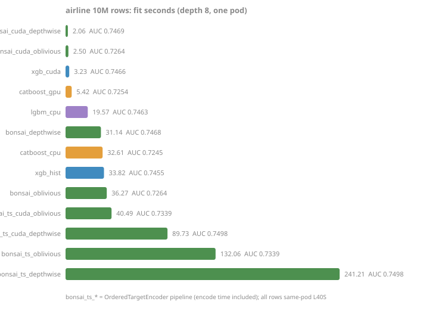

<!-- GENERATED by scripts/render_results.py. Edit the generator, not this page. -->

## Airline delays: the real-data speed ladder

The benchm-ml airline ladder (0.1M/1M/10M rows, mixed categorical/numeric, AUC), both the campaign knob shape and Pafka's depth-10 protocol, all rows one pod. `bonsai_ts_*` rows are the labeled exception to the uniform ordinal-code convention (OrderedTargetEncoder pipeline; `fit_s` includes the encode).

**campaign knobs (depth 8)**, fit seconds / test AUC:

| variant | 0.1m | 1m | 10m |
|---|---|---|---|
| bonsai_depthwise | 2.7s / 0.7260 | 7.5s / 0.7447 | 38.2s / 0.7468 |
| bonsai_oblivious | 2.0s / 0.7218 | 6.4s / 0.7256 | 36.2s / 0.7264 |
| bonsai_cuda_depthwise | 0.4s / 0.7264 | 0.8s / 0.7446 | 2.7s / 0.7486 |
| bonsai_cuda_oblivious | 0.9s / 0.7218 | 1.2s / 0.7256 | 3.2s / 0.7264 |
| bonsai_ts_depthwise | 3.2s / 0.7238 | 10.1s / 0.7462 | 70.7s / 0.7498 |
| bonsai_ts_oblivious | 2.5s / 0.7247 | 9.7s / 0.7326 | 67.1s / 0.7339 |
| bonsai_ts_cuda_depthwise | 0.6s / 0.7234 | 2.9s / 0.7452 | 35.2s / 0.7499 |
| bonsai_ts_cuda_oblivious | 1.1s / 0.7247 | 3.3s / 0.7326 | 37.3s / 0.7339 |
| xgb_hist | 0.8s / 0.7263 | 3.3s / 0.7430 | 26.3s / 0.7455 |
| xgb_cuda | 0.2s / 0.7250 | 0.5s / 0.7426 | 3.3s / 0.7466 |
| lgbm_cpu | 1.5s / 0.7263 | 4.1s / 0.7431 | 17.3s / 0.7463 |
| catboost_cpu | 1.0s / 0.7167 | 5.8s / 0.7234 | 24.7s / 0.7245 |
| catboost_gpu | 0.5s / 0.7167 | 0.9s / 0.7229 | 5.3s / 0.7254 |

**Pafka protocol (depth 10)**, fit seconds / test AUC:

| variant | 0.1m | 1m | 10m |
|---|---|---|---|
| bonsai_depthwise | - | - | - |
| bonsai_oblivious | - | - | - |
| bonsai_cuda_depthwise | - | - | - |
| bonsai_cuda_oblivious | - | - | - |
| bonsai_ts_depthwise | - | - | - |
| bonsai_ts_oblivious | - | - | - |
| bonsai_ts_cuda_depthwise | - | - | - |
| bonsai_ts_cuda_oblivious | - | - | - |
| xgb_hist | - | - | - |
| xgb_cuda | - | - | - |
| lgbm_cpu | - | - | - |
| catboost_cpu | - | - | - |
| catboost_gpu | - | - | - |

Ingest / train seconds behind the campaign-knob total above (issue #301). bonsai's split comes from the two-step `Dataset(..., device=...)` plus `train(pairs, ds)` form, which for a cuda arm bins on the device exactly where the fused call does; every refresh fits the anchor cell both ways, interleaved on the same pod, and the supersession is gated on their agreement, so the seam these columns report belongs to the same pipeline the total measures. CatBoost's `Pool()` step only wraps the raw arrays; it quantizes inside `fit`, so its ingest column reads low and that cost sits in train instead (issue #253). Its total is the only number directly comparable to the other libraries' split.

| variant | 0.1m | 1m | 10m |
|---|---|---|---|
| bonsai_depthwise | 0.0s / 2.7s | 0.1s / 7.4s | 0.6s / 37.5s |
| bonsai_oblivious | 0.0s / 2.0s | 0.1s / 6.3s | 0.6s / 35.5s |
| bonsai_cuda_depthwise | 0.0s / 0.3s | 0.0s / 0.7s | 0.4s / 2.3s |
| bonsai_cuda_oblivious | 0.0s / 0.9s | 0.0s / 1.2s | 0.4s / 2.9s |
| bonsai_ts_depthwise | 0.0s / 3.0s | 0.1s / 7.8s | 0.9s / 37.0s |
| bonsai_ts_oblivious | 0.0s / 2.2s | 0.1s / 7.4s | 0.9s / 33.9s |
| bonsai_ts_cuda_depthwise | 0.0s / 0.3s | 0.1s / 0.6s | 0.4s / 2.4s |
| bonsai_ts_cuda_oblivious | 0.0s / 0.8s | 0.0s / 1.1s | 0.4s / 2.8s |
| xgb_hist | 0.2s / 0.6s | 0.3s / 3.0s | 1.9s / 24.3s |
| xgb_cuda | 0.0s / 0.2s | 0.2s / 0.3s | 1.8s / 1.4s |
| lgbm_cpu | 0.0s / 1.4s | 0.1s / 4.0s | 0.6s / 16.6s |
| catboost_cpu | 0.0s / 1.0s | 0.2s / 5.7s | 1.7s / 22.9s |
| catboost_gpu | 0.0s / 0.4s | 0.2s / 0.7s | 1.7s / 3.6s |

*Source: [`airline-2026-08.jsonl`](../../../benchmarks/results/airline-2026-08.jsonl). A bonsai variant has the best AUC in every cell under both protocols, and bonsai CUDA depthwise is also the fastest fit from 1M rows up under ordinal encoding; XGBoost-GPU keeps only the smallest cell. Evidence: [benchmarks/airline-2026-07.md](../../../benchmarks/airline-2026-07.md). Measured at `db383c5` (2026-08-04, pod-NVIDIA-L40S).*
