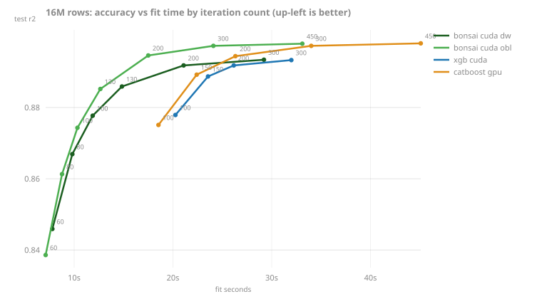

<!-- GENERATED by scripts/render_results.py. Edit the generator, not this page. -->

# The accuracy-time frontier

### GPU accuracy-vs-time frontier at 16M

| variant | iters | fit_s | test r2 |
|---|---|---|---|
| bonsai_cuda_depthwise | 60 | 13.49 | 0.8459 |
| bonsai_cuda_depthwise | 80 | 15.55 | 0.8669 |
| bonsai_cuda_depthwise | 100 | 17.49 | 0.8777 |
| bonsai_cuda_depthwise | 130 | 20.26 | 0.8859 |
| bonsai_cuda_depthwise | 200 | 26.48 | 0.8918 |
| bonsai_cuda_depthwise | 300 | 34.65 | 0.8934 |
| bonsai_cuda_oblivious | 60 | 12.79 | 0.8386 |
| bonsai_cuda_oblivious | 80 | 14.45 | 0.8613 |
| bonsai_cuda_oblivious | 100 | 16.01 | 0.8743 |
| bonsai_cuda_oblivious | 130 | 18.18 | 0.8852 |
| bonsai_cuda_oblivious | 200 | 22.93 | 0.8946 |
| bonsai_cuda_oblivious | 300 | 29.20 | 0.8973 |
| bonsai_cuda_oblivious | 450 | 37.92 | 0.8979 |
| bonsai_cuda_leafwise | 60 | 14.41 | 0.8459 |
| bonsai_cuda_leafwise | 80 | 16.81 | 0.8669 |
| bonsai_cuda_leafwise | 100 | 19.10 | 0.8777 |
| bonsai_cuda_leafwise | 130 | 22.44 | 0.8859 |
| bonsai_cuda_leafwise | 200 | 29.96 | 0.8918 |
| bonsai_cuda_leafwise | 300 | 39.47 | 0.8934 |
| xgb_cuda | 100 | 26.34 | 0.8779 |
| xgb_cuda | 150 | 29.84 | 0.8887 |
| xgb_cuda | 200 | 33.82 | 0.8918 |
| xgb_cuda | 300 | 38.83 | 0.8933 |
| catboost_gpu | 100 | 18.94 | 0.8751 |
| catboost_gpu | 150 | 22.85 | 0.8892 |
| catboost_gpu | 200 | 26.49 | 0.8944 |
| catboost_gpu | 300 | 34.14 | 0.8973 |
| catboost_gpu | 450 | 45.36 | 0.8980 |
| lgbm_cuda | 100 | 24.10 | 0.8847 |
| lgbm_cuda | 150 | 30.50 | 0.8910 |
| lgbm_cuda | 200 | 35.72 | 0.8924 |
| lgbm_cuda | 300 | 45.05 | 0.8930 |

*Source: [`gpu-pareto-16M-2026-08.jsonl`](../../../benchmarks/results/gpu-pareto-16M-2026-08.jsonl). bonsai is first to every measured accuracy across the grid (terminal accuracies tie within the noise band) and its marginal round cost stays below CatBoost's on the same pod. Evidence: [benchmarks/gpu-pareto-16M-2026-07.md](../../../benchmarks/gpu-pareto-16M-2026-07.md). Measured at `5dff84b` (2026-08-02, pod-NVIDIA-L40S).*

### Ordered boosting at scale (CatBoost door)

The probe behind decisions 62 to 64: CatBoost's Ordered vs Plain modes against bonsai oblivious as rows grow.

| door | rows | learner | knob | fit_s | test r2 |
|---|---|---|---|---|---|
| ordered | 200,000 | catboost_ordered | iters=100 | 17.06 | 0.8722 |
| ordered | 200,000 | catboost_plain | iters=100 | 2.51 | 0.8720 |
| ordered | 200,000 | bonsai_oblivious | iters=100 | 3.91 | 0.8747 |
| ordered | 200,000 | catboost_ordered | iters=200 | 30.59 | 0.8932 |
| ordered | 200,000 | catboost_plain | iters=200 | 4.66 | 0.8937 |
| ordered | 200,000 | bonsai_oblivious | iters=200 | 7.30 | 0.8940 |
| ordered | 1,000,000 | catboost_ordered | iters=100 | 63.22 | 0.8754 |
| ordered | 1,000,000 | catboost_plain | iters=100 | 8.36 | 0.8760 |
| ordered | 1,000,000 | bonsai_oblivious | iters=100 | 9.98 | 0.8766 |
| bins | 1,000,000 | catboost_plain | bin samples=None | 8.01 | 0.8760 |
| bins | 1,000,000 | bonsai_oblivious | bin samples=200000 | 9.76 | 0.8766 |
| bins | 1,000,000 | bonsai_oblivious | bin samples=1000000 | 9.98 | 0.8766 |
| bins | 4,000,000 | catboost_plain | bin samples=None | 36.73 | 0.8762 |
| bins | 4,000,000 | bonsai_oblivious | bin samples=200000 | 34.36 | 0.8763 |
| bins | 4,000,000 | bonsai_oblivious | bin samples=1000000 | 35.40 | 0.8766 |
| bins | 4,000,000 | bonsai_oblivious | bin samples=4000000 | 36.62 | 0.8764 |
| isolate | 16,000,000 | catboost_plain_cpu | - | 157.67 | 0.8744 |
| isolate | 16,000,000 | bonsai_oblivious_cpu | - | 171.75 | 0.8749 |
| isolate | 16,000,000 | bonsai_depthwise_cpu | - | 151.93 | 0.8782 |
| gpu | 16,000,000 | bonsai_cuda_oblivious_prefix | iters=100 | - | 0.8638 |
| gpu | 16,000,000 | bonsai_cuda_oblivious_fixed | iters=100 | 29.21 | 0.8749 |
| gpu | 16,000,000 | bonsai_cuda_oblivious_fixed | iters=160 | 41.03 | 0.8913 |
| gpu | 16,000,000 | bonsai_cuda_depthwise | iters=100 | 30.37 | 0.8776 |
| gpu | 16,000,000 | catboost_gpu | iters=100 | 23.81 | 0.8751 |
| gpu | 16,000,000 | catboost_gpu | iters=150 | 28.37 | 0.8892 |
| gpu | 16,000,000 | catboost_gpu | iters=200 | 32.19 | 0.8944 |

*Source: [`catboost-scale-edge-2026-07.jsonl`](../../../benchmarks/results/catboost-scale-edge-2026-07.jsonl). Evidence: [benchmarks/catboost-scale-edge-2026-07.md](../../../benchmarks/catboost-scale-edge-2026-07.md).*
