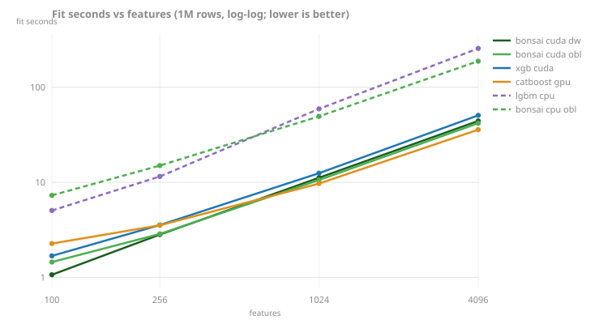

<!-- GENERATED by scripts/render_results.py. Edit the generator, not this page. -->

# Fit at scale

### The re-baseline: fit seconds at scale

Same-pod sweep (AMD EPYC 9554 64-Core Processor, NVIDIA L40S), synthetic regression, `fit()` timed end to end including each library's own ingest, best of repeats, test r² in parentheses.

Scaling rows (100 features):

| rows | bonsai cuda dw | bonsai cuda obl | xgb cuda | catboost gpu | lgbm cpu | bonsai cpu obl |
|---|---|---|---|---|---|---|
| 250k | 0.5s (.871) | 1.0s (.875) | 0.8s (.872) | 1.6s (.875) | 2.5s (.872) | 5.2s (.875) |
| 1M | 1.1s (.876) | 1.4s (.876) | 1.7s (.876) | 2.3s (.876) | 5.0s (.877) | 7.3s (.876) |
| 4M | 4.5s (.878) | 4.4s (.875) | 5.3s (.878) | 5.0s (.877) | 19.9s (.879) | 20.2s (.875) |
| 16M | 20.5s (.879) | 18.4s (.876) | 19.9s (.880) | 18.5s (.876) | 111.3s (.879) | 73.3s (.876) |

Scaling features (1M rows):

| cols | bonsai cuda dw | bonsai cuda obl | xgb cuda | catboost gpu | lgbm cpu | bonsai cpu obl |
|---|---|---|---|---|---|---|
| 100 | 1.1s (.876) | 1.4s (.876) | 1.7s (.876) | 2.3s (.876) | 5.0s (.877) | 7.3s (.876) |
| 256 | 2.8s (.876) | 2.9s (.876) | 3.6s (.876) | 3.5s (.876) | 11.5s (.876) | 15.0s (.876) |
| 1024 | 11.2s (.876) | 10.6s (.876) | 12.5s (.876) | 9.7s (.875) | 59.2s (.876) | 49.3s (.876) |
| 4096 | 44.2s (.875) | 41.9s (.875) | 50.6s (.876) | 35.8s (.874) | 256.2s (.875) | 188.1s (.875) |

The wide cells of this table predate the 2026-07-30 wide re-baseline; the current width standings are on [Width and shape](perf-shape.md).

*Source: [`rebaseline-2026-07.jsonl`](../../../benchmarks/results/rebaseline-2026-07.jsonl). Runner: [scripts/bench_scaling.py](../../../scripts/bench_scaling.py) (`python -m bonsai.bench.scaling`); README Performance derives from the same file.*

### The XGBoost 3.3 recheck (decision 87)

XGBoost 3.3 (2026-07-21) claimed lower GPU quantile-sketching memory and wide-data CPU histogram tiling, both aimed at cells bonsai competes in, so the claims above were rechecked on one pod (L40S) with three same-pod arms: bonsai at main, XGBoost 3.2.0, XGBoost 3.3.0. Every published standing survives. On GPU, 3.3 matches 3.2 within noise at every cell and host RSS does not move (22.1GB at 16M against bonsai's 6.9GB, the README's 3x memory claim reproduced on a second host). On CPU at 16M bonsai sits 6% behind `xgboost-hist`, inside the published "within ~8%, host-dependent" band. The one real improvement: 3.3 halves wide-CPU hist time at 1M x 4096 (nothing at 1024), narrowing bonsai's lead at that cell from 2.4x to 1.19x. No published cell flips; the wide standings above are GPU, where 3.3 changes nothing. Fit is best of repeats; RSS is the worst repeat; this pod's absolutes do not compare to the re-baseline table per the fleet-spread caveat.

| device | rows | cols | bonsai fit | xgb 3.2 fit | xgb 3.3 fit | 3.3 vs 3.2 | bonsai RSS | xgb 3.3 RSS |
|---|---|---|---|---|---|---|---|---|
| gpu | 1M | 100 | 0.8s | 2.7s | 2.7s | 1.01x | 0.7GB | 1.9GB |
| gpu | 4M | 100 | 3.1s | 9.4s | 9.6s | 1.02x | 2.0GB | 6.1GB |
| gpu | 16M | 100 | 12.1s | 37.1s | 37.5s | 1.01x | 6.9GB | 22.1GB |
| gpu | 1M | 256 | 2.3s | 6.4s | 6.3s | 0.98x | 1.4GB | 4.1GB |
| gpu | 1M | 1024 | 9.1s | 24.4s | 22.8s | 0.93x | 4.8GB | 15.1GB |
| cpu | 16M | 100 | 116.7s | 109.2s | 109.8s | 1.01x | 10.4GB | 10.5GB |
| cpu | 1M | 1024 | 86.2s | 94.5s | 97.3s | 1.03x | 7.3GB | 8.6GB |
| cpu | 1M | 4096 | 323.9s | 783.7s | 387.1s | 0.49x | 29.0GB | 33.9GB |

*Source: [`xgb33-recheck-2026-07.jsonl`](../../../benchmarks/results/xgb33-recheck-2026-07.jsonl). Driver: `python -m bonsai.bench.scaling --worker` per cell, three arms on one pod; verdict recorded as decision 87.*

### The scaling study

964 runs across 7 hosts and the axes base, bins, cols, rows; regenerate exponents and the committed log-log plots under [`benchmarks/results/scaling/`](../../../benchmarks/results/scaling) with [scripts/analyze_scaling.py](../../../scripts/analyze_scaling.py).

*Source: [`scaling.jsonl`](../../../benchmarks/results/scaling.jsonl). The full-history perf ledger behind [benchmarks/README.md](../../../benchmarks/README.md); decision 46.*

### GPU year-MSD track

Latest run per device on the YearPredictionMSD pipeline benchmark (full history in the file):

| GPU | as of | fit_s | predict_s | rmse |
|---|---|---|---|---|
| NVIDIA A100-SXM4-80GB | 2026-07-04 | 5.01 | 2.08 | 8.9911 |
| NVIDIA GeForce RTX 5090 | 2026-07-07 | 2.91 | 2.92 | 8.9911 |
| Orin (nvgpu) | 2026-07-04 | 52.21 | 0.89 | 8.9911 |

*Source: [`gpu_msd.jsonl`](../../../benchmarks/results/gpu_msd.jsonl). Runner: [scripts/bench_gpu.py](../../../scripts/bench_gpu.py); pipeline timing mode.*

### CPU 16M round (the prefetch tie)

| rows | bonsai_depthwise | xgb_hist |
|---|---|---|
| 250,000 | 6.7s (.871) | 3.2s (.871) |
| 1,000,000 | 9.3s (.876) | 5.5s (.876) |
| 4,000,000 | 24.3s (.878) | 19.5s (.878) |
| 16,000,000 | 75.8s (.879) | 75.7s (.880) |

*Source: [`cpu-prefetch-round-2026-07.jsonl`](../../../benchmarks/results/cpu-prefetch-round-2026-07.jsonl). Decision 61: software prefetch closed the 16M CPU gap to XGBoost-hist on this pod.*
