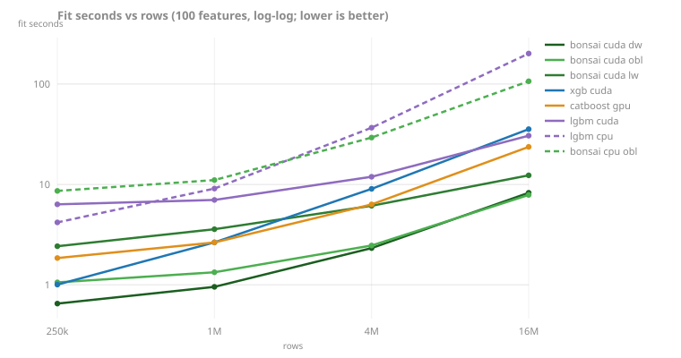

<!-- GENERATED by scripts/render_results.py. Edit the generator, not this page. -->

# Fit at scale

### The re-baseline: fit seconds at scale

Same-pod sweep (AMD EPYC 9354 32-Core Processor, NVIDIA L40S), synthetic regression, `fit()` timed end to end including each library's own ingest, best of repeats, test r² in parentheses.

Scaling rows (100 features):

| rows | bonsai cuda dw | bonsai cuda obl | xgb cuda | catboost gpu | lgbm cuda | lgbm cpu | bonsai cpu obl |
|---|---|---|---|---|---|---|---|
| 250k | 0.4s (.872) | 0.9s (.877) | 1.0s (.872) | 1.9s (.875) | 6.1s (.879) | 4.1s (.872) | 7.7s (.877) |
| 1M | 0.8s (.877) | 1.2s (.877) | 2.7s (.876) | 2.7s (.876) | 7.5s (.884) | 9.7s (.877) | 11.9s (.877) |
| 4M | 3.1s (.878) | 3.1s (.876) | 9.3s (.878) | 6.4s (.877) | 11.7s (.885) | 32.9s (.879) | 34.0s (.876) |
| 16M | 12.1s (.879) | 10.5s (.877) | 36.9s (.880) | 24.1s (.876) | 31.7s (.886) | 210.2s (.879) | 109.8s (.877) |

Width scaling has its own standings axis on [Width and shape](perf-shape.md).

*Source: [`rebaseline-2026-08.jsonl`](../../../benchmarks/results/rebaseline-2026-08.jsonl). Runner: [scripts/bench_scaling.py](../../../scripts/bench_scaling.py) (`python -m bonsai.bench.scaling`); README Performance derives from the same file. Measured at `0b077ad` (2026-08-01, pod-NVIDIA-L40S).*

### The XGBoost 3.3 recheck (decision 87)

XGBoost 3.3 (2026-07-21) claimed lower GPU quantile-sketching memory and wide-data CPU histogram tiling, both aimed at cells bonsai competes in, so the claims above were rechecked on one pod (L40S) with three same-pod arms: bonsai at main, XGBoost 3.2.0, XGBoost 3.3.0. Every published standing survives. On GPU, 3.3 matches 3.2 within noise at every cell and host RSS does not move (22.1GB at 16M against bonsai's 6.9GB, the README's 3x memory claim reproduced on a second host). On CPU at 16M bonsai sits 6% behind `xgboost-hist`, inside the published "within ~8%, host-dependent" band. The one real improvement: 3.3 halves wide-CPU hist time at 1M x 4096 (nothing at 1024), narrowing bonsai's lead at that cell from 2.4x to 1.19x. No published cell flips; the wide standings above are GPU, where 3.3 changes nothing. Fit is best of repeats; RSS is the worst repeat; this pod's absolutes do not compare to the re-baseline table per the fleet-spread caveat.

| device | rows | cols | bonsai fit | xgb 3.2 fit | xgb 3.3 fit | 3.3 vs 3.2 | bonsai RSS | xgb 3.3 RSS |
|---|---|---|---|---|---|---|---|---|
| gpu | 1M | 100 | 0.8s | 2.7s | 2.7s | 1.01x | 0.7GB | 1.9GB |
| gpu | 4M | 100 | 3.1s | 9.4s | 9.6s | 1.02x | 2.0GB | 6.1GB |
| gpu | 16M | 100 | 12.1s | 37.1s | 37.5s | 1.01x | 6.9GB | 22.1GB |
| gpu | 1M | 256 | 2.3s | 6.4s | 6.3s | 0.98x | 1.4GB | 4.1GB |
| gpu | 1M | 1024 | 9.1s | 24.4s | 22.8s | 0.93x | 4.8GB | 15.1GB |
| cpu | 16M | 100 | 116.7s | 109.2s | 109.8s | 1.01x | 10.4GB | 10.5GB |
| cpu | 1M | 1024 | 86.2s | 94.5s | 97.3s | 1.03x | 7.3GB | 8.6GB |
| cpu | 1M | 4096 | 323.9s | 783.7s | 387.1s | 0.49x | 29.0GB | 33.9GB |

*Source: [`xgb33-recheck-2026-07.jsonl`](../../../benchmarks/results/xgb33-recheck-2026-07.jsonl). Driver: `python -m bonsai.bench.scaling --worker` per cell, three arms on one pod; verdict recorded as decision 87.*

### CPU 16M round (the prefetch tie)

| rows | bonsai_depthwise | xgb_hist |
|---|---|---|
| 250,000 | 6.7s (.871) | 3.2s (.871) |
| 1,000,000 | 9.3s (.876) | 5.5s (.876) |
| 4,000,000 | 24.3s (.878) | 19.5s (.878) |
| 16,000,000 | 75.8s (.879) | 75.7s (.880) |

*Source: [`cpu-prefetch-round-2026-07.jsonl`](../../../benchmarks/results/cpu-prefetch-round-2026-07.jsonl). Decision 61: software prefetch closed the 16M CPU gap to XGBoost-hist on this pod.*

### The leafwise recheck: decision 42's claim at scale (decision 95)

The decision-42-era reading ("bonsai CPU leafwise beats LightGBM's CUDA leaf-wise") was measured at 464k rows; on one pod at ladder scales it inverts, monotonically, to 5.3x in LightGBM's favor at 16M. The engineering conclusion stands the other way up: leaf-wise on the GPU is viable at scale (LightGBM ships it), and bonsai's leafwise grower is now the only grower without device support (issue #268). The anchor arm ties this pod to the ladders; LightGBM-CUDA's higher r2 column is the depth-cap artifact recorded in decision 95.

| rows | bonsai leafwise (cpu) | lgbm cuda | lgbm cpu | bonsai cuda dw (anchor) |
|---|---|---|---|---|
| 250k | 7.1s (.872) | 5.7s (.879) | 2.4s (.872) | 0.5s (.872) |
| 1M | 15.1s (.877) | 6.3s (.884) | 5.1s (.877) | 1.1s (.877) |
| 4M | 39.6s (.878) | 9.7s (.885) | 20.0s (.879) | 4.4s (.878) |
| 16M | 128.4s (.879) | 24.4s (.886) | 104.7s (.879) | 17.2s (.879) |

*Source: [`leafwise-recheck-2026-08.jsonl`](../../../benchmarks/results/leafwise-recheck-2026-08.jsonl). One pod (L40S, US-MO-1, 2026-08-01), SCALING knobs at 100 iters, best of 2 reps; evidence for decision 95.*

### The device-leafwise cadence probe (stage 0 of doc 20's admission)

Before building the device leafwise plane, its per-round fixed cost was priced by replaying the round skeleton (25,500 rounds: launches, two pinned syncs, staging, host heap ops) with trivial kernels on an L40S. The fixed cost F is the no-copyback config: **30.3 us/round** against a 100 us budget and a 300 us kill line, so the one-node-per-round design proceeds. Buckets: launch and staging floor 24.5, syncs 5.2, grid width 0.6 (the fixed cost does not track node size), and the data-proportional range copy-back 15.8 us/round excluded from F.

| config | seconds | us/round |
|---|---|---|
| full | 1.175 | 46.1 |
| no_copyback | 0.773 | 30.3 |
| no_syncs | 0.640 | 25.1 |
| floor | 0.757 | 29.7 |

*Source: [`leafwise-cadence-2026-08.json`](../../../benchmarks/results/leafwise-cadence-2026-08.json). One pod (L40S, US-MO-1, 2026-08-01); probe [experiments/leafwise_cadence/cadence.cu](../../../experiments/leafwise_cadence/cadence.cu); evidence [benchmarks/leafwise-cadence-2026-08.md](../../../benchmarks/leafwise-cadence-2026-08.md) for issue #268.*

### The device-leafwise ladder: admission by measurement (stage 2)

Same pod, four arms, best of two reps, interleaved. The kill criterion pre-registered in issue #268 was one number: beat LightGBM's CUDA leaf-wise at 16M x 100 on the same pod, or the grower does not register. It is met with 5% to spare at 16M, and `cuda_leafwise` beats its own CPU arm at every cell, 4.6x to 7.1x. The anchor row prices what is left: the depthwise plane moves the same histogram volume in less time, because serializing the frontier to one node per round costs launches that the level plane batches away.

| rows | bonsai cuda leafwise | lgbm cuda | bonsai leafwise (cpu) | bonsai cuda dw (anchor) |
|---|---|---|---|---|
| 250k | 2.9s (.872) | 6.7s (.879) | 13.5s (.872) | 0.7s (.872) |
| 1M | 4.4s (.877) | 7.7s (.884) | 29.3s (.877) | 1.6s (.877) |
| 4M | 10.2s (.878) | 12.2s (.885) | 66.9s (.878) | 6.0s (.878) |
| 16M | 30.8s (.879) | 32.4s (.886) | 219.8s (.879) | 22.6s (.879) |

The capped ladder above hides the strategy's point: at a 256-leaf budget and a depth-8 cap the leaf budget and the full tree are the same tree, so every arm returns the depthwise accuracy. Lifting the cap is where leaf-wise differs, and it is also the only comparison against LightGBM that is honest, since its CUDA learner ignores `max_depth` outright (decision 95, confirmed in its source: `CUDASingleGPUTreeLearner::Train` never calls the one site that enforces depth). Uncapped, bonsai's leaf-wise growers reach LightGBM's accuracy to four decimals, which is the reading the capped rows' r2 column was never measuring. LightGBM is faster here: uncapped best-first must find a split for every leaf it creates, doubling bonsai's per-round count from 25,500 to 51,100, and that is the optimization target the admission leaves open rather than a quality difference.

| 16M x 100, no depth cap | fit_s | test r2 |
|---|---|---|
| bonsai cuda leafwise | 38.6s | 0.8859 |
| lgbm cuda | 31.6s | 0.8858 |
| bonsai leafwise (cpu) | 271.0s | 0.8859 |

*Source: [`leafwise-ladder-2026-08.jsonl`](../../../benchmarks/results/leafwise-ladder-2026-08.jsonl). One pod (L40S, US-NC-1, 2026-08-01), SCALING knobs at 100 iters and 256 leaves, best of 2 reps; the ladder that admitted `cuda_leafwise` under [docs/architecture/20-cuda-leafwise.md](../../architecture/20-cuda-leafwise.md). Absolute times run above the 2026-08-01 recheck, which used a different pod with a wider CPU; only same-pod comparisons are meaningful.*

### The closing ladder: what stage 3's levers moved (decision 98)

Same knobs and the same three device arms as the admission ladder above, one pod, best of two reps, interleaved, and unprofiled. Stage 3 landed two levers on the leaf plane, the device-resident objective and the round's pinned and packed staging, and reverted a third (the partition chain) that measured worthless. The reference arms carry the cross-ladder comparison, because these are two rentals of the same GPU model rather than one pod: `lgbm_cuda` and the depthwise anchor reproduce their stage 2 times within 2% at every cell, so the leafwise column's move is the levers and not the rental. `cuda_leafwise` fits 24.4s at 16M x 100 against stage 2's 30.8s, and the cut runs 21% to 27% across the ladder, largest at the small cells where the round's fixed cost is the fit. The margin over LightGBM's CUDA leaf-wise at 16M widens from 5% to 24%; 1.3s of fit still separate the leaf plane from the resident depthwise anchor at the same cell, and that is what stage 3 leaves open. `r2_test` is identical to stage 2 in every cell of the table.

| rows | bonsai cuda leafwise | lgbm cuda | bonsai cuda dw (anchor) | stage 2 leafwise |
|---|---|---|---|---|
| 250k | 2.1s (.872) | 6.6s (.879) | 0.7s (.872) | 2.9s |
| 1M | 3.2s (.877) | 7.6s (.884) | 1.6s (.877) | 4.4s |
| 4M | 7.6s (.878) | 12.3s (.885) | 5.9s (.878) | 10.2s |
| 16M | 24.4s (.879) | 31.9s (.886) | 23.0s (.879) | 30.8s |

The uncapped arm is the cell stage 3 most wanted to move, and the one the admission recorded against itself. Lifting the depth cap is where best-first differs from level-wise and where the comparison against LightGBM is honest, since its CUDA learner ignores `max_depth` outright (decision 95). It is also where the round count doubles, from 25,500 to 51,100, because every leaf the tree creates must be found rather than skipped at the cap. Stage 2 measured 38.6s against LightGBM's 31.6s at equal r2; the levers cut that to 32.3s, and LightGBM still leads it, by 2%.

| 16M x 100, no depth cap | fit_s | test r2 | stage 2 fit_s |
|---|---|---|---|
| bonsai cuda leafwise | 32.3s | 0.8862 | 38.6s |
| lgbm cuda | 31.7s | 0.8858 | 31.6s |

*Source: [`leafwise-stage3-2026-08.jsonl`](../../../benchmarks/results/leafwise-stage3-2026-08.jsonl). One pod (L40S, US-NC-1, 2026-08-02), SCALING knobs at 100 iters and 256 leaves, best of 2 reps, no profiler (the profile peel drains the round's pipeline and prices host residue 7x high, doc 20). CPU `leafwise` is unchanged since the stage 2 ladder above and is cited from it rather than re-measured, which is why this ladder is three arms.*
