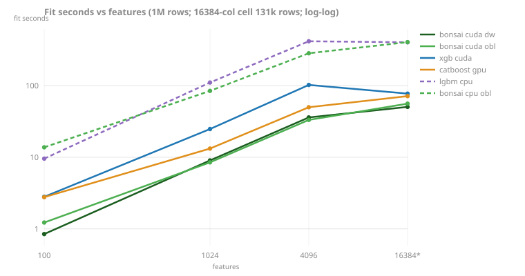
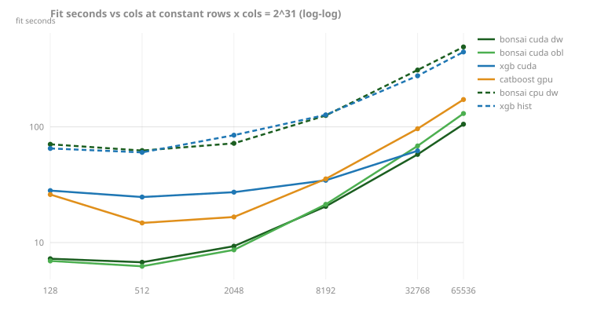
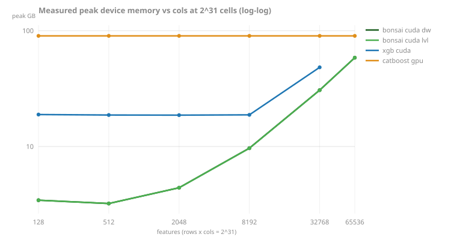

<!-- GENERATED by scripts/render_results.py. Edit the generator, not this page. -->

# Width and shape

### The wide-CPU fill: from a 2-6x wall to one tiled pass (decisions 88, 89)

Ultra-wide selections broke the row-wise u8 fill: its per-row scatter targets the whole selected histogram footprint (33.6MB at 16k features x 255 bins), so every add missed cache (decision 88 routed those levels feature-parallel; same-pod at 131k x 16384 the 7x leafwise deficit against LightGBM collapsed to 1.2x). Decision 89 then retired the strategy pair: the mirror moved to a column-block-tiled layout and the fill runs tiles outer, rows inner, so the live scatter target is one block's histograms at any width. The tiled fill beat both prior strategies at their own best cells in an interleaved same-pod A/B (326 vs 369s at 1M x 4096 against the row path; 442 vs 514s at 131k x 16384 against feature-parallel; a wash at 16M x 100) and produces bit-identical models at every width. The origin is a production field report (issue #217).

| grower | row-wise fill (before) | feature-parallel (decision 88, retired by 89) | lgbm_cpu |
|---|---|---|---|
| depthwise | 1019s | 379s | 367s |
| leafwise | 2591s | 445s | 367s |

*Source: [`wide-cpu-hist-2026-07.jsonl`](../../../benchmarks/results/wide-cpu-hist-2026-07.jsonl). Evidence: [benchmarks/wide-cpu-hist-2026-07.md](../../../benchmarks/wide-cpu-hist-2026-07.md); verdict recorded as decision 88.*

### The CUDA wide recheck: the wall was already gone (decision 90)

A campaign to close the recorded ~5x wide-GPU gap to XGBoost closed at stage 0: the gap no longer exists. The recorded numbers dated to 2026-07-08 code, before the device-resident line landed; on current main, one pod, bonsai's CUDA growers lead every wide cell against both references at 3-4x less host memory. The stale reading ("CatBoost keeps the wide lead") is corrected wherever it appeared; the six-variant cols re-baseline below completes the recorded follow-up.

| variant | rows | cols | fit | test r² | peak RSS |
|---|---|---|---|---|---|
| bonsai_cuda_depthwise | 131k | 16384 | 54.9s | 0.8585 | 8.8GB |
| bonsai_cuda_oblivious | 131k | 16384 | 61.2s | 0.8714 | 8.8GB |
| catboost_gpu | 131k | 16384 | 71.2s | 0.8709 | 25.3GB |
| xgb_cuda | 131k | 16384 | 76.7s | 0.8581 | 39.3GB |
| bonsai_cuda_depthwise | 1M | 4096 | 37.7s | 0.8742 | 16.4GB |
| catboost_gpu | 1M | 4096 | 50.2s | 0.8751 | 50.6GB |
| xgb_cuda | 1M | 4096 | 103.7s | 0.8761 | 60.4GB |

*Source: [`cuda-wide-recheck-2026-07.jsonl`](../../../benchmarks/results/cuda-wide-recheck-2026-07.jsonl). Same pod (L40S, US-NC-1, 2026-07-30), SCALING knobs; verdict recorded as decision 90.*

### The cols re-baseline: wide standings on current main (decision 90 follow-up)

The six-variant cols-axis re-baseline promised by decision 90. bonsai's CUDA growers hold the fastest slot at every measured width, at a fraction of the reference libraries' peak host memory; the tables below carry the current numbers. The widest cell drops to 131k rows to hold total cells at 2^31, so its column is not comparable to the 1M-row columns (starred in the chart). The CPU reference arms bound the GPU advantage: bonsai CPU and LightGBM trade the widest-cell lead within a rep's noise while the GPU growers are several times faster than either.

Fit seconds (test r²), best of reps:

| cell | bonsai cuda dw | bonsai cuda obl | bonsai cuda lw | xgb cuda | catboost gpu | lgbm cuda | lgbm cpu | bonsai cpu obl |
|---|---|---|---|---|---|---|---|---|
| 1M x 100 | 0.8s (.877) | 1.2s (.877) | 2.5s (.877) | 2.7s (.876) | 2.7s (.876) | 7.2s (.884) | 9.8s (.877) | 13.6s (.877) |
| 1M x 1024 | 8.9s (.876) | 8.4s (.876) | 12.8s (.876) | 23.0s (.876) | 13.1s (.875) | 47.9s (.884) | 97.1s (.876) | 80.1s (.876) |
| 1M x 4096 | 35.1s (.876) | 32.9s (.875) | 46.1s (.876) | 96.5s (.876) | 48.5s (.874) | 197.6s (.883) | 454.7s (.875) | 277.3s (.875) |
| 131k x 16384 | 51.0s (.860) | 56.1s (.876) | 1203.4s (.860) | 76.1s (.861) | 70.5s (.874) | 561.2s (.868) | 403.3s (.862) | 427.3s (.876) |

Peak host RSS, worst rep:

| cell | bonsai cuda dw | bonsai cuda obl | bonsai cuda lw | xgb cuda | catboost gpu | lgbm cuda | lgbm cpu | bonsai cpu obl |
|---|---|---|---|---|---|---|---|---|
| 1M x 100 | 0.7GB | 0.7GB | 0.7GB | 1.8GB | 1.5GB | 1.2GB | 1.1GB | 0.9GB |
| 1M x 1024 | 4.9GB | 4.9GB | 4.9GB | 15.2GB | 13.1GB | 9.7GB | 9.3GB | 7.3GB |
| 1M x 4096 | 18.6GB | 18.6GB | 18.6GB | 60.5GB | 51.5GB | 40.3GB | 36.9GB | 29.0GB |
| 131k x 16384 | 9.8GB | 9.8GB | 28.0GB | 40.4GB | 26.2GB | 58.1GB | 51.0GB | 22.0GB |

*Source: [`cols-rebaseline-2026-08.jsonl`](../../../benchmarks/results/cols-rebaseline-2026-08.jsonl). One pod, SCALING knobs, GPU arms 2 reps / CPU arms 1; supersedes the July 8 study's wide cells. Measured at `77633a6` (2026-08-03, pod-NVIDIA-L40S).*

### The iso-volume shape frontier (decision 91)

Constant data volume, swept aspect ratio: every cell of the primary ladder holds rows x cols at 2^31 (an 8GiB float32 matrix) while cols runs 128 to 65536, so costs that scale with total cells stay flat and whatever rises is paying for width. Measured peak device memory (`dev_mem`, NVML-sampled while the child runs, gates off) is an output, not an estimate. One pod: RTX PRO 6000 Blackwell Workstation Edition (96GB, 64 vCPU, 1.1TB RAM, sync probe 4.5us/op), threads 16.

bonsai's CUDA growers are fastest at every cell of both ladders and their fit time is nearly flat across the tall half of the iso-line (7.2s at 16M x 128 to 9.3s at 1M x 2048) where both references vary 1.5-2x; every arm rises together past 8192 cols as histogram cost (cols x bins) takes over. Device memory separates harder than time: bonsai peaks at 3.4GB where XGBoost holds 18.9GB, and CatBoost allocates 90.2GB (the whole card) at every cell including 1M x 100, so it never fails but never shares the device. The one failure is data: xgb_cuda died at 32k x 65536 on both attempts, the sampler recording 33.4GB of device memory at death. At the widest aspect (32k x 65536, where p is 2x n) the oblivious grower keeps test r2 at .873 while depthwise falls to .815, the symmetric tree's regularization showing at extreme width. On the 2^33 stretch (a 32GiB matrix, GPU arms only) bonsai leads 4.1x over XGBoost at 67M x 128 (27.9 vs 113.8s) at 6.3x less device memory (11.7 vs 73.6GB).

Fit seconds (test r2), best of reps, 2^31 cells plus the 1M x 100 anchor:

| cell | bonsai cuda dw | bonsai cuda obl | xgb cuda | catboost gpu | bonsai cpu dw | xgb hist |
|---|---|---|---|---|---|---|
| 1M x 100 | 0.5s (.877) | 1.1s (.877) | 1.6s (.876) | 1.8s (.876) | 5.2s (.877) | 3.5s (.876) |
| 16M x 128 | 7.2s (.879) | 6.9s (.876) | 28.1s (.879) | 26.0s (.875) | 70.8s (.879) | 65.1s (.879) |
| 4M x 512 | 6.8s (.878) | 6.2s (.876) | 24.7s (.878) | 14.8s (.877) | 62.4s (.878) | 60.2s (.878) |
| 1M x 2048 | 9.3s (.876) | 8.6s (.876) | 27.3s (.877) | 16.6s (.876) | 72.1s (.876) | 84.8s (.877) |
| 262k x 8192 | 20.5s (.868) | 21.4s (.874) | 34.5s (.867) | 35.5s (.874) | 125.5s (.868) | 127.1s (.867) |
| 65k x 32768 | 57.8s (.841) | 68.5s (.870) | 62.1s (.840) | 96.3s (.866) | 310.0s (.843) | 276.3s (.841) |
| 32k x 65536 | 105.5s (.816) | 130.4s (.874) | - | 172.4s (.869) | 491.1s (.816) | 444.0s (.817) |

Measured peak device memory (per-process, worst rep is within sampling noise of best), 2^31 cells plus the 1M x 100 anchor:

| cell | bonsai cuda dw | bonsai cuda obl | xgb cuda | catboost gpu |
|---|---|---|---|---|
| 1M x 100 | 0.8GB | 0.8GB | 0.9GB | 90.2GB |
| 16M x 128 | 3.4GB | 3.4GB | 18.9GB | 90.2GB |
| 4M x 512 | 3.2GB | 3.2GB | 18.7GB | 90.2GB |
| 1M x 2048 | 4.4GB | 4.4GB | 18.7GB | 90.2GB |
| 262k x 8192 | 9.7GB | 9.7GB | 18.8GB | 90.2GB |
| 65k x 32768 | 30.7GB | 30.7GB | 48.3GB | 90.2GB |
| 32k x 65536 | 58.5GB | 58.5GB | - | 90.2GB |

The 2^33 stretch, GPU arms:

| cell | bonsai cuda dw | bonsai cuda obl | xgb cuda | catboost gpu |
|---|---|---|---|---|
| 67M x 128 | 27.9s (.880) | 23.9s (.871) | 113.8s (.880) | 103.8s (.877) |
| 4M x 2048 | 25.8s (.878) | 22.6s (.876) | 101.6s (.878) | 47.7s (.876) |
| 262k x 32768 | 85.3s (.870) | 88.3s (.877) | 160.7s (.868) | 154.7s (.876) |

| cell | bonsai cuda dw | bonsai cuda obl | xgb cuda | catboost gpu |
|---|---|---|---|---|
| 67M x 128 | 11.7GB | 11.7GB | 73.6GB | 90.2GB |
| 4M x 2048 | 10.5GB | 10.5GB | 72.7GB | 90.2GB |
| 262k x 32768 | 36.7GB | 36.7GB | 73.2GB | 90.2GB |

*Source: [`iso-volume-2026-08.jsonl`](../../../benchmarks/results/iso-volume-2026-08.jsonl). Specs: bundled in [bench/specs/](../../../python/bonsai/bench/specs/); driver: [scripts/pod_bench_driver.sh](../../../scripts/pod_bench_driver.sh); evidence: [benchmarks/iso-volume-2026-08.md](../../../benchmarks/iso-volume-2026-08.md); verdict recorded as decision 91. Measured at `a907895` (2026-07-30, pod-NVIDIA-RTX-PRO-6000-Blackwell-Workstation-Edition).*
