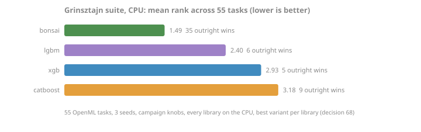

<!-- GENERATED by scripts/render_results.py. Edit the generator, not this page. -->

# Grinsztajn standings

### External standings: the Grinsztajn suite

The [Grinsztajn et al. tabular benchmark](https://arxiv.org/abs/2207.08815) at the paper-medium protocol: 55 OpenML tasks, three seeds, campaign knobs for every library (decision 68). Best variant per library, average rank across tasks, lower is better.

| library | mean rank | outright wins |
|---|---|---|
| bonsai | 1.44 | 36 |
| lgbm | 2.51 | 5 |
| xgb | 2.84 | 6 |
| catboost | 3.22 | 8 |

Per-suite mean rank:

| library | cat_clf | cat_reg | num_clf | num_reg |
|---|---|---|---|---|
| bonsai | 1.29 | 1.46 | 1.67 | 1.30 |
| lgbm | 2.29 | 2.77 | 2.47 | 2.45 |
| xgb | 3.57 | 2.54 | 2.87 | 2.75 |
| catboost | 2.86 | 3.23 | 3.00 | 3.50 |

Sensitivity: XGBoost's campaign mapping sets `min_child_weight=20` (hessian-weighted, the knob-translation bracket recorded in decision 68); replacing its rows with the `min_child_weight=1` run gives the other end of the bracket:

| library | mean rank | outright wins |
|---|---|---|
| bonsai | 1.78 | 18 |
| xgb | 2.18 | 23 |
| lgbm | 2.69 | 6 |
| catboost | 3.35 | 8 |

Reproduce: `pip install bonsai-gbt[bench]`, then `python -m bonsai.bench.grinsztajn out.jsonl` to run the suite (hours; datasets fetch from OpenML), then `--report` on the same file to render the standings from the jsonl.

*Source: [`grinsztajn-2026-07.jsonl`](../../../benchmarks/results/grinsztajn-2026-07.jsonl), [`grinsztajn-2026-07-xgb-mcw1.jsonl`](../../../benchmarks/results/grinsztajn-2026-07-xgb-mcw1.jsonl). As-run; evidence narrative in [benchmarks/grinsztajn-2026-07.md](../../../benchmarks/grinsztajn-2026-07.md), ruling in decision 68.*
