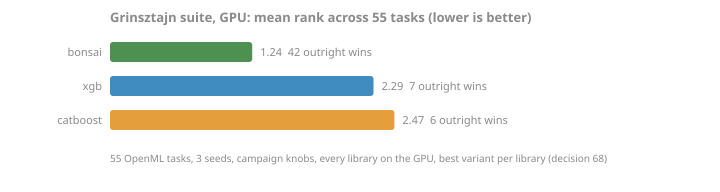
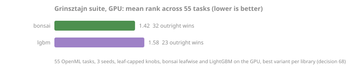

<!-- GENERATED by scripts/render_results.py. Edit the generator, not this page. -->

# Grinsztajn standings

### External standings: the Grinsztajn suite

The [Grinsztajn et al. tabular benchmark](https://arxiv.org/abs/2207.08815) at the paper-medium protocol: 55 OpenML tasks, three seeds, campaign knobs for every library (decision 68). Best variant per library, average rank across tasks, lower is better.

| library | mean rank | outright wins |
|---|---|---|
| bonsai | 1.49 | 35 |
| lgbm | 2.40 | 6 |
| xgb | 2.93 | 5 |
| catboost | 3.18 | 9 |

Per-suite mean rank:

| library | cat_clf | cat_reg | num_clf | num_reg |
|---|---|---|---|---|
| bonsai | 1.43 | 1.46 | 1.80 | 1.30 |
| lgbm | 2.00 | 2.69 | 2.53 | 2.25 |
| xgb | 3.86 | 2.62 | 2.73 | 2.95 |
| catboost | 2.71 | 3.23 | 2.93 | 3.50 |

XGBoost's campaign mapping sets `min_child_weight=20` (hessian-weighted, the knob-translation bracket recorded in decision 68). The other end of that bracket, the same suite with XGBoost at `min_child_weight=1`, was measured: bonsai keeps the lead at mean rank 1.78 and XGBoost rises to second. Those rows are closed evidence now, listed in the archive.

Reproduce: `pip install bonsai-gbt[bench]`, then `python -m bonsai.bench.grinsztajn out.jsonl` to run the suite (hours; datasets fetch from OpenML), then `--report` on the same file to render the standings from the jsonl.

*Source: [`quality-grinsztajn-2026-09.jsonl`](../../../benchmarks/results/quality-grinsztajn-2026-09.jsonl). As-run; evidence narrative in [benchmarks/grinsztajn-2026-07.md](../../../benchmarks/grinsztajn-2026-07.md), ruling in decision 68.*

### Device standings: the same suite on the GPU

The same 55 tasks, seeds, and campaign knobs, with every library on its GPU build: bonsai's three CUDA growers against XGBoost `device=cuda`, LightGBM `device_type=cuda`, and CatBoost `task_type=GPU`, ranked by the same rule as the CPU table (best variant per library, average rank across tasks, lower is better). Each table ranks one plane against its own peers; the drift table below is where a device arm is read against its CPU rows.

| library | mean rank | outright wins |
|---|---|---|
| bonsai | 1.24 | 42 |
| xgb | 2.29 | 7 |
| catboost | 2.47 | 6 |

`lgbm_cuda` is measured but not ranked: LightGBM's CUDA tree learner does not apply `max_depth` (LightGBM 4.7.0: the only depth check is the serial learner's `BeforeFindBestSplit`, which the CUDA `Train` loop never calls), so at the campaign knobs it grows 63 leaves at any depth where every other arm is capped at depth 6. Ranked among all arms it would read 1.71 with 38 outright wins. Its rows are read in the drift table below.

Per-suite mean rank:

| library | cat_clf | cat_reg | num_clf | num_reg |
|---|---|---|---|---|
| bonsai | 1.00 | 1.31 | 1.33 | 1.20 |
| xgb | 2.86 | 2.23 | 2.33 | 2.10 |
| catboost | 2.14 | 2.46 | 2.33 | 2.70 |

Reproduce: `python -m bonsai.bench.grinsztajn --device cuda out.jsonl` on a CUDA host, then `--report` on the same file.

*Source: [`quality-grinsztajn-gpu-2026-09.jsonl`](../../../benchmarks/results/quality-grinsztajn-gpu-2026-09.jsonl). As-run on one GPU host; the arm placement is pinned by python/tests/bench/test_grinsztajn.py.*

### Device drift: each GPU arm against its CPU rows

Every arm of the device sweep read against the CPU row of the same suite, dataset, seed, and library strategy. The gap is the device metric minus the CPU metric (r2 or AUC), and its allowance is the task's own noise: the host's seed-to-seed spread of that task and strategy, plus 1e-04. The worst pair is the one nearest to, or past, its allowance, shown with the spread it is read against. bonsai's three arms are gated, and a release refuses to ship one past its allowance; a reference library's GPU build is reported the same way but not held, since its distance from its own CPU build is that library's to explain.

| device arm | CPU partner | pairs | mean gap | worst gap | host spread | worst task | verdict |
|---|---|---|---|---|---|---|---|
| bonsai_cuda_depthwise | bonsai_dw | 165 | -2.94e-05 | 3.56e-06 | 1.77e-05 | SGEMM_GPU_kernel_performance s2 | held |
| bonsai_cuda_leafwise | bonsai_lw | 165 | -4.08e-05 | 4.37e-06 | 1.17e-05 | SGEMM_GPU_kernel_performance s0 | held |
| bonsai_cuda_levelwise | bonsai_obl | 165 | -1.24e-05 | 1.40e-04 | 1.33e-04 | Bike_Sharing_Demand s1 | held |
| xgb_cuda | xgb | 165 | -5.79e-04 | 1.08e-03 | 2.91e-04 | covertype s2 | moved (not gated) |
| lgbm_cuda | lgbm | 165 | +6.54e-03 | 2.62e-02 | 8.28e-03 | compass s0 | moved (not gated) |
| catboost_gpu | catboost | 165 | +2.66e-04 | 5.89e-03 | 2.21e-03 | cpu_act s2 | moved (not gated) |

*Source: [`quality-grinsztajn-gpu-2026-09.jsonl`](../../../benchmarks/results/quality-grinsztajn-gpu-2026-09.jsonl). The allowance and the pairing rule live in scripts/check_standings.py.*

### Head to head: bonsai leafwise against LightGBM at 63 leaves

LightGBM's CUDA learner caps a tree by its leaf count alone, which is why the device table above ranks every library but it. This regime meets it there: the campaign's 63 leaves under a depth cap of 62, the deepest a 63-leaf tree can reach, so the leaf count is the only cap on both sides. That is one parameter change on bonsai's leafwise grower (`max_depth=62` in place of 6), and LightGBM's own `max_depth=-1` fits the same trees as the cap. Everything else is the campaign: the same 55 tasks, three seeds, and knobs (decision 68), both learners on the GPU. Only the learners a leaf count alone can cap run here; a depthwise or symmetric tree at depth 62 would be a different experiment, so bonsai's other growers, XGBoost, and CatBoost are absent by design.

| library | mean rank | outright wins |
|---|---|---|
| bonsai | 1.42 | 32 |
| lgbm | 1.58 | 23 |

Per-suite mean rank:

| library | cat_clf | cat_reg | num_clf | num_reg |
|---|---|---|---|---|
| bonsai | 1.29 | 1.62 | 1.40 | 1.35 |
| lgbm | 1.71 | 1.38 | 1.60 | 1.65 |

Task by task: the gap is bonsai's mean over seeds minus LightGBM's (r2 or AUC), and a task is won by the higher mean.

| suite | tasks | bonsai wins | lightgbm wins | ties | mean gap | widest lead | widest deficit |
|---|---|---|---|---|---|---|---|
| cat_clf | 7 | 5 | 2 | 0 | +0.0023 | +0.0091 | -0.0004 |
| cat_reg | 13 | 5 | 8 | 0 | -0.0015 | +0.0019 | -0.0109 |
| num_clf | 15 | 9 | 6 | 0 | +0.0007 | +0.0052 | -0.0024 |
| num_reg | 20 | 13 | 7 | 0 | +0.0014 | +0.0256 | -0.0130 |
| all | 55 | 32 | 23 | 0 | +0.0006 | +0.0256 | -0.0130 |

Reproduce: `python -m bonsai.bench.grinsztajn --device cuda --regime leaf-capped out.jsonl` on a CUDA host, then `--report` on the same file.

*Source: [`quality-grinsztajn-leaf-capped-gpu-2026-09.jsonl`](../../../benchmarks/results/quality-grinsztajn-leaf-capped-gpu-2026-09.jsonl). As-run on one GPU host; the regime's knobs and arms are pinned by python/tests/bench/test_grinsztajn.py.*
