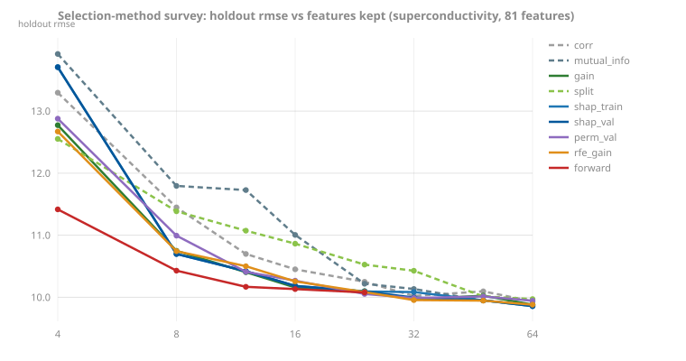

<!-- GENERATED by scripts/render_results.py. Edit the generator, not this page. -->

# Probes

### Probe: per-feature bin budgets (declined, decision 67)

Test r² under per-feature bin-budget policies at a 255-bin default; no policy moved standings outside the chance band.

| dataset | bonsai_uniform255 | bonsai_importance | bonsai_inverse | bonsai_headroom | lgbm_uniform255 | lgbm_importance | xgb_uniform255 |
|---|---|---|---|---|---|---|---|
| adult | 0.9298 | 0.9286 | 0.9171 | 0.9285 | 0.9302 | 0.9302 | 0.9303 |
| california | 0.8260 | 0.8272 | 0.8274 | 0.8277 | 0.8289 | 0.8289 | 0.8275 |
| kick | 0.7830 | 0.7734 | 0.7638 | 0.7727 | 0.7846 | 0.7822 | 0.7851 |
| synth_20of100 | 0.8694 | 0.8698 | 0.7858 | 0.8705 | 0.8694 | 0.8703 | 0.8700 |
| year_msd | 0.3012 | 0.3000 | 0.2970 | 0.3009 | 0.3006 | 0.3011 | 0.3002 |

*Source: [`binning-probe-2026-07.json`](../../../benchmarks/results/binning-probe-2026-07.json). Probe: [scripts/probe_binning.py](../../../scripts/probe_binning.py); evidence [benchmarks/binning-tradeoff-2026-07.md](../../../benchmarks/binning-tradeoff-2026-07.md).*

### Probe: categorical machinery (resolved as an encoder, decision 58)

AUC by setup: each reference library's own categorical toggle against ordinal codes, and bonsai's ordered-target-statistics preprocessing.

| setup | adult | amazon | kick |
|---|---|---|---|
| bonsai_ordinal | 0.9300 | 0.8307 | 0.7830 |
| bonsai_ts4_a10 | 0.9303 | 0.8512 | 0.7771 |
| bonsai_ts_a1 | 0.9306 | 0.8502 | 0.7774 |
| bonsai_ts_a10 | 0.9303 | 0.8536 | 0.7792 |
| bonsai_ts_plus_code | 0.9303 | 0.8590 | 0.7797 |
| catboost_native | 0.9283 | 0.8894 | 0.7777 |
| catboost_ordinal | 0.9269 | 0.7791 | 0.7740 |
| lgbm_native | 0.9303 | 0.8572 | 0.7666 |
| lgbm_ordinal | 0.9302 | 0.8278 | 0.7846 |
| xgb_native | 0.9283 | 0.7878 | 0.7791 |
| xgb_ordinal | 0.9276 | 0.8052 | 0.7827 |

*Source: [`cat-tradeoff-2026-07.json`](../../../benchmarks/results/cat-tradeoff-2026-07.json). Probe: [scripts/probe_categorical.py](../../../scripts/probe_categorical.py); evidence [benchmarks/categorical-tradeoff-2026-07.md](../../../benchmarks/categorical-tradeoff-2026-07.md).*

### Probe: ranking objectives (gated, issue #58)

NDCG@10 by regime; the stable gap is to listwise losses only, so issue #58 is scoped listwise-first.

| learner | graded (NDCG@10) | mq2008 (NDCG@10) | search (NDCG@10) |
|---|---|---|---|
| bonsai_regression | 0.6623 | 0.7720 | 0.3028 |
| lgbm_regression | 0.6653 | 0.7714 | 0.2972 |
| lgbm_lambdarank | 0.6601 | 0.7662 | 0.3023 |
| xgb_rank_ndcg | 0.6673 | 0.7866 | 0.3084 |
| catboost_yetirank | 0.6679 | 0.7746 | 0.3132 |

*Source: [`ranking-tradeoff-2026-07.jsonl`](../../../benchmarks/results/ranking-tradeoff-2026-07.jsonl). Probe: [scripts/probe_ranking.py](../../../scripts/probe_ranking.py); evidence [benchmarks/ranking-tradeoff-2026-07.md](../../../benchmarks/ranking-tradeoff-2026-07.md).*

### Probe: CatBoost's categorical machinery priced by its own toggle (reopener predicate, decision 80)

On the cat-heavy TabArena subset, CatBoost native vs the same model with categoricals ordinal-encoded: the toggle prices the machinery at 68% of CatBoost's remaining lead over bonsai_ts (mean share -0.0099 of -0.0147); the pure-numeric control is bit-identical in both arms. Where the price is largest, ablated CatBoost loses to bonsai_ts outright.

| dataset | cat native | cat ablated | bonsai_ts | categorical share | remaining gap |
|---|---|---|---|---|---|
| Amazon_employee_access | 0.1287 | 0.1765 | 0.1522 | -0.0478 | -0.0235 |
| kddcup09_appetency | 0.1581 | 0.1773 | 0.1696 | -0.0193 | -0.0115 |
| splice | 0.0905 | 0.1098 | 0.1054 | -0.0192 | -0.0149 |
| in_vehicle_coupon_recommendation | 0.1533 | 0.1669 | 0.1901 | -0.0135 | -0.0368 |
| Marketing_Campaign | 0.0670 | 0.0754 | 0.0743 | -0.0083 | -0.0073 |
| credit-g | 0.2123 | 0.2202 | 0.2247 | -0.0079 | -0.0124 |
| anneal | 0.0518 | 0.0539 | 0.0700 | -0.0021 | -0.0183 |
| Bank_Customer_Churn | 0.1229 | 0.1248 | 0.1301 | -0.0018 | -0.0072 |
| customer_satisfaction_in_airline | 0.0052 | 0.0057 | 0.0065 | -0.0005 | -0.0013 |
| NATICUSdroid | 0.0140 | 0.0140 | 0.0152 | 0.0000 | -0.0011 |
| qsar-biodeg | 0.0753 | 0.0752 | 0.0889 | 0.0001 | -0.0136 |
| MIC | 0.4634 | 0.4618 | 0.4913 | 0.0016 | -0.0280 |

*Source: [`tabarena-cat-probe-2026-07.jsonl`](../../../benchmarks/results/tabarena-cat-probe-2026-07.jsonl). Probe: [scripts/probe_tabarena_cat.py](../../../scripts/probe_tabarena_cat.py); evidence [benchmarks/tabarena-cat-probe-2026-07.md](../../../benchmarks/tabarena-cat-probe-2026-07.md). Lower is better for every metric column (error/log-loss form).*

### Probe: ordered boosting priced by CatBoost's own toggle (declined, decision 81)

On 12 small pure-numeric datasets at matched knobs, Ordered beats Plain beyond the chance band on 0 of 12 and is distinctly worse where the toggle moves most, at 3.9x the train time. The mechanism is not the small-data edge; the campaign died at its pre-registered first stage. Lower is better in both metric columns.

| dataset | metric | CatBoost Ordered (matched) | CatBoost Plain (matched) |
|---|---|---|---|
| MagicTelescope | one_minus_auc | 0.0594 | 0.0578 |
| QSAR-TID-11 | rmse | 0.9232 | 0.8950 |
| QSAR_fish_toxicity | rmse | 0.9679 | 0.9522 |
| banknote | one_minus_auc | 0.0000 | 0.0001 |
| breast_cancer | one_minus_auc | 0.0067 | 0.0038 |
| concrete_compressive_strength | rmse | 5.0237 | 4.7311 |
| houses | rmse | 0.2294 | 0.2269 |
| phoneme | one_minus_auc | 0.0681 | 0.0618 |
| pima_diabetes | one_minus_auc | 0.1760 | 0.1770 |
| spambase | one_minus_auc | 0.0110 | 0.0113 |
| superconductivity | rmse | 10.8729 | 10.2908 |
| wind | rmse | 2.9736 | 2.9580 |

*Source: [`ordered-boosting-probe-2026-07.jsonl`](../../../benchmarks/results/ordered-boosting-probe-2026-07.jsonl). Probe: [scripts/probe_ordered_boosting_rung0.py](../../../scripts/probe_ordered_boosting_rung0.py); evidence [benchmarks/ordered-boosting-probe-2026-07.md](../../../benchmarks/ordered-boosting-probe-2026-07.md).*

### Probe: static K-permutation target statistics (declined, decision 82)

K-averaged ordered target statistics as plain preprocessing recover a negative share of the gap to native CatBoost on the cat-heavy pool (K=8 pool mean -0.026): the average converges toward leave-one-out statistics while the single ordering's noise was implicit regularization. The categorical substance is the per-split machinery. Lower is better in every metric column.

| dataset | bonsai_ts (K=1) | K=4 | K=8 | CatBoost native |
|---|---|---|---|---|
| Amazon_employee_access | 0.1522 | 0.1550 | 0.1555 | 0.1287 |
| Bank_Customer_Churn | 0.1301 | 0.1294 | 0.1294 | 0.1229 |
| MIC | 0.4913 | 0.4913 | 0.4913 | 0.4634 |
| Marketing_Campaign | 0.0743 | 0.0719 | 0.0722 | 0.0670 |
| NATICUSdroid | 0.0152 | 0.0152 | 0.0152 | 0.0140 |
| anneal | 0.0700 | 0.0700 | 0.0700 | 0.0518 |
| credit-g | 0.2247 | 0.2138 | 0.2317 | 0.2123 |
| customer_satisfaction_in_airline | 0.0065 | 0.0065 | 0.0066 | 0.0052 |
| in_vehicle_coupon_recommendation | 0.1901 | 0.1882 | 0.1878 | 0.1533 |
| kddcup09_appetency | 0.1696 | 0.1719 | 0.1703 | 0.1581 |
| qsar-biodeg | 0.0889 | 0.0906 | 0.0883 | 0.0753 |
| splice | 0.1054 | 0.1054 | 0.1054 | 0.0905 |

*Source: [`static-k-encoder-probe-2026-07.jsonl`](../../../benchmarks/results/static-k-encoder-probe-2026-07.jsonl). Probe: [scripts/probe_static_k_encoder.py](../../../scripts/probe_static_k_encoder.py); evidence [benchmarks/static-k-encoder-probe-2026-07.md](../../../benchmarks/static-k-encoder-probe-2026-07.md).*

### Probe: a per-dataset learning-rate rule (declined, decision 83)

Even a validation-selected oracle over eight rates gains nothing on the pool (it wins validation 10 of 12 but test only 6 of 12, the overfit signature), and CatBoost's own automatic rate transplants to a no-op in a tight band around the shipped 0.05. Lower is better in the metric columns.

| dataset | default (0.05) | oracle | oracle lr | CatBoost auto-lr |
|---|---|---|---|---|
| MagicTelescope | 0.0612 | 0.0642 | 0.20 | 0.058 |
| QSAR-TID-11 | 0.8829 | 0.8895 | 0.08 | 0.061 |
| QSAR_fish_toxicity | 1.0335 | 1.0220 | 0.08 | 0.045 |
| banknote | 0.0000 | 0.0001 | 0.01 | 0.030 |
| breast_cancer | 0.0061 | 0.0067 | 0.30 | 0.024 |
| concrete_compressive_strength | 4.5874 | 4.5857 | 0.12 | 0.046 |
| houses | 0.2282 | 0.2277 | 0.03 | 0.074 |
| phoneme | 0.0676 | 0.0651 | 0.03 | 0.042 |
| pima_diabetes | 0.1675 | 0.1661 | 0.12 | 0.026 |
| spambase | 0.0105 | 0.0114 | 0.12 | 0.041 |
| superconductivity | 9.8563 | 9.8563 | 0.05 | 0.075 |
| wind | 3.0207 | 3.0198 | 0.02 | 0.063 |

*Source: [`lr-rule-probe-2026-07.jsonl`](../../../benchmarks/results/lr-rule-probe-2026-07.jsonl). Probe: [scripts/probe_lr_rule.py](../../../scripts/probe_lr_rule.py); evidence [benchmarks/lr-rule-probe-2026-07.md](../../../benchmarks/lr-rule-probe-2026-07.md).*

### Probe: the bagged-protocol randomization interaction (declined, decision 85)

Decision 81's last reopener: is CatBoost's small-data lead a bagged-protocol interaction, its randomization defaults decorrelating ensemble members where bonsai's deterministic ones cannot? Priced at zero core cost on the 12-dataset pure-numeric pool. The headline interaction, (cat single minus cat bag8) minus (bonsai single minus bonsai bag8), is negative in both pool means and inside the chance band on 7 of 12; of the 5 out-of-band cases 4 favor bonsai, and the neutralization arm shows stock CatBoost randomization is null under bagging. 8-fold data-bagging already gives bonsai the decorrelation. Lower is better; positive share means the lever lowers error.

| dataset | metric | bag gain bonsai | bag gain cat | interaction | randomization share | in band |
|---|---|---|---|---|---|---|
| MagicTelescope | one_minus_auc | 0.0022 | 0.0006 | -0.0016 | 0.0003 | no |
| QSAR-TID-11 | rmse | 0.0218 | 0.0241 | 0.0023 | -0.0008 | yes |
| QSAR_fish_toxicity | rmse | 0.0923 | 0.0301 | -0.0622 | 0.0051 | no |
| banknote | one_minus_auc | 0.0000 | 0.0000 | -0.0000 | 0.0002 | yes |
| breast_cancer | one_minus_auc | 0.0019 | 0.0015 | -0.0004 | 0.0000 | yes |
| concrete_compressive_strength | rmse | 0.0445 | 0.0702 | 0.0257 | 0.0192 | yes |
| houses | rmse | 0.0084 | 0.0032 | -0.0052 | -0.0006 | no |
| phoneme | one_minus_auc | 0.0094 | 0.0068 | -0.0027 | 0.0000 | no |
| pima_diabetes | one_minus_auc | 0.0012 | 0.0048 | 0.0036 | 0.0068 | no |
| spambase | one_minus_auc | -0.0001 | -0.0003 | -0.0002 | 0.0003 | yes |
| superconductivity | rmse | 0.3898 | 0.2680 | -0.1218 | -0.0269 | yes |
| wind | rmse | 0.0652 | 0.0357 | -0.0296 | 0.0013 | yes |

*Source: [`bagging-interaction-probe-2026-07.jsonl`](../../../benchmarks/results/bagging-interaction-probe-2026-07.jsonl). Probe: [scripts/probe_bagging_interaction.py](../../../scripts/probe_bagging_interaction.py); evidence [benchmarks/bagging-interaction-probe-2026-07.md](../../../benchmarks/bagging-interaction-probe-2026-07.md).*

### Probe: honest shadow-feature selection (declined, decision 86)

Does a refit-based shadow-feature selector (append a permuted copy of every column, keep only real features that beat the shadow importances) buy accuracy over plain top-k-by-gain, and how does it price against CatBoost select_features? Priced at zero core cost on two regimes (REAL-WIDE up to 1024 features, NOISE-INJECTED with shuffled-copy noise equal to each set's feature count), with the bonsai arms run under all three growers. The shadow arm's `shadow vs top-k` delta is inside the chance band on 26 of 27 grower-dataset cells and favors truncation in the 27th, so every beyond-band win it scores is a win plain truncation also scores at the same k, and it loses beyond the band on the same two low-dimensional real sets under every grower (leafwise is bit-identical to depthwise, the 63-leaf budget never binds at depth 6). Selection is not an accuracy lever on this pool; where it recovers accuracy it removes injected junk a one-line top-k already removes. The grower-independent reference arms (cat select, XGBoost) live on the depthwise rows. Lower is better in every metric column; positive `shadow vs top-k` means the shadow machinery beats truncation.

| dataset | grower | regime | metric | k / total | bonsai all | bonsai shadow | bonsai top-k | cat select | shadow vs top-k | shadow beats all |
|---|---|---|---|---|---|---|---|---|---|---|
| QSAR-TID-11 | depthwise | real_wide | rmse | 306 / 1024 | 0.88287 | 0.89051 | 0.89300 | 0.89338 | 0.00248 | no |
| QSAR-TID-11 | leafwise | real_wide | rmse | 306 / 1024 | 0.88287 | 0.89051 | 0.89300 | - | 0.00248 | no |
| QSAR-TID-11 | oblivious | real_wide | rmse | 249 / 1024 | 0.88780 | 0.89709 | 0.89400 | - | -0.00310 | no |
| superconductivity | depthwise | real_wide | rmse | 67 / 81 | 9.85628 | 9.92407 | 9.91435 | 10.14472 | -0.00972 | no |
| superconductivity | leafwise | real_wide | rmse | 67 / 81 | 9.85628 | 9.92407 | 9.91435 | - | -0.00972 | no |
| superconductivity | oblivious | real_wide | rmse | 72 / 81 | 10.09384 | 10.08169 | 10.10188 | - | 0.02019 | no |
| spambase | depthwise | real_wide | one_minus_auc | 24 / 57 | 0.01050 | 0.01169 | 0.01197 | 0.01289 | 0.00027 | no |
| spambase | leafwise | real_wide | one_minus_auc | 24 / 57 | 0.01050 | 0.01169 | 0.01197 | - | 0.00027 | no |
| spambase | oblivious | real_wide | one_minus_auc | 25 / 57 | 0.01000 | 0.01120 | 0.01120 | - | 0.00000 | no |
| houses | depthwise | noise_injected | rmse | 11 / 16 | 0.23289 | 0.23149 | 0.23149 | 0.22809 | 0.00000 | no |
| houses | leafwise | noise_injected | rmse | 11 / 16 | 0.23289 | 0.23149 | 0.23149 | - | 0.00000 | no |
| houses | oblivious | noise_injected | rmse | 10 / 16 | 0.23029 | 0.22639 | 0.22639 | - | 0.00000 | no |
| concrete_compressive_strength | depthwise | noise_injected | rmse | 8 / 16 | 5.32359 | 4.58744 | 4.58744 | 4.65285 | 0.00000 | yes |
| concrete_compressive_strength | leafwise | noise_injected | rmse | 8 / 16 | 5.32359 | 4.58744 | 4.58744 | - | 0.00000 | yes |
| concrete_compressive_strength | oblivious | noise_injected | rmse | 8 / 16 | 5.36823 | 4.77173 | 4.77173 | - | 0.00000 | yes |
| wind | depthwise | noise_injected | rmse | 14 / 28 | 3.07949 | 3.02061 | 3.02729 | 2.99762 | 0.00668 | no |
| wind | leafwise | noise_injected | rmse | 14 / 28 | 3.07949 | 3.02061 | 3.02729 | - | 0.00668 | no |
| wind | oblivious | noise_injected | rmse | 13 / 28 | 3.05815 | 2.99657 | 2.96965 | - | -0.02693 | yes |
| breast_cancer | depthwise | noise_injected | one_minus_auc | 17 / 60 | 0.00818 | 0.00692 | 0.00650 | 0.00797 | -0.00042 | yes |
| breast_cancer | leafwise | noise_injected | one_minus_auc | 17 / 60 | 0.00818 | 0.00692 | 0.00650 | - | -0.00042 | yes |
| breast_cancer | oblivious | noise_injected | one_minus_auc | 16 / 60 | 0.01048 | 0.00839 | 0.00881 | - | 0.00042 | yes |
| pima_diabetes | depthwise | noise_injected | one_minus_auc | 6 / 16 | 0.19104 | 0.20203 | 0.20203 | 0.19116 | 0.00000 | no |
| pima_diabetes | leafwise | noise_injected | one_minus_auc | 6 / 16 | 0.19104 | 0.20203 | 0.20203 | - | 0.00000 | no |
| pima_diabetes | oblivious | noise_injected | one_minus_auc | 5 / 16 | 0.18890 | 0.19773 | 0.19057 | - | -0.00716 | no |
| MagicTelescope | depthwise | noise_injected | one_minus_auc | 11 / 20 | 0.06516 | 0.06344 | 0.06344 | 0.05787 | 0.00000 | yes |
| MagicTelescope | leafwise | noise_injected | one_minus_auc | 11 / 20 | 0.06516 | 0.06344 | 0.06344 | - | 0.00000 | yes |
| MagicTelescope | oblivious | noise_injected | one_minus_auc | 11 / 20 | 0.06428 | 0.05956 | 0.05956 | - | 0.00000 | yes |

*Source: [`feature-selection-probe-2026-07.jsonl`](../../../benchmarks/results/feature-selection-probe-2026-07.jsonl). Probe: [scripts/probe_feature_selection.py](../../../scripts/probe_feature_selection.py); evidence [benchmarks/feature-selection-probe-2026-07.md](../../../benchmarks/feature-selection-probe-2026-07.md).*

#### The selection-method survey (guide 14 worked example)

Ten selection methods, one shared judge: each method produces a feature ranking, every ranking is refit at matched knobs on its top-k down a budget ladder, and error is read on an untouched holdout (superconductivity, 81 real features, baseline rmse 9.85628; wide-short contrast on QSAR-TID-11, baseline rmse 0.88287). The tables, the pairwise top-16 overlap matrix and the readings live in [guide chapter 14](../../guide/14-feature-selection.md); they add no verdict weight to decision 86.

*Source: [`selection-survey-2026-07.jsonl`](../../../benchmarks/results/selection-survey-2026-07.jsonl). Survey: [scripts/probe_selection_survey.py](../../../scripts/probe_selection_survey.py); readings: [guide chapter 14](../../guide/14-feature-selection.md).*
